```python
import numpy as np
import matplotlib.pyplot as plt
import os
import cv2 as cv
from sklearn.model_selection import train_test_split

import tensorflow as tf
from tensorflow import shape,math 
from tensorflow.keras import Input,layers,Model
from tensorflow.keras.losses import mse,binary_crossentropy
from tensorflow.keras.utils import plot_model
```

## 1. 데이터 불러오기


```python
def DataLoad(src):
    temp = []
    files = os.listdir(src)
    for i in range(len(os.listdir(src))):
        if files[i][-4:] == '.jpg':
            temp.append(files[i])
    print(len(temp))
    return temp

src = 'C:/Users/105/Desktop/datasets/cats_and_dogs/cats/'
filenames = DataLoad(src)
```

    2000
    


```python
# 이미지 읽기 및 출력
def img_plot(img):
    plt.imshow(img)
    plt.show()
    
def img_read(src,file):
    img = cv.imread(src+file, cv.IMREAD_GRAYSCALE)
    img = cv.resize(img, (128,128))
    return img

X,Y = [] , []
count = 0

# 경로와 파일명을 입력으로 넣어서 확인하고
# 데이터를 255로 나누어서 0~1 사이로 정규화 하여 X 리스트에 넣습니다.
for name in filenames :
    X.append(img_read(src,name)/255.)
    Y.append(float(name[4:5]))

#print(Y)
# array로 데이터 변환
X = np.asarray(X)
Y = np.asarray(Y)

# X dataset 일부 확인
for i in range(10):
    img = X[i]
    img_plot(img)
print('X_list shape:', np.shape(X), 'Y_list shape', np.shape(Y))
```


    
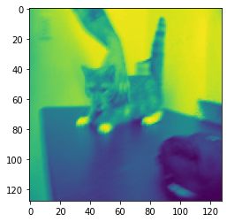
    


    
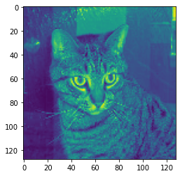
    


    
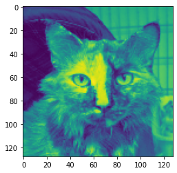
    


    
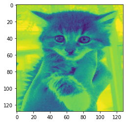
    


    
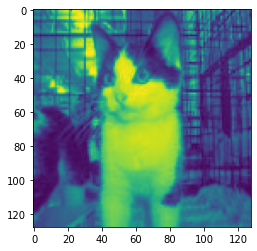
    


    
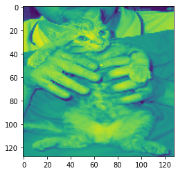
    


    
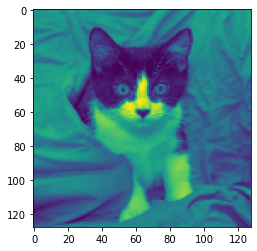
    


    
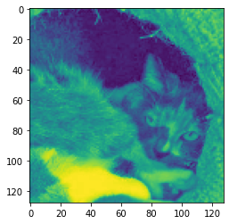
    


    
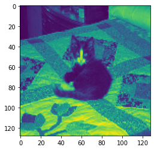
    


    
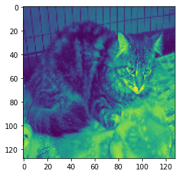
    


    X_list shape: (2000, 128, 128) Y_list shape (2000,)
    


```python
# Train set, Test set 으로 나누기
x_train , x_test , y_train , y_test = train_test_split(X,Y, test_size=0.2, random_state=5, shuffle=True)
x_train = np.array(x_train)
x_test = np.array(x_test)

# (image,image) 이미지를 (image * image) 크기의 벡터로 만듭니다.
x_train = x_train.reshape((len(x_train), np.prod(x_train.shape[1:]))).astype('float32')
x_test = x_test.reshape((len(x_test), np.prod(x_test.shape[1:]))).astype('float32')

print("Datasets_train_shape:{} Datasets_test_shape:{}".format(np.shape(x_train),np.shape(x_test)))
```

    Datasets_train_shape:(1600, 16384) Datasets_test_shape:(400, 16384)
    

## 2. VAE 모델만들기


```python
# 네트워크 파라메타
input_shape = np.shape(x_train[0])[0]
original_dim = input_shape
_1st_dim = 4096
_2nd_dim = 2048
_3rd_dim = 1024
_4th_dim = 512
_5th_dim = 256
latent_dim = 2
```

## 3. Encoder 생성


```python
def encoder():
    # 인코더의 입력층을 생성
    inputs = Input(shape=(input_shape,), name='input_shape')
    
    # 인코더의 hidden층을 생성, 500개의 유닛을 사용
    encoder_hidden = layers.Dense(_1st_dim, activation = 'relu', name='encoder_hidden1')(inputs)
    encoder_hidden = layers.Dense(_2nd_dim, activation = 'relu', name='encoder_hidden2')(encoder_hidden)
    encoder_hidden = layers.Dense(_3rd_dim, activation = 'relu', name='encoder_hidden3')(encoder_hidden)
    encoder_hidden = layers.Dense(_4th_dim, activation = 'relu', name='encoder_hidden4')(encoder_hidden)
    encoder_hidden = layers.Dense(_5th_dim, activation = 'relu', name='encoder_hidden5')(encoder_hidden)
    
    # 평균(mean)과 표준편차(sigma)층을 정의
    # 이떄 sigma 대신 log variance를 사용. 신경망의 출력은 음수를 가질 수 있지만, sigma는 항상 양수여야함
    # 각각 2개의 유닛을 사용.
    z_mean = layers.Dense(latent_dim, name='z_mean')(encoder_hidden)
    z_log_var = layers.Dense(latent_dim, name='z_log_var')(encoder_hidden)
    
    # 평균과 표준편차를 매핑하여 Z_sampling층 생성
    
    # Z 샘플링 함수 생성
    def sampling(args):
        z_mean, z_log_var = args
        batch = shape(z_mean)[0]
        dim = shape(z_mean)[1]
        
        # 보편적으로 , 정규분포의 평균은 0, 표준편차는 1
        # Reparameterization Trick사용을 위해 Gussian(=normal)분포에서 랜덤변수(sample) 입실론 추출
        epsilon = tf.compat.v2.random.normal(shape=(batch,dim))
        return z_mean + tf.math.exp(0.5 * z_log_var) * epsilon
    
    # layers.Lambda API 래핑에 사용할 함수와, 유닛수(n, )를 지정
    z_sampling = layers.Lambda(sampling, (latent_dim), name='z_sample')([z_mean, z_log_var])
    
    # 하나의 입력과 다중출력을 포함하는 encoder 모델 생성
    return Model(inputs, [z_mean, z_log_var,z_sampling], name='encoder')

encoder = encoder()

encoder.summary()
plot_model(encoder, to_file='vae_mip_encoder.png', show_shapes=True)
```

    Model: "encoder"
    __________________________________________________________________________________________________
    Layer (type)                    Output Shape         Param #     Connected to                     
    ==================================================================================================
    input_shape (InputLayer)        [(None, 16384)]      0                                            
    __________________________________________________________________________________________________
    encoder_hidden1 (Dense)         (None, 4096)         67112960    input_shape[0][0]                
    __________________________________________________________________________________________________
    encoder_hidden2 (Dense)         (None, 2048)         8390656     encoder_hidden1[0][0]            
    __________________________________________________________________________________________________
    encoder_hidden3 (Dense)         (None, 1024)         2098176     encoder_hidden2[0][0]            
    __________________________________________________________________________________________________
    encoder_hidden4 (Dense)         (None, 512)          524800      encoder_hidden3[0][0]            
    __________________________________________________________________________________________________
    encoder_hidden5 (Dense)         (None, 256)          131328      encoder_hidden4[0][0]            
    __________________________________________________________________________________________________
    z_mean (Dense)                  (None, 2)            514         encoder_hidden5[0][0]            
    __________________________________________________________________________________________________
    z_log_var (Dense)               (None, 2)            514         encoder_hidden5[0][0]            
    __________________________________________________________________________________________________
    z_sample (Lambda)               (None, 2)            0           z_mean[0][0]                     
                                                                     z_log_var[0][0]                  
    ==================================================================================================
    Total params: 78,258,948
    Trainable params: 78,258,948
    Non-trainable params: 0
    __________________________________________________________________________________________________
    


    
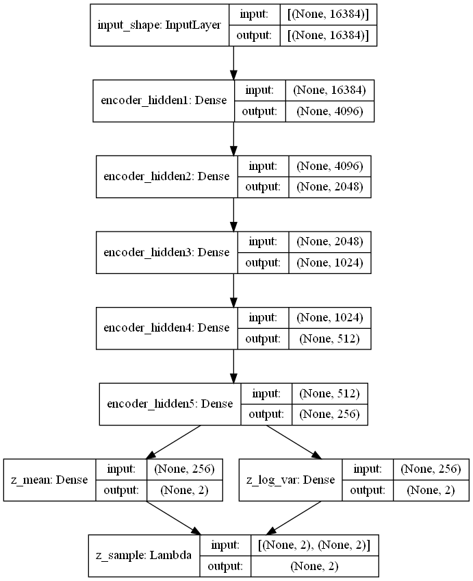
    


## 4. Decoder 생성


```python
def decoder():
    
    # 디코더의 입력층을 생성. Decoder의 입력은 latent
    input_z = Input(shape=(latent_dim,), name='input_z')
    
    # 디코더의 hidden층을 생성. 인코더와 동일하게 500개의 유닛을 사용
    decoder_hidden = layers.Dense(_5th_dim, activation='relu', name='decoder_hidden1')(input_z)
    decoder_hidden = layers.Dense(_4th_dim, activation='relu', name='decoder_hidden2')(decoder_hidden)
    decoder_hidden = layers.Dense(_3rd_dim, activation='relu', name='decoder_hidden3')(decoder_hidden)
    decoder_hidden = layers.Dense(_2nd_dim, activation='relu', name='decoder_hidden4')(decoder_hidden)
    decoder_hidden = layers.Dense(_1st_dim, activation='relu', name='decoder_hidden5')(decoder_hidden)

    # 디코더의 출력층은 인코더 입력벡터 수만큼 유닛을 사용
    outputs = layers.Dense(original_dim, activation = 'sigmoid', name='output')(decoder_hidden)
    
    return Model(input_z, outputs, name='decoder')

decoder = decoder()

decoder.summary()
plot_model(decoder, to_file='vae_mlp_decoder.png', show_shapes=True)
```

    Model: "decoder"
    _________________________________________________________________
    Layer (type)                 Output Shape              Param #   
    =================================================================
    input_z (InputLayer)         [(None, 2)]               0         
    _________________________________________________________________
    decoder_hidden1 (Dense)      (None, 256)               768       
    _________________________________________________________________
    decoder_hidden2 (Dense)      (None, 512)               131584    
    _________________________________________________________________
    decoder_hidden3 (Dense)      (None, 1024)              525312    
    _________________________________________________________________
    decoder_hidden4 (Dense)      (None, 2048)              2099200   
    _________________________________________________________________
    decoder_hidden5 (Dense)      (None, 4096)              8392704   
    _________________________________________________________________
    output (Dense)               (None, 16384)             67125248  
    =================================================================
    Total params: 78,274,816
    Trainable params: 78,274,816
    Non-trainable params: 0
    _________________________________________________________________
    


    
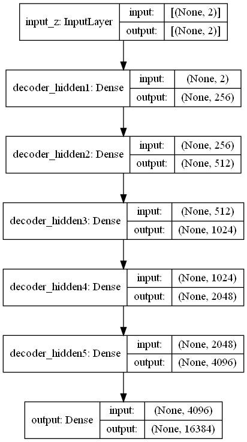
    


## 5. VAE모델 생성


```python
def vae():
    # vae는 입력으로 이미지가 들어와 encoder를 통해 z_sampling 되어 decoder로 출력
    inputs = Input(shape=(input_shape), name='input_shape')
    outputs = decoder(encoder(inputs)[2]) #[0]:z_mean, [1]:z_olg_var , [2]:z_sampling
    
    return Model(inputs, outputs, name='vae_mlp')

# VAE 모델 정의
model = vae()
model.summary()
plot_model(model, to_file='vae_mip.png', show_shapes=True)
```

    Model: "vae_mlp"
    _________________________________________________________________
    Layer (type)                 Output Shape              Param #   
    =================================================================
    input_shape (InputLayer)     [(None, 16384)]           0         
    _________________________________________________________________
    encoder (Functional)         [(None, 2), (None, 2), (N 78258948  
    _________________________________________________________________
    decoder (Functional)         (None, 16384)             78274816  
    =================================================================
    Total params: 156,533,764
    Trainable params: 156,533,764
    Non-trainable params: 0
    _________________________________________________________________
    


    
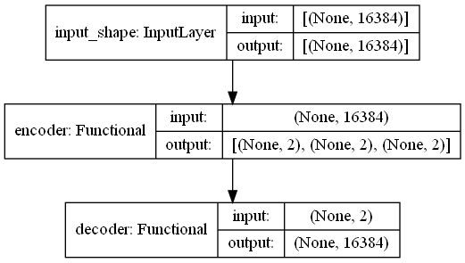
    


```python
# 하이퍼 파라메타 설정
num_epochs = 2000
batch_size = 20
learning_rate = 1e-4
```


```python
# 모델 학습 loss, optimizer 정의
adam = tf.keras.optimizers.Adam(learning_rate = learning_rate)
def vae_loss(x,recon_x):
    # (1)Reconstruct loss (Marginal_likelihood) : Cross-entropy
    z_mean, z_log_var, z_sampling = encoder(x)
    recon_x = decoder(z_sampling)
    reconstruction_loss = binary_crossentropy(x, recon_x)
    # reconstruction_loss = mse(inputs, outputs)
    reconstruction_loss *= original_dim
    # (2) KL divergence(Latent_loss)
    kl_loss = 0.5 * tf.reduce_sum(tf.square(z_mean)+tf.exp(z_log_var)-z_log_var -1, 1)
    return tf.reduce_mean(reconstruction_loss + kl_loss) #ELBO(=VAE_loss)

model.compile(optimizer=adam, loss=vae_loss)
```


```python
# 모델 학습
hist = model.fit(x_train, x_train, epochs=num_epochs, batch_size=batch_size)
# 학습된 VAE 모델 저장
model.save_weights('vae_bracket.h5')
```

    Epoch 1/2000
    80/80 [==============================] - 5s 32ms/step - loss: 11301.0898
    Epoch 2/2000
    80/80 [==============================] - 2s 31ms/step - loss: 11051.1826
    Epoch 3/2000
    80/80 [==============================] - 3s 31ms/step - loss: 10983.7158
    Epoch 4/2000
    80/80 [==============================] - 3s 35ms/step - loss: 10962.1172
    Epoch 5/2000
    80/80 [==============================] - 3s 34ms/step - loss: 10858.4512: 0s - loss: 10
    Epoch 6/2000
    80/80 [==============================] - 3s 34ms/step - loss: 10662.2930
    Epoch 7/2000
    80/80 [==============================] - 3s 33ms/step - loss: 10599.7363
    Epoch 8/2000
    80/80 [==============================] - 3s 33ms/step - loss: 10595.2646
    Epoch 9/2000
    80/80 [==============================] - 3s 33ms/step - loss: 10588.6348
    Epoch 10/2000
    80/80 [==============================] - 3s 33ms/step - loss: 10585.7402
    Epoch 11/2000
    80/80 [==============================] - 3s 33ms/step - loss: 10580.5859
    Epoch 12/2000
    80/80 [==============================] - 3s 33ms/step - loss: 10580.0127: 1s - 
    Epoch 13/2000
    80/80 [==============================] - 3s 33ms/step - loss: 10578.6533: 0s - loss: 105
    Epoch 14/2000
    80/80 [==============================] - 3s 33ms/step - loss: 10577.3037: 0s - loss: 10
    Epoch 15/2000
    80/80 [==============================] - 3s 33ms/step - loss: 10580.7324
    Epoch 16/2000
    80/80 [==============================] - 3s 35ms/step - loss: 10575.7451: 0s - loss: 10575.35
    Epoch 17/2000
    80/80 [==============================] - 3s 34ms/step - loss: 10573.6250
    Epoch 18/2000
    80/80 [==============================] - 3s 34ms/step - loss: 10575.0967: 0s - loss: 
    Epoch 19/2000
    80/80 [==============================] - 3s 33ms/step - loss: 10570.1846: 0s - loss: 1 - ETA: 0s - loss: 10573.1
    Epoch 20/2000
    80/80 [==============================] - 3s 33ms/step - loss: 10569.1924: 0s - loss: 10571.2
    Epoch 21/2000
    80/80 [==============================] - 3s 34ms/step - loss: 10570.3691
    Epoch 22/2000
    80/80 [==============================] - 3s 33ms/step - loss: 10562.1260: 1s -
    Epoch 23/2000
    80/80 [==============================] - 3s 33ms/step - loss: 10565.9062
    Epoch 24/2000
    80/80 [==============================] - 3s 34ms/step - loss: 10572.7803
    Epoch 25/2000
    80/80 [==============================] - 3s 34ms/step - loss: 10558.5488: 1s - ETA: 0s - loss: 10556.210
    Epoch 26/2000
    80/80 [==============================] - 3s 33ms/step - loss: 10575.8867
    Epoch 27/2000
    80/80 [==============================] - 3s 34ms/step - loss: 10559.3916: 1s -
    Epoch 28/2000
    80/80 [==============================] - 3s 34ms/step - loss: 10556.5430
    Epoch 29/2000
    80/80 [==============================] - 3s 34ms/step - loss: 10560.4805
    Epoch 30/2000
    80/80 [==============================] - 3s 33ms/step - loss: 10562.2227: 0s - los
    Epoch 31/2000
    80/80 [==============================] - 3s 33ms/step - loss: 10586.9902: 0s - l
    Epoch 32/2000
    80/80 [==============================] - 3s 34ms/step - loss: 10577.1914
    Epoch 33/2000
    80/80 [==============================] - 3s 33ms/step - loss: 10545.8438
    Epoch 34/2000
    80/80 [==============================] - 3s 34ms/step - loss: 10522.4336: 0s - loss: 10519.6
    Epoch 35/2000
    80/80 [==============================] - 3s 34ms/step - loss: 10559.9678: 1s - loss: 10538.6 - ETA: 1s 
    Epoch 36/2000
    80/80 [==============================] - 3s 34ms/step - loss: 10537.3008
    Epoch 37/2000
    80/80 [==============================] - 3s 33ms/step - loss: 10528.4883
    Epoch 38/2000
    80/80 [==============================] - 3s 34ms/step - loss: 10539.5391
    Epoch 39/2000
    80/80 [==============================] - 3s 33ms/step - loss: 10529.1689
    Epoch 40/2000
    80/80 [==============================] - 3s 33ms/step - loss: 10559.9365
    Epoch 41/2000
    80/80 [==============================] - 3s 33ms/step - loss: 10524.2451
    Epoch 42/2000
    80/80 [==============================] - 3s 33ms/step - loss: 10500.7061
    Epoch 43/2000
    80/80 [==============================] - 3s 33ms/step - loss: 10504.7822
    Epoch 44/2000
    80/80 [==============================] - 3s 33ms/step - loss: 10503.4541: 0s - loss: 
    Epoch 45/2000
    80/80 [==============================] - 3s 33ms/step - loss: 10514.6641
    Epoch 46/2000
    80/80 [==============================] - 3s 33ms/step - loss: 10522.9805
    Epoch 47/2000
    80/80 [==============================] - 3s 34ms/step - loss: 10573.0508
    Epoch 48/2000
    80/80 [==============================] - 3s 33ms/step - loss: 10504.9834: 0s - loss: 10497.9
    Epoch 49/2000
    80/80 [==============================] - 3s 33ms/step - loss: 10498.9160: 1s -
    Epoch 50/2000
    80/80 [==============================] - 3s 33ms/step - loss: 10501.8848
    Epoch 51/2000
    80/80 [==============================] - 3s 33ms/step - loss: 10498.5742: 0s - lo
    Epoch 52/2000
    80/80 [==============================] - 3s 33ms/step - loss: 10513.4297
    Epoch 53/2000
    80/80 [==============================] - 3s 34ms/step - loss: 10500.0615
    Epoch 54/2000
    80/80 [==============================] - 3s 34ms/step - loss: 10503.4297
    Epoch 55/2000
    80/80 [==============================] - 3s 34ms/step - loss: 10510.3115
    Epoch 56/2000
    80/80 [==============================] - 3s 33ms/step - loss: 10502.5967
    Epoch 57/2000
    80/80 [==============================] - 3s 33ms/step - loss: 10506.4326
    Epoch 58/2000
    80/80 [==============================] - 3s 33ms/step - loss: 10513.8037
    Epoch 59/2000
    80/80 [==============================] - 3s 34ms/step - loss: 10496.1514
    Epoch 60/2000
    80/80 [==============================] - 3s 33ms/step - loss: 10494.7490
    Epoch 61/2000
    80/80 [==============================] - 3s 33ms/step - loss: 10536.8789: 0s - loss: 105
    Epoch 62/2000
    80/80 [==============================] - 3s 33ms/step - loss: 10522.1309
    Epoch 63/2000
    80/80 [==============================] - 3s 33ms/step - loss: 10515.0938
    Epoch 64/2000
    80/80 [==============================] - 3s 33ms/step - loss: 10499.4814
    Epoch 65/2000
    80/80 [==============================] - 3s 33ms/step - loss: 10508.1025
    Epoch 66/2000
    80/80 [==============================] - 3s 33ms/step - loss: 10496.5391
    Epoch 67/2000
    80/80 [==============================] - 3s 33ms/step - loss: 10552.1279: 0s - loss: 10539.52
    Epoch 68/2000
    80/80 [==============================] - 3s 34ms/step - loss: 10611.7891
    Epoch 69/2000
    80/80 [==============================] - 3s 34ms/step - loss: 10570.0791
    Epoch 70/2000
    80/80 [==============================] - 3s 33ms/step - loss: 10561.8389: 1s - loss: 10524 - ETA: 1s - loss:  - ETA: 0s - loss: 105
    Epoch 71/2000
    80/80 [==============================] - 3s 35ms/step - loss: 10553.6289
    Epoch 72/2000
    80/80 [==============================] - 3s 35ms/step - loss: 10554.9736: 0s - loss: 1056
    Epoch 73/2000
    80/80 [==============================] - 3s 32ms/step - loss: 10569.2588: 0s - loss: 10566.4
    Epoch 74/2000
    80/80 [==============================] - 3s 32ms/step - loss: 10550.0312: 1s - loss: 10567.1 - ETA: 1 - ETA: 0s - loss: 1054
    Epoch 75/2000
    80/80 [==============================] - 3s 32ms/step - loss: 10528.6387: 0s - loss: 10527.94
    Epoch 76/2000
    80/80 [==============================] - 3s 32ms/step - loss: 10536.5361
    Epoch 77/2000
    80/80 [==============================] - 3s 33ms/step - loss: 10531.1641
    Epoch 78/2000
    80/80 [==============================] - 3s 32ms/step - loss: 10534.2109
    Epoch 79/2000
    80/80 [==============================] - 3s 33ms/step - loss: 10509.3438: 0s - los
    Epoch 80/2000
    80/80 [==============================] - 3s 32ms/step - loss: 10499.6465
    Epoch 81/2000
    80/80 [==============================] - 3s 32ms/step - loss: 10518.7188
    Epoch 82/2000
    80/80 [==============================] - 3s 32ms/step - loss: 10493.6689
    Epoch 83/2000
    80/80 [==============================] - 3s 32ms/step - loss: 10512.2598
    Epoch 84/2000
    80/80 [==============================] - 3s 34ms/step - loss: 10506.6816: 0s - loss: 105
    Epoch 85/2000
    80/80 [==============================] - 3s 33ms/step - loss: 10488.6885
    Epoch 86/2000
    80/80 [==============================] - 3s 34ms/step - loss: 10494.8799
    Epoch 87/2000
    80/80 [==============================] - 3s 34ms/step - loss: 10515.6367
    Epoch 88/2000
    80/80 [==============================] - 3s 34ms/step - loss: 10484.0527: 1s 
    Epoch 89/2000
    80/80 [==============================] - 3s 34ms/step - loss: 10479.1621
    Epoch 90/2000
    80/80 [==============================] - 3s 34ms/step - loss: 10509.7217
    Epoch 91/2000
    80/80 [==============================] - 3s 34ms/step - loss: 10472.1123
    Epoch 92/2000
    80/80 [==============================] - 3s 34ms/step - loss: 10483.6348
    Epoch 93/2000
    80/80 [==============================] - 3s 33ms/step - loss: 10493.4209: 0s - loss: 10494.534
    Epoch 94/2000
    80/80 [==============================] - 3s 33ms/step - loss: 10489.4473: 0s - loss:
    Epoch 95/2000
    80/80 [==============================] - 3s 34ms/step - loss: 10492.8252
    Epoch 96/2000
    80/80 [==============================] - 3s 34ms/step - loss: 10485.8652: 0s - loss: 10
    Epoch 97/2000
    80/80 [==============================] - 3s 34ms/step - loss: 10479.5156
    Epoch 98/2000
    80/80 [==============================] - 3s 34ms/step - loss: 10482.1016
    Epoch 99/2000
    80/80 [==============================] - 3s 32ms/step - loss: 10518.4424
    Epoch 100/2000
    80/80 [==============================] - 3s 31ms/step - loss: 10557.3271
    Epoch 101/2000
    80/80 [==============================] - 3s 32ms/step - loss: 10526.8262
    Epoch 102/2000
    80/80 [==============================] - 3s 32ms/step - loss: 10522.6084: 
    Epoch 103/2000
    80/80 [==============================] - 3s 32ms/step - loss: 10524.8096: 1s - loss: 10553.307 - ETA: - ETA: 0s - loss: 10
    Epoch 104/2000
    80/80 [==============================] - 3s 32ms/step - loss: 10520.5312
    Epoch 105/2000
    80/80 [==============================] - 2s 31ms/step - loss: 10508.3574: 0s - loss: 10508.739 - ETA: 0s - loss: 10510.4
    Epoch 106/2000
    80/80 [==============================] - 3s 32ms/step - loss: 10495.7617: 0s - loss: 10497
    Epoch 107/2000
    80/80 [==============================] - 3s 32ms/step - loss: 10532.7451:
    Epoch 108/2000
    80/80 [==============================] - 3s 32ms/step - loss: 10509.1367
    Epoch 109/2000
    80/80 [==============================] - 3s 31ms/step - loss: 10499.9053
    Epoch 110/2000
    80/80 [==============================] - 3s 32ms/step - loss: 10491.1484
    Epoch 111/2000
    80/80 [==============================] - 3s 33ms/step - loss: 10500.9727: 0s - loss: 104
    Epoch 112/2000
    80/80 [==============================] - 3s 33ms/step - loss: 10493.9277: 1s - loss: 10465.5 - ETA
    Epoch 113/2000
    80/80 [==============================] - 3s 34ms/step - loss: 10491.4951: 0s - loss: 
    Epoch 114/2000
    80/80 [==============================] - 3s 33ms/step - loss: 10480.8135
    Epoch 115/2000
    80/80 [==============================] - 3s 32ms/step - loss: 10480.3926
    Epoch 116/2000
    80/80 [==============================] - 3s 32ms/step - loss: 10500.5049
    Epoch 117/2000
    80/80 [==============================] - 3s 33ms/step - loss: 10501.5430
    Epoch 118/2000
    80/80 [==============================] - 3s 34ms/step - loss: 10505.6611
    Epoch 119/2000
    80/80 [==============================] - 3s 33ms/step - loss: 10499.1348
    Epoch 120/2000
    80/80 [==============================] - 3s 34ms/step - loss: 10504.4199
    Epoch 121/2000
    80/80 [==============================] - 3s 33ms/step - loss: 10483.9961
    Epoch 122/2000
    80/80 [==============================] - 3s 33ms/step - loss: 10502.3711
    Epoch 123/2000
    80/80 [==============================] - 3s 33ms/step - loss: 10504.0762
    Epoch 124/2000
    80/80 [==============================] - 3s 33ms/step - loss: 10497.1289
    Epoch 125/2000
    80/80 [==============================] - 3s 32ms/step - loss: 10492.1123
    Epoch 126/2000
    80/80 [==============================] - 3s 32ms/step - loss: 10474.0820: 0s - loss: 10475
    Epoch 127/2000
    80/80 [==============================] - 3s 34ms/step - loss: 10491.6367: 0s - loss:
    Epoch 128/2000
    80/80 [==============================] - 3s 32ms/step - loss: 10496.7002:  - ETA: 0s - lo
    Epoch 129/2000
    80/80 [==============================] - 3s 32ms/step - loss: 10501.5059: 0s - 
    Epoch 130/2000
    80/80 [==============================] - 3s 32ms/step - loss: 10525.7500: 0s - loss: 1052
    Epoch 131/2000
    80/80 [==============================] - 3s 32ms/step - loss: 10495.0312: 0s - loss: 1
    Epoch 132/2000
    80/80 [==============================] - 3s 33ms/step - loss: 10489.1475: 0s - loss:
    Epoch 133/2000
    80/80 [==============================] - 3s 33ms/step - loss: 10488.7090
    Epoch 134/2000
    80/80 [==============================] - 3s 32ms/step - loss: 10480.1035: 0s - loss
    Epoch 135/2000
    80/80 [==============================] - 3s 32ms/step - loss: 10480.8877
    Epoch 136/2000
    80/80 [==============================] - 3s 32ms/step - loss: 10477.8896
    Epoch 137/2000
    80/80 [==============================] - 3s 33ms/step - loss: 10467.1104: 0s - loss: 1
    Epoch 138/2000
    80/80 [==============================] - 3s 32ms/step - loss: 10472.4268: 1s - ETA: 0s - loss: 1047
    Epoch 139/2000
    80/80 [==============================] - 3s 32ms/step - loss: 10470.0391: 0s - loss: 10477.4
    Epoch 140/2000
    80/80 [==============================] - 3s 32ms/step - loss: 10485.4873: 0s - loss:
    Epoch 141/2000
    80/80 [==============================] - 3s 32ms/step - loss: 10486.0547
    Epoch 142/2000
    80/80 [==============================] - 3s 32ms/step - loss: 10488.5820
    Epoch 143/2000
    80/80 [==============================] - 3s 33ms/step - loss: 10465.8486
    Epoch 144/2000
    80/80 [==============================] - 3s 33ms/step - loss: 10457.6016: 0s - los
    Epoch 145/2000
    80/80 [==============================] - 3s 33ms/step - loss: 10465.3711
    Epoch 146/2000
    80/80 [==============================] - 3s 34ms/step - loss: 10461.0879
    Epoch 147/2000
    80/80 [==============================] - 3s 33ms/step - loss: 10446.4180
    Epoch 148/2000
    80/80 [==============================] - 3s 32ms/step - loss: 10470.5029
    Epoch 149/2000
    80/80 [==============================] - 3s 32ms/step - loss: 10467.7354
    Epoch 150/2000
    80/80 [==============================] - 3s 32ms/step - loss: 10444.5859: 0s - loss: 104
    Epoch 151/2000
    80/80 [==============================] - 3s 33ms/step - loss: 10449.9609
    Epoch 152/2000
    80/80 [==============================] - 3s 32ms/step - loss: 10450.2461
    Epoch 153/2000
    80/80 [==============================] - 3s 32ms/step - loss: 10463.8516
    Epoch 154/2000
    80/80 [==============================] - 3s 32ms/step - loss: 10455.9023
    Epoch 155/2000
    80/80 [==============================] - 3s 32ms/step - loss: 10452.1865
    Epoch 156/2000
    80/80 [==============================] - 3s 33ms/step - loss: 10456.3740
    Epoch 157/2000
    80/80 [==============================] - 3s 32ms/step - loss: 10444.8271
    Epoch 158/2000
    80/80 [==============================] - 3s 32ms/step - loss: 10465.2285: 0s - loss: 10457.
    Epoch 159/2000
    80/80 [==============================] - 3s 33ms/step - loss: 10467.9365
    Epoch 160/2000
    80/80 [==============================] - 3s 32ms/step - loss: 10461.7344: 1 - ETA: 0s - loss: 
    Epoch 161/2000
    80/80 [==============================] - 3s 32ms/step - loss: 10449.3779
    Epoch 162/2000
    80/80 [==============================] - 3s 32ms/step - loss: 10462.9238
    Epoch 163/2000
    80/80 [==============================] - 3s 32ms/step - loss: 10466.7383: 0s - loss: 10460.9
    Epoch 164/2000
    80/80 [==============================] - 3s 32ms/step - loss: 10443.3105
    Epoch 165/2000
    80/80 [==============================] - 3s 33ms/step - loss: 10427.6152
    Epoch 166/2000
    80/80 [==============================] - 3s 33ms/step - loss: 10427.1777: 0s - loss: 10430
    Epoch 167/2000
    80/80 [==============================] - 3s 33ms/step - loss: 10445.6992
    Epoch 168/2000
    80/80 [==============================] - 3s 34ms/step - loss: 10447.2812
    Epoch 169/2000
    80/80 [==============================] - 3s 33ms/step - loss: 10434.1221
    Epoch 170/2000
    80/80 [==============================] - 3s 33ms/step - loss: 10420.9648: 1s - loss - ETA: 0s - loss
    Epoch 171/2000
    80/80 [==============================] - 3s 32ms/step - loss: 10404.4453
    Epoch 172/2000
    80/80 [==============================] - 3s 32ms/step - loss: 10407.8975
    Epoch 173/2000
    80/80 [==============================] - 3s 32ms/step - loss: 10417.6289: 1s - los - ETA: 0s - loss: 
    Epoch 174/2000
    80/80 [==============================] - 3s 32ms/step - loss: 10403.4590
    Epoch 175/2000
    80/80 [==============================] - 3s 32ms/step - loss: 10432.5068
    Epoch 176/2000
    80/80 [==============================] - 3s 34ms/step - loss: 10424.3965
    Epoch 177/2000
    80/80 [==============================] - 3s 34ms/step - loss: 10419.8760
    Epoch 178/2000
    80/80 [==============================] - 3s 34ms/step - loss: 10418.6816:
    Epoch 179/2000
    80/80 [==============================] - 3s 33ms/step - loss: 10434.7129 ETA: 0s - loss: 104
    Epoch 180/2000
    80/80 [==============================] - 3s 33ms/step - loss: 10426.9092: 0s - loss: 104
    Epoch 181/2000
    80/80 [==============================] - 3s 33ms/step - loss: 10430.1973
    Epoch 182/2000
    80/80 [==============================] - 3s 33ms/step - loss: 10420.3320
    Epoch 183/2000
    80/80 [==============================] - 3s 34ms/step - loss: 10387.3105
    Epoch 184/2000
    80/80 [==============================] - 3s 35ms/step - loss: 10389.7920
    Epoch 185/2000
    80/80 [==============================] - 3s 33ms/step - loss: 10394.4229
    Epoch 186/2000
    80/80 [==============================] - 3s 33ms/step - loss: 10395.3564
    Epoch 187/2000
    80/80 [==============================] - 3s 32ms/step - loss: 10388.7822
    Epoch 188/2000
    80/80 [==============================] - 3s 33ms/step - loss: 10389.0059
    Epoch 189/2000
    80/80 [==============================] - 3s 32ms/step - loss: 10415.5234: 1s - loss: 10416.8 - ETA: 1s
    Epoch 190/2000
    80/80 [==============================] - 3s 32ms/step - loss: 10411.5098
    Epoch 191/2000
    80/80 [==============================] - 3s 32ms/step - loss: 10391.2344: 1s - lo - ETA: 1s -
    Epoch 192/2000
    80/80 [==============================] - 3s 32ms/step - loss: 10398.9814
    Epoch 193/2000
    80/80 [==============================] - 3s 32ms/step - loss: 10422.2490
    Epoch 194/2000
    80/80 [==============================] - 3s 32ms/step - loss: 10399.7529: 1s - loss: 10383.4 - 
    Epoch 195/2000
    80/80 [==============================] - 3s 32ms/step - loss: 10382.4062: 1s - loss:  - ETA: 1s
    Epoch 196/2000
    80/80 [==============================] - 3s 34ms/step - loss: 10378.8379
    Epoch 197/2000
    80/80 [==============================] - 3s 35ms/step - loss: 10388.5703: 1
    Epoch 198/2000
    80/80 [==============================] - 3s 34ms/step - loss: 10378.2500
    Epoch 199/2000
    80/80 [==============================] - 3s 34ms/step - loss: 10379.8506
    Epoch 200/2000
    80/80 [==============================] - 3s 33ms/step - loss: 10373.2266
    Epoch 201/2000
    80/80 [==============================] - 3s 32ms/step - loss: 10369.5391: 0s - loss: 
    Epoch 202/2000
    80/80 [==============================] - 3s 33ms/step - loss: 10366.5459
    Epoch 203/2000
    80/80 [==============================] - 3s 32ms/step - loss: 10372.0811
    Epoch 204/2000
    80/80 [==============================] - 3s 33ms/step - loss: 10380.5283: 0s - loss:
    Epoch 205/2000
    80/80 [==============================] - 3s 33ms/step - loss: 10377.8379
    Epoch 206/2000
    80/80 [==============================] - 3s 33ms/step - loss: 10379.8672
    Epoch 207/2000
    80/80 [==============================] - 3s 33ms/step - loss: 10456.4424
    Epoch 208/2000
    80/80 [==============================] - 3s 33ms/step - loss: 10418.7217
    Epoch 209/2000
    80/80 [==============================] - 3s 32ms/step - loss: 10455.8516
    Epoch 210/2000
    80/80 [==============================] - 3s 32ms/step - loss: 10499.1797
    Epoch 211/2000
    80/80 [==============================] - 3s 32ms/step - loss: 10489.0908: 1s -
    Epoch 212/2000
    80/80 [==============================] - 3s 32ms/step - loss: 10509.0479: 0s - l
    Epoch 213/2000
    80/80 [==============================] - 3s 32ms/step - loss: 10497.7354
    Epoch 214/2000
    80/80 [==============================] - 3s 33ms/step - loss: 10504.9102
    Epoch 215/2000
    80/80 [==============================] - 3s 33ms/step - loss: 10478.8096
    Epoch 216/2000
    80/80 [==============================] - 3s 33ms/step - loss: 10509.3477
    Epoch 217/2000
    80/80 [==============================] - 3s 33ms/step - loss: 10521.1299
    Epoch 218/2000
    80/80 [==============================] - 3s 32ms/step - loss: 10499.7529
    Epoch 219/2000
    80/80 [==============================] - 3s 33ms/step - loss: 10526.3984: 2s - loss: 10513
    Epoch 220/2000
    80/80 [==============================] - 3s 33ms/step - loss: 10501.9033
    Epoch 221/2000
    80/80 [==============================] - 3s 33ms/step - loss: 10518.2979
    Epoch 222/2000
    80/80 [==============================] - 3s 34ms/step - loss: 10493.7314
    Epoch 223/2000
    80/80 [==============================] - 3s 34ms/step - loss: 10504.8438
    Epoch 224/2000
    80/80 [==============================] - 3s 34ms/step - loss: 10485.8076
    Epoch 225/2000
    80/80 [==============================] - 3s 34ms/step - loss: 10482.7383
    Epoch 226/2000
    80/80 [==============================] - 3s 34ms/step - loss: 10492.1367: 2s  - ETA: 1s -
    Epoch 227/2000
    80/80 [==============================] - 3s 36ms/step - loss: 10499.1748: 0s - loss
    Epoch 228/2000
    80/80 [==============================] - 3s 31ms/step - loss: 10484.0264: 1s
    Epoch 229/2000
    80/80 [==============================] - 3s 31ms/step - loss: 10466.1777
    Epoch 230/2000
    80/80 [==============================] - 3s 32ms/step - loss: 10481.5654: 1s  - ETA: 0s - loss: 10483.6 - ETA: 0s - loss: 10476.8
    Epoch 231/2000
    80/80 [==============================] - 3s 32ms/step - loss: 10497.9102
    Epoch 232/2000
    80/80 [==============================] - 3s 32ms/step - loss: 10469.3447
    Epoch 233/2000
    80/80 [==============================] - 3s 32ms/step - loss: 10470.6270
    Epoch 234/2000
    80/80 [==============================] - 3s 32ms/step - loss: 10455.9297: 0s - loss:
    Epoch 235/2000
    80/80 [==============================] - 3s 32ms/step - loss: 10454.0684: 0s - loss: 1045
    Epoch 236/2000
    80/80 [==============================] - 3s 32ms/step - loss: 10447.3037: 0s - loss: 10446.193
    Epoch 237/2000
    80/80 [==============================] - 3s 32ms/step - loss: 10463.5566
    Epoch 238/2000
    80/80 [==============================] - 3s 32ms/step - loss: 10474.0078
    Epoch 239/2000
    80/80 [==============================] - 3s 32ms/step - loss: 10460.5205
    Epoch 240/2000
    80/80 [==============================] - 3s 32ms/step - loss: 10469.6201: 0s - loss: 10469.4
    Epoch 241/2000
    80/80 [==============================] - 3s 32ms/step - loss: 10454.4561
    Epoch 242/2000
    80/80 [==============================] - 3s 32ms/step - loss: 10468.3477
    Epoch 243/2000
    80/80 [==============================] - 3s 32ms/step - loss: 10492.7490
    Epoch 244/2000
    80/80 [==============================] - 3s 32ms/step - loss: 10462.6191: 2s - loss: 10 - ETA: 1s - loss: 10449.31
    Epoch 245/2000
    80/80 [==============================] - 3s 32ms/step - loss: 10461.1592
    Epoch 246/2000
    80/80 [==============================] - 3s 32ms/step - loss: 10452.7754: 2s - loss: 1045 - ETA: 0s - loss: 10460.528
    Epoch 247/2000
    80/80 [==============================] - 3s 32ms/step - loss: 10446.9756: 1s
    Epoch 248/2000
    80/80 [==============================] - 3s 32ms/step - loss: 10474.2217
    Epoch 249/2000
    80/80 [==============================] - 3s 32ms/step - loss: 10473.8213
    Epoch 250/2000
    80/80 [==============================] - 3s 32ms/step - loss: 10465.2373: 1s - los - ETA: 0s - loss
    Epoch 251/2000
    80/80 [==============================] - 3s 31ms/step - loss: 10464.0205
    Epoch 252/2000
    80/80 [==============================] - 3s 32ms/step - loss: 10454.7422
    Epoch 253/2000
    80/80 [==============================] - 3s 32ms/step - loss: 10465.0371
    Epoch 254/2000
    80/80 [==============================] - 2s 31ms/step - loss: 10447.3047
    Epoch 255/2000
    80/80 [==============================] - 2s 31ms/step - loss: 10449.5752
    Epoch 256/2000
    80/80 [==============================] - 2s 31ms/step - loss: 10493.4561: 0s - loss: 10 - ETA: 0s - loss: 10490.244
    Epoch 257/2000
    80/80 [==============================] - ETA: 0s - loss: 10456.2188- ETA: 0s - l - 3s 32ms/step - loss: 10456.2939
    Epoch 258/2000
    80/80 [==============================] - 3s 31ms/step - loss: 10471.1328
    Epoch 259/2000
    80/80 [==============================] - 3s 32ms/step - loss: 10480.2578
    Epoch 260/2000
    80/80 [==============================] - 2s 31ms/step - loss: 10443.2686
    Epoch 261/2000
    80/80 [==============================] - 2s 31ms/step - loss: 10443.5430: 0s - loss: 10435.
    Epoch 262/2000
    80/80 [==============================] - 2s 31ms/step - loss: 10458.8945: 0s - loss: 10445
    Epoch 263/2000
    80/80 [==============================] - 3s 34ms/step - loss: 10427.2900
    Epoch 264/2000
    80/80 [==============================] - 3s 32ms/step - loss: 10510.6777: 1s - los - ETA: 0s - loss: 10
    Epoch 265/2000
    80/80 [==============================] - 3s 33ms/step - loss: 10447.1123
    Epoch 266/2000
    80/80 [==============================] - 3s 32ms/step - loss: 10475.3174
    Epoch 267/2000
    80/80 [==============================] - 3s 33ms/step - loss: 10446.6885
    Epoch 268/2000
    80/80 [==============================] - 3s 33ms/step - loss: 10432.9473
    Epoch 269/2000
    80/80 [==============================] - 3s 33ms/step - loss: 10536.3877
    Epoch 270/2000
    80/80 [==============================] - 3s 33ms/step - loss: 10528.4473: 0s - loss: 1052
    Epoch 271/2000
    80/80 [==============================] - 3s 33ms/step - loss: 10511.9961: 0s - loss: 10521.
    Epoch 272/2000
    80/80 [==============================] - 3s 34ms/step - loss: 10456.1846
    Epoch 273/2000
    80/80 [==============================] - 3s 34ms/step - loss: 10430.5859
    Epoch 274/2000
    80/80 [==============================] - 3s 34ms/step - loss: 10443.9570: 1s - loss: 1 - ETA: 0s - loss: 1
    Epoch 275/2000
    80/80 [==============================] - 3s 33ms/step - loss: 10437.8477
    Epoch 276/2000
    80/80 [==============================] - 3s 35ms/step - loss: 10453.0684: 0s - loss
    Epoch 277/2000
    80/80 [==============================] - 3s 33ms/step - loss: 10487.3633: 0s - lo
    Epoch 278/2000
    80/80 [==============================] - 3s 33ms/step - loss: 10447.4580
    Epoch 279/2000
    80/80 [==============================] - 3s 33ms/step - loss: 10453.5117
    Epoch 280/2000
    80/80 [==============================] - 3s 33ms/step - loss: 10478.0254: 1s - loss: - ETA: 0s - loss:
    Epoch 281/2000
    80/80 [==============================] - 3s 32ms/step - loss: 10461.6680: 0s - loss: 10
    Epoch 282/2000
    80/80 [==============================] - 3s 32ms/step - loss: 10420.1182: 0s - loss: 10
    Epoch 283/2000
    80/80 [==============================] - 3s 33ms/step - loss: 10433.5322
    Epoch 284/2000
    80/80 [==============================] - 3s 32ms/step - loss: 10426.3584
    Epoch 285/2000
    80/80 [==============================] - 3s 33ms/step - loss: 10438.5439: 2s - loss:  - ETA: 1s - loss: 10433.73 - ETA: 1
    Epoch 286/2000
    80/80 [==============================] - 3s 33ms/step - loss: 10427.3164: 2s  - ETA: 1s -
    Epoch 287/2000
    80/80 [==============================] - 3s 33ms/step - loss: 10414.1553
    Epoch 288/2000
    80/80 [==============================] - 3s 32ms/step - loss: 10424.0840
    Epoch 289/2000
    80/80 [==============================] - 3s 33ms/step - loss: 10418.7959
    Epoch 290/2000
    80/80 [==============================] - 3s 33ms/step - loss: 10431.2793
    Epoch 291/2000
    80/80 [==============================] - 3s 33ms/step - loss: 10442.1221
    Epoch 292/2000
    80/80 [==============================] - 3s 32ms/step - loss: 10418.8135
    Epoch 293/2000
    80/80 [==============================] - 3s 33ms/step - loss: 10432.5332
    Epoch 294/2000
    80/80 [==============================] - 3s 32ms/step - loss: 10457.4131
    Epoch 295/2000
    80/80 [==============================] - 3s 34ms/step - loss: 10452.3604
    Epoch 296/2000
    80/80 [==============================] - 3s 33ms/step - loss: 10472.7529: 0s - loss: 104
    Epoch 297/2000
    80/80 [==============================] - 3s 33ms/step - loss: 10432.4434: 2s  - ETA: 1s - 
    Epoch 298/2000
    80/80 [==============================] - 3s 33ms/step - loss: 10423.4727: 2s - loss: 103 - ET - ETA: 0s - loss: 104
    Epoch 299/2000
    80/80 [==============================] - 3s 33ms/step - loss: 10410.9023
    Epoch 300/2000
    80/80 [==============================] - 3s 33ms/step - loss: 10414.6201:
    Epoch 301/2000
    80/80 [==============================] - 3s 33ms/step - loss: 10429.5615
    Epoch 302/2000
    80/80 [==============================] - 3s 34ms/step - loss: 10412.9873
    Epoch 303/2000
    80/80 [==============================] - 3s 34ms/step - loss: 10416.6816
    Epoch 304/2000
    80/80 [==============================] - 3s 34ms/step - loss: 10396.8223
    Epoch 305/2000
    80/80 [==============================] - 3s 34ms/step - loss: 10380.8545
    Epoch 306/2000
    80/80 [==============================] - 3s 32ms/step - loss: 10388.9189: 1s -
    Epoch 307/2000
    80/80 [==============================] - 3s 33ms/step - loss: 10402.6367
    Epoch 308/2000
    80/80 [==============================] - 3s 33ms/step - loss: 10398.3369
    Epoch 309/2000
    80/80 [==============================] - 3s 33ms/step - loss: 10416.0186
    Epoch 310/2000
    80/80 [==============================] - 3s 32ms/step - loss: 10422.0898: 0s - loss: 10
    Epoch 311/2000
    80/80 [==============================] - 3s 33ms/step - loss: 10388.3408
    Epoch 312/2000
    80/80 [==============================] - 3s 32ms/step - loss: 10402.9814: 2s - loss - 
    Epoch 313/2000
    80/80 [==============================] - 3s 33ms/step - loss: 10396.1240
    Epoch 314/2000
    80/80 [==============================] - 3s 33ms/step - loss: 10404.2363
    Epoch 315/2000
    80/80 [==============================] - 3s 32ms/step - loss: 10373.0186
    Epoch 316/2000
    80/80 [==============================] - 3s 32ms/step - loss: 10378.6445: 0s - lo
    Epoch 317/2000
    80/80 [==============================] - 3s 33ms/step - loss: 10395.6182: 2s - loss - ET
    Epoch 318/2000
    80/80 [==============================] - 3s 33ms/step - loss: 10405.5098
    Epoch 319/2000
    80/80 [==============================] - 3s 33ms/step - loss: 10392.9072
    Epoch 320/2000
    80/80 [==============================] - 3s 33ms/step - loss: 10383.8047
    Epoch 321/2000
    80/80 [==============================] - 3s 33ms/step - loss: 10366.0156
    Epoch 322/2000
    80/80 [==============================] - 3s 33ms/step - loss: 10357.7842
    Epoch 323/2000
    80/80 [==============================] - 3s 34ms/step - loss: 10358.6816
    Epoch 324/2000
    80/80 [==============================] - 3s 34ms/step - loss: 10372.3428
    Epoch 325/2000
    80/80 [==============================] - 3s 34ms/step - loss: 10366.6016
    Epoch 326/2000
    80/80 [==============================] - 3s 33ms/step - loss: 10375.8125
    Epoch 327/2000
    80/80 [==============================] - 3s 33ms/step - loss: 10385.7988
    Epoch 328/2000
    80/80 [==============================] - 3s 33ms/step - loss: 10379.6602
    Epoch 329/2000
    80/80 [==============================] - 3s 34ms/step - loss: 10391.3262
    Epoch 330/2000
    80/80 [==============================] - 3s 33ms/step - loss: 10392.8721
    Epoch 331/2000
    80/80 [==============================] - 3s 33ms/step - loss: 10402.5391: 0s - loss: 10
    Epoch 332/2000
    80/80 [==============================] - 3s 32ms/step - loss: 10379.2461
    Epoch 333/2000
    80/80 [==============================] - 3s 33ms/step - loss: 10363.6992
    Epoch 334/2000
    80/80 [==============================] - 3s 33ms/step - loss: 10358.8516
    Epoch 335/2000
    80/80 [==============================] - 3s 33ms/step - loss: 10389.1025
    Epoch 336/2000
    80/80 [==============================] - 3s 33ms/step - loss: 10347.2676
    Epoch 337/2000
    80/80 [==============================] - 3s 33ms/step - loss: 10373.8369
    Epoch 338/2000
    80/80 [==============================] - 3s 33ms/step - loss: 10441.7324
    Epoch 339/2000
    80/80 [==============================] - 3s 34ms/step - loss: 10422.7344: 0s - loss
    Epoch 340/2000
    80/80 [==============================] - 3s 33ms/step - loss: 10400.5117
    Epoch 341/2000
    80/80 [==============================] - 3s 35ms/step - loss: 10380.4443
    Epoch 342/2000
    80/80 [==============================] - 3s 33ms/step - loss: 10390.8174
    Epoch 343/2000
    80/80 [==============================] - 3s 34ms/step - loss: 10378.7871
    Epoch 344/2000
    80/80 [==============================] - 3s 33ms/step - loss: 10355.0273
    Epoch 345/2000
    80/80 [==============================] - 3s 33ms/step - loss: 10380.0469
    Epoch 346/2000
    80/80 [==============================] - 3s 33ms/step - loss: 10364.4648
    Epoch 347/2000
    80/80 [==============================] - 3s 33ms/step - loss: 10372.8398: 1s - loss: 1 - ETA: 0s - l
    Epoch 348/2000
    80/80 [==============================] - 3s 33ms/step - loss: 10353.9873: 1
    Epoch 349/2000
    80/80 [==============================] - 3s 33ms/step - loss: 10368.7197: 0s - loss: 1036
    Epoch 350/2000
    80/80 [==============================] - 3s 32ms/step - loss: 10367.3809
    Epoch 351/2000
    80/80 [==============================] - 3s 33ms/step - loss: 10347.0459
    Epoch 352/2000
    80/80 [==============================] - 3s 34ms/step - loss: 10353.7539
    Epoch 353/2000
    80/80 [==============================] - 3s 33ms/step - loss: 10349.8906
    Epoch 354/2000
    80/80 [==============================] - 3s 33ms/step - loss: 10346.9590ETA: 0s - loss: 10349.734 - ETA: 0s - loss: 10347.08
    Epoch 355/2000
    80/80 [==============================] - 3s 32ms/step - loss: 10377.1357: 0s - loss: 10379.67
    Epoch 356/2000
    80/80 [==============================] - 3s 33ms/step - loss: 10371.5449
    Epoch 357/2000
    80/80 [==============================] - 3s 33ms/step - loss: 10352.9922
    Epoch 358/2000
    80/80 [==============================] - 3s 33ms/step - loss: 10373.1621: 0s - loss: 
    Epoch 359/2000
    80/80 [==============================] - 3s 33ms/step - loss: 10359.4131
    Epoch 360/2000
    80/80 [==============================] - 3s 33ms/step - loss: 10356.8916
    Epoch 361/2000
    80/80 [==============================] - 3s 33ms/step - loss: 10372.8896: 0s - loss
    Epoch 362/2000
    80/80 [==============================] - 3s 34ms/step - loss: 10349.7305
    Epoch 363/2000
    80/80 [==============================] - 3s 33ms/step - loss: 10352.5566
    Epoch 364/2000
    80/80 [==============================] - 3s 33ms/step - loss: 10372.2432:
    Epoch 365/2000
    80/80 [==============================] - 3s 34ms/step - loss: 10377.3467
    Epoch 366/2000
    80/80 [==============================] - 3s 34ms/step - loss: 10360.6387: 1s 
    Epoch 367/2000
    80/80 [==============================] - 3s 35ms/step - loss: 10344.6787
    Epoch 368/2000
    80/80 [==============================] - 3s 34ms/step - loss: 10374.1973: 2s - lo - ETA
    Epoch 369/2000
    80/80 [==============================] - 3s 34ms/step - loss: 10447.3184
    Epoch 370/2000
    80/80 [==============================] - 3s 34ms/step - loss: 10403.2744
    Epoch 371/2000
    80/80 [==============================] - 3s 34ms/step - loss: 10395.7314: 0s - loss: 10404.
    Epoch 372/2000
    80/80 [==============================] - 3s 33ms/step - loss: 10404.0527: 0s - l
    Epoch 373/2000
    80/80 [==============================] - 3s 34ms/step - loss: 10352.8066
    Epoch 374/2000
    80/80 [==============================] - 3s 33ms/step - loss: 10359.9043
    Epoch 375/2000
    80/80 [==============================] - 2s 31ms/step - loss: 10360.8672: 0s - loss: 1036
    Epoch 376/2000
    80/80 [==============================] - 3s 32ms/step - loss: 10387.8721
    Epoch 377/2000
    80/80 [==============================] - 3s 31ms/step - loss: 10430.0479
    Epoch 378/2000
    80/80 [==============================] - 2s 31ms/step - loss: 10441.3730
    Epoch 379/2000
    80/80 [==============================] - 2s 30ms/step - loss: 10411.3408
    Epoch 380/2000
    80/80 [==============================] - 2s 31ms/step - loss: 10380.9561
    Epoch 381/2000
    80/80 [==============================] - 2s 31ms/step - loss: 10383.1836
    Epoch 382/2000
    80/80 [==============================] - 2s 30ms/step - loss: 10389.6621
    Epoch 383/2000
    80/80 [==============================] - 2s 31ms/step - loss: 10363.3008
    Epoch 384/2000
    80/80 [==============================] - 2s 31ms/step - loss: 10365.4111: 1
    Epoch 385/2000
    80/80 [==============================] - 2s 30ms/step - loss: 10366.8887
    Epoch 386/2000
    80/80 [==============================] - 2s 31ms/step - loss: 10394.1152
    Epoch 387/2000
    80/80 [==============================] - 2s 31ms/step - loss: 10392.2646
    Epoch 388/2000
    80/80 [==============================] - 2s 31ms/step - loss: 10369.1992
    Epoch 389/2000
    80/80 [==============================] - 2s 31ms/step - loss: 10342.6689
    Epoch 390/2000
    80/80 [==============================] - 2s 31ms/step - loss: 10338.0137
    Epoch 391/2000
    80/80 [==============================] - 3s 31ms/step - loss: 10340.6523
    Epoch 392/2000
    80/80 [==============================] - 2s 31ms/step - loss: 10351.8975: 0s - lo
    Epoch 393/2000
    80/80 [==============================] - 2s 31ms/step - loss: 10352.8457
    Epoch 394/2000
    80/80 [==============================] - 3s 32ms/step - loss: 10333.2314
    Epoch 395/2000
    80/80 [==============================] - 3s 32ms/step - loss: 10341.0234
    Epoch 396/2000
    80/80 [==============================] - 3s 32ms/step - loss: 10336.1123
    Epoch 397/2000
    80/80 [==============================] - 3s 32ms/step - loss: 10367.1348
    Epoch 398/2000
    80/80 [==============================] - 3s 31ms/step - loss: 10423.5312:
    Epoch 399/2000
    80/80 [==============================] - 3s 32ms/step - loss: 10388.1973
    Epoch 400/2000
    80/80 [==============================] - 3s 31ms/step - loss: 10390.8789
    Epoch 401/2000
    80/80 [==============================] - 2s 31ms/step - loss: 10354.2461
    Epoch 402/2000
    80/80 [==============================] - 3s 31ms/step - loss: 10365.0820
    Epoch 403/2000
    80/80 [==============================] - 3s 31ms/step - loss: 10394.8916
    Epoch 404/2000
    80/80 [==============================] - 3s 31ms/step - loss: 10401.9463
    Epoch 405/2000
    80/80 [==============================] - 2s 31ms/step - loss: 10390.6787
    Epoch 406/2000
    80/80 [==============================] - 2s 31ms/step - loss: 10421.9893
    Epoch 407/2000
    80/80 [==============================] - 2s 31ms/step - loss: 10363.1045: 
    Epoch 408/2000
    80/80 [==============================] - 2s 31ms/step - loss: 10351.4355
    Epoch 409/2000
    80/80 [==============================] - 3s 31ms/step - loss: 10328.0820
    Epoch 410/2000
    80/80 [==============================] - 3s 31ms/step - loss: 10356.4268
    Epoch 411/2000
    80/80 [==============================] - 2s 30ms/step - loss: 10349.4609
    Epoch 412/2000
    80/80 [==============================] - 2s 31ms/step - loss: 10335.2051
    Epoch 413/2000
    80/80 [==============================] - 2s 31ms/step - loss: 10332.8682
    Epoch 414/2000
    80/80 [==============================] - 2s 30ms/step - loss: 10349.5645
    Epoch 415/2000
    80/80 [==============================] - 2s 31ms/step - loss: 10351.8447
    Epoch 416/2000
    80/80 [==============================] - 2s 30ms/step - loss: 10333.4512
    Epoch 417/2000
    80/80 [==============================] - 2s 31ms/step - loss: 10346.9873
    Epoch 418/2000
    80/80 [==============================] - 2s 31ms/step - loss: 10344.9883
    Epoch 419/2000
    80/80 [==============================] - 2s 31ms/step - loss: 10343.2461
    Epoch 420/2000
    80/80 [==============================] - 2s 31ms/step - loss: 10339.7715
    Epoch 421/2000
    80/80 [==============================] - 2s 30ms/step - loss: 10328.9590: 
    Epoch 422/2000
    80/80 [==============================] - 2s 31ms/step - loss: 10321.6260
    Epoch 423/2000
    80/80 [==============================] - 2s 30ms/step - loss: 10349.6406
    Epoch 424/2000
    80/80 [==============================] - 2s 31ms/step - loss: 10328.7285
    Epoch 425/2000
    80/80 [==============================] - 2s 31ms/step - loss: 10377.0977
    Epoch 426/2000
    80/80 [==============================] - 2s 31ms/step - loss: 10389.1953
    Epoch 427/2000
    80/80 [==============================] - 2s 31ms/step - loss: 10401.3291
    Epoch 428/2000
    80/80 [==============================] - 2s 31ms/step - loss: 10423.3750
    Epoch 429/2000
    80/80 [==============================] - 3s 31ms/step - loss: 10397.1943
    Epoch 430/2000
    80/80 [==============================] - 2s 31ms/step - loss: 10340.4561
    Epoch 431/2000
    80/80 [==============================] - 2s 30ms/step - loss: 10327.6533
    Epoch 432/2000
    80/80 [==============================] - 2s 30ms/step - loss: 10362.5654
    Epoch 433/2000
    80/80 [==============================] - 2s 31ms/step - loss: 10343.6533
    Epoch 434/2000
    80/80 [==============================] - 2s 30ms/step - loss: 10346.9873
    Epoch 435/2000
    80/80 [==============================] - 2s 31ms/step - loss: 10351.3301
    Epoch 436/2000
    80/80 [==============================] - 2s 31ms/step - loss: 10329.6436
    Epoch 437/2000
    80/80 [==============================] - 2s 31ms/step - loss: 10333.4678
    Epoch 438/2000
    80/80 [==============================] - 2s 31ms/step - loss: 10329.1523
    Epoch 439/2000
    80/80 [==============================] - 2s 31ms/step - loss: 10330.0342
    Epoch 440/2000
    80/80 [==============================] - 2s 30ms/step - loss: 10323.1553
    Epoch 441/2000
    80/80 [==============================] - 2s 31ms/step - loss: 10329.4150
    Epoch 442/2000
    80/80 [==============================] - 2s 31ms/step - loss: 10365.8975
    Epoch 443/2000
    80/80 [==============================] - 2s 31ms/step - loss: 10389.8916
    Epoch 444/2000
    80/80 [==============================] - 3s 31ms/step - loss: 10402.6064
    Epoch 445/2000
    80/80 [==============================] - 2s 31ms/step - loss: 10389.8721: 1s - loss: 1 - ETA: 0s - loss: 1
    Epoch 446/2000
    80/80 [==============================] - 2s 31ms/step - loss: 10422.2422
    Epoch 447/2000
    80/80 [==============================] - 2s 31ms/step - loss: 10416.2480: 0s - loss: 
    Epoch 448/2000
    80/80 [==============================] - 2s 31ms/step - loss: 10367.8652
    Epoch 449/2000
    80/80 [==============================] - 3s 32ms/step - loss: 10359.9033: 0s - loss: 10371
    Epoch 450/2000
    80/80 [==============================] - 3s 32ms/step - loss: 10344.1084: 0s - los
    Epoch 451/2000
    80/80 [==============================] - 3s 31ms/step - loss: 10425.5068: 0s - lo
    Epoch 452/2000
    80/80 [==============================] - 2s 31ms/step - loss: 10423.8398TA: 0s - loss: 1
    Epoch 453/2000
    80/80 [==============================] - 2s 31ms/step - loss: 10399.2920
    Epoch 454/2000
    80/80 [==============================] - 3s 31ms/step - loss: 10446.6523
    Epoch 455/2000
    80/80 [==============================] - 2s 31ms/step - loss: 10431.5908
    Epoch 456/2000
    80/80 [==============================] - 3s 31ms/step - loss: 10429.3223
    Epoch 457/2000
    80/80 [==============================] - 2s 31ms/step - loss: 10433.9209: 0s - loss: 10446.25 - ETA: 0s - loss: 10430.49
    Epoch 458/2000
    80/80 [==============================] - 2s 31ms/step - loss: 10386.6914
    Epoch 459/2000
    80/80 [==============================] - 2s 31ms/step - loss: 10368.2891: 1s - loss: 10377 - ETA: 1s 
    Epoch 460/2000
    80/80 [==============================] - 2s 31ms/step - loss: 10386.6992
    Epoch 461/2000
    80/80 [==============================] - 2s 31ms/step - loss: 10400.5664: 0s - loss:
    Epoch 462/2000
    80/80 [==============================] - 2s 31ms/step - loss: 10413.3223
    Epoch 463/2000
    80/80 [==============================] - 2s 31ms/step - loss: 10420.5430
    Epoch 464/2000
    80/80 [==============================] - 2s 31ms/step - loss: 10416.8076
    Epoch 465/2000
    80/80 [==============================] - 2s 31ms/step - loss: 10409.5947
    Epoch 466/2000
    80/80 [==============================] - 2s 31ms/step - loss: 10401.1084: 0s - 
    Epoch 467/2000
    80/80 [==============================] - 3s 32ms/step - loss: 10414.9268
    Epoch 468/2000
    80/80 [==============================] - 2s 30ms/step - loss: 10422.9824
    Epoch 469/2000
    80/80 [==============================] - 2s 31ms/step - loss: 10450.7998
    Epoch 470/2000
    80/80 [==============================] - 3s 32ms/step - loss: 10438.6943: 2s - los - ETA: 1
    Epoch 471/2000
    80/80 [==============================] - 2s 31ms/step - loss: 10423.2666: 0s - loss: 104
    Epoch 472/2000
    80/80 [==============================] - 2s 30ms/step - loss: 10406.4814
    Epoch 473/2000
    80/80 [==============================] - 3s 33ms/step - loss: 10402.9365: 1s - loss: 104 - ET
    Epoch 474/2000
    80/80 [==============================] - 3s 32ms/step - loss: 10382.5557
    Epoch 475/2000
    80/80 [==============================] - 2s 31ms/step - loss: 10366.7920: 1s - loss: 1036 - ETA: 0s - l
    Epoch 476/2000
    80/80 [==============================] - 2s 31ms/step - loss: 10359.0811
    Epoch 477/2000
    80/80 [==============================] - 2s 31ms/step - loss: 10367.0693
    Epoch 478/2000
    80/80 [==============================] - 3s 31ms/step - loss: 10374.2480: 0s - loss: 103
    Epoch 479/2000
    80/80 [==============================] - 2s 30ms/step - loss: 10342.8291
    Epoch 480/2000
    80/80 [==============================] - 2s 30ms/step - loss: 10355.0938: 0s - loss:
    Epoch 481/2000
    80/80 [==============================] - 2s 31ms/step - loss: 10334.2578
    Epoch 482/2000
    80/80 [==============================] - 3s 32ms/step - loss: 10335.1504
    Epoch 483/2000
    80/80 [==============================] - 2s 31ms/step - loss: 10347.1260
    Epoch 484/2000
    80/80 [==============================] - 2s 31ms/step - loss: 10363.9141
    Epoch 485/2000
    80/80 [==============================] - 2s 31ms/step - loss: 10374.6689
    Epoch 486/2000
    80/80 [==============================] - 2s 31ms/step - loss: 10328.5371
    Epoch 487/2000
    80/80 [==============================] - 3s 31ms/step - loss: 10313.1875
    Epoch 488/2000
    80/80 [==============================] - 2s 31ms/step - loss: 10321.5312
    Epoch 489/2000
    80/80 [==============================] - 2s 31ms/step - loss: 10312.2949
    Epoch 490/2000
    80/80 [==============================] - 2s 31ms/step - loss: 10337.0508
    Epoch 491/2000
    80/80 [==============================] - 2s 31ms/step - loss: 10333.0430
    Epoch 492/2000
    80/80 [==============================] - 2s 31ms/step - loss: 10354.5107
    Epoch 493/2000
    80/80 [==============================] - 3s 31ms/step - loss: 10362.4277: 1s  - ETA: 0s - loss:
    Epoch 494/2000
    80/80 [==============================] - 3s 32ms/step - loss: 10336.3125
    Epoch 495/2000
    80/80 [==============================] - 3s 32ms/step - loss: 10334.8389: 
    Epoch 496/2000
    80/80 [==============================] - 3s 31ms/step - loss: 10379.5840
    Epoch 497/2000
    80/80 [==============================] - 3s 31ms/step - loss: 10351.6064
    Epoch 498/2000
    80/80 [==============================] - 2s 31ms/step - loss: 10326.2549
    Epoch 499/2000
    80/80 [==============================] - 2s 31ms/step - loss: 10332.9473
    Epoch 500/2000
    80/80 [==============================] - ETA: 0s - loss: 10352.752 - 2s 31ms/step - loss: 10355.8711
    Epoch 501/2000
    80/80 [==============================] - 2s 29ms/step - loss: 10354.4385: 0s - loss: 10355.668
    Epoch 502/2000
    80/80 [==============================] - 3s 31ms/step - loss: 10369.3301
    Epoch 503/2000
    80/80 [==============================] - 2s 31ms/step - loss: 10382.6729
    Epoch 504/2000
    80/80 [==============================] - 2s 31ms/step - loss: 10367.3086
    Epoch 505/2000
    80/80 [==============================] - 2s 31ms/step - loss: 10340.3447
    Epoch 506/2000
    80/80 [==============================] - 2s 31ms/step - loss: 10383.4990
    Epoch 507/2000
    80/80 [==============================] - 3s 32ms/step - loss: 10347.5908
    Epoch 508/2000
    80/80 [==============================] - 2s 31ms/step - loss: 10332.7129
    Epoch 509/2000
    80/80 [==============================] - 2s 31ms/step - loss: 10326.9346
    Epoch 510/2000
    80/80 [==============================] - 2s 31ms/step - loss: 10314.5947
    Epoch 511/2000
    80/80 [==============================] - 2s 31ms/step - loss: 10342.7188
    Epoch 512/2000
    80/80 [==============================] - 3s 31ms/step - loss: 10335.2520
    Epoch 513/2000
    80/80 [==============================] - 2s 31ms/step - loss: 10341.0186
    Epoch 514/2000
    80/80 [==============================] - 3s 32ms/step - loss: 10395.6279: 0s - loss: 10396.
    Epoch 515/2000
    80/80 [==============================] - 3s 32ms/step - loss: 10408.9863
    Epoch 516/2000
    80/80 [==============================] - 3s 31ms/step - loss: 10386.5684
    Epoch 517/2000
    80/80 [==============================] - 3s 31ms/step - loss: 10372.0576
    Epoch 518/2000
    80/80 [==============================] - 3s 32ms/step - loss: 10368.0947
    Epoch 519/2000
    80/80 [==============================] - 3s 31ms/step - loss: 10370.6240
    Epoch 520/2000
    80/80 [==============================] - 3s 32ms/step - loss: 10370.1338
    Epoch 521/2000
    80/80 [==============================] - 2s 31ms/step - loss: 10333.2021
    Epoch 522/2000
    80/80 [==============================] - 2s 31ms/step - loss: 10341.0508
    Epoch 523/2000
    80/80 [==============================] - 2s 31ms/step - loss: 10310.6836: 0s - loss: 10307.494
    Epoch 524/2000
    80/80 [==============================] - 2s 30ms/step - loss: 10336.3906
    Epoch 525/2000
    80/80 [==============================] - 2s 31ms/step - loss: 10349.3672
    Epoch 526/2000
    80/80 [==============================] - 2s 31ms/step - loss: 10316.5107
    Epoch 527/2000
    80/80 [==============================] - 2s 31ms/step - loss: 10324.7656
    Epoch 528/2000
    80/80 [==============================] - 2s 31ms/step - loss: 10365.1289
    Epoch 529/2000
    80/80 [==============================] - 2s 30ms/step - loss: 10359.8018
    Epoch 530/2000
    80/80 [==============================] - 3s 31ms/step - loss: 10350.8604
    Epoch 531/2000
    80/80 [==============================] - 3s 31ms/step - loss: 10362.7559
    Epoch 532/2000
    80/80 [==============================] - 2s 31ms/step - loss: 10330.3398
    Epoch 533/2000
    80/80 [==============================] - 3s 31ms/step - loss: 10328.7412
    Epoch 534/2000
    80/80 [==============================] - 2s 31ms/step - loss: 10329.8721
    Epoch 535/2000
    80/80 [==============================] - 2s 31ms/step - loss: 10326.7490
    Epoch 536/2000
    80/80 [==============================] - 2s 31ms/step - loss: 10312.6133
    Epoch 537/2000
    80/80 [==============================] - 3s 32ms/step - loss: 10311.5869
    Epoch 538/2000
    80/80 [==============================] - 3s 32ms/step - loss: 10337.1279
    Epoch 539/2000
    80/80 [==============================] - 3s 32ms/step - loss: 10308.9990
    Epoch 540/2000
    80/80 [==============================] - 2s 30ms/step - loss: 10316.4707: 2s - loss: 10320
    Epoch 541/2000
    80/80 [==============================] - 2s 30ms/step - loss: 10357.2344
    Epoch 542/2000
    80/80 [==============================] - 2s 31ms/step - loss: 10364.2354
    Epoch 543/2000
    80/80 [==============================] - 3s 32ms/step - loss: 10319.6836
    Epoch 544/2000
    80/80 [==============================] - 3s 32ms/step - loss: 10322.9629
    Epoch 545/2000
    80/80 [==============================] - 2s 31ms/step - loss: 10291.8223
    Epoch 546/2000
    80/80 [==============================] - 2s 31ms/step - loss: 10284.4453
    Epoch 547/2000
    80/80 [==============================] - 2s 31ms/step - loss: 10292.9180
    Epoch 548/2000
    80/80 [==============================] - 2s 31ms/step - loss: 10304.0684
    Epoch 549/2000
    80/80 [==============================] - 2s 31ms/step - loss: 10323.1055
    Epoch 550/2000
    80/80 [==============================] - 2s 31ms/step - loss: 10295.9951
    Epoch 551/2000
    80/80 [==============================] - 2s 31ms/step - loss: 10290.2676
    Epoch 552/2000
    80/80 [==============================] - 2s 31ms/step - loss: 10303.1436
    Epoch 553/2000
    80/80 [==============================] - 2s 31ms/step - loss: 10308.5459
    Epoch 554/2000
    80/80 [==============================] - 2s 30ms/step - loss: 10303.0439
    Epoch 555/2000
    80/80 [==============================] - 2s 31ms/step - loss: 10325.1982
    Epoch 556/2000
    80/80 [==============================] - 2s 31ms/step - loss: 10312.2031
    Epoch 557/2000
    80/80 [==============================] - 3s 31ms/step - loss: 10324.4365: 1s - loss: 10310.937 - ETA: 1s 
    Epoch 558/2000
    80/80 [==============================] - 2s 31ms/step - loss: 10384.6006: 0s - loss: 1
    Epoch 559/2000
    80/80 [==============================] - 2s 29ms/step - loss: 10346.2930
    Epoch 560/2000
    80/80 [==============================] - 2s 31ms/step - loss: 10361.2988
    Epoch 561/2000
    80/80 [==============================] - 2s 31ms/step - loss: 10352.1973
    Epoch 562/2000
    80/80 [==============================] - 3s 31ms/step - loss: 10304.7227
    Epoch 563/2000
    80/80 [==============================] - 3s 32ms/step - loss: 10305.5762: 0s - loss:
    Epoch 564/2000
    80/80 [==============================] - 3s 31ms/step - loss: 10297.7568
    Epoch 565/2000
    80/80 [==============================] - 2s 31ms/step - loss: 10327.3184
    Epoch 566/2000
    80/80 [==============================] - 3s 32ms/step - loss: 10328.6768
    Epoch 567/2000
    80/80 [==============================] - 2s 31ms/step - loss: 10320.4863
    Epoch 568/2000
    80/80 [==============================] - 2s 31ms/step - loss: 10310.7900
    Epoch 569/2000
    80/80 [==============================] - 2s 30ms/step - loss: 10385.9883: 1s - loss: 1 - ETA
    Epoch 570/2000
    80/80 [==============================] - 2s 30ms/step - loss: 10368.4297
    Epoch 571/2000
    80/80 [==============================] - 2s 31ms/step - loss: 10360.9473
    Epoch 572/2000
    80/80 [==============================] - 3s 32ms/step - loss: 10354.0234
    Epoch 573/2000
    80/80 [==============================] - 2s 31ms/step - loss: 10354.5273
    Epoch 574/2000
    80/80 [==============================] - 2s 31ms/step - loss: 10347.6992
    Epoch 575/2000
    80/80 [==============================] - 3s 31ms/step - loss: 10329.6396
    Epoch 576/2000
    80/80 [==============================] - 2s 30ms/step - loss: 10341.8711: 1
    Epoch 577/2000
    80/80 [==============================] - 2s 30ms/step - loss: 10335.8965
    Epoch 578/2000
    80/80 [==============================] - 2s 31ms/step - loss: 10338.6797
    Epoch 579/2000
    80/80 [==============================] - 2s 31ms/step - loss: 10334.0918
    Epoch 580/2000
    80/80 [==============================] - 2s 31ms/step - loss: 10312.4775
    Epoch 581/2000
    80/80 [==============================] - 2s 31ms/step - loss: 10313.2930: 0s - los
    Epoch 582/2000
    80/80 [==============================] - 2s 31ms/step - loss: 10322.5811
    Epoch 583/2000
    80/80 [==============================] - 3s 31ms/step - loss: 10315.4912
    Epoch 584/2000
    80/80 [==============================] - 2s 31ms/step - loss: 10293.6621
    Epoch 585/2000
    80/80 [==============================] - 2s 31ms/step - loss: 10306.7539
    Epoch 586/2000
    80/80 [==============================] - 2s 31ms/step - loss: 10281.6123: 0s - loss: 102
    Epoch 587/2000
    80/80 [==============================] - 3s 32ms/step - loss: 10305.8291: 0s - l
    Epoch 588/2000
    80/80 [==============================] - 2s 31ms/step - loss: 10332.0146
    Epoch 589/2000
    80/80 [==============================] - 2s 30ms/step - loss: 10363.1982
    Epoch 590/2000
    80/80 [==============================] - 2s 31ms/step - loss: 10378.0225
    Epoch 591/2000
    80/80 [==============================] - 2s 31ms/step - loss: 10377.4453
    Epoch 592/2000
    80/80 [==============================] - 2s 31ms/step - loss: 10359.7803
    Epoch 593/2000
    80/80 [==============================] - 2s 31ms/step - loss: 10387.4219
    Epoch 594/2000
    80/80 [==============================] - 2s 31ms/step - loss: 10376.9717: 0s - loss: 1
    Epoch 595/2000
    80/80 [==============================] - 2s 31ms/step - loss: 10350.1572
    Epoch 596/2000
    80/80 [==============================] - 2s 31ms/step - loss: 10366.5752
    Epoch 597/2000
    80/80 [==============================] - 2s 31ms/step - loss: 10373.5869
    Epoch 598/2000
    80/80 [==============================] - 2s 31ms/step - loss: 10354.2324
    Epoch 599/2000
    80/80 [==============================] - 2s 31ms/step - loss: 10337.3545
    Epoch 600/2000
    80/80 [==============================] - 3s 32ms/step - loss: 10339.9014
    Epoch 601/2000
    80/80 [==============================] - 3s 32ms/step - loss: 10342.2510
    Epoch 602/2000
    80/80 [==============================] - 2s 31ms/step - loss: 10360.0127
    Epoch 603/2000
    80/80 [==============================] - 2s 31ms/step - loss: 10344.7373
    Epoch 604/2000
    80/80 [==============================] - 2s 31ms/step - loss: 10339.1064
    Epoch 605/2000
    80/80 [==============================] - 2s 31ms/step - loss: 10365.6230
    Epoch 606/2000
    80/80 [==============================] - 3s 31ms/step - loss: 10385.8447
    Epoch 607/2000
    80/80 [==============================] - 3s 32ms/step - loss: 10364.6816 - ETA: 0s - loss: 10365.11
    Epoch 608/2000
    80/80 [==============================] - 2s 31ms/step - loss: 10355.9502
    Epoch 609/2000
    80/80 [==============================] - 3s 31ms/step - loss: 10345.8105:
    Epoch 610/2000
    80/80 [==============================] - 2s 31ms/step - loss: 10339.2002
    Epoch 611/2000
    80/80 [==============================] - 2s 31ms/step - loss: 10356.0010
    Epoch 612/2000
    80/80 [==============================] - 3s 32ms/step - loss: 10431.6172: - ETA: 0s - los
    Epoch 613/2000
    80/80 [==============================] - 2s 31ms/step - loss: 10421.7148
    Epoch 614/2000
    80/80 [==============================] - 2s 31ms/step - loss: 10410.3828: 1s -
    Epoch 615/2000
    80/80 [==============================] - 2s 31ms/step - loss: 10380.2871: 
    Epoch 616/2000
    80/80 [==============================] - 3s 31ms/step - loss: 10340.8711
    Epoch 617/2000
    80/80 [==============================] - 3s 32ms/step - loss: 10333.9961
    Epoch 618/2000
    80/80 [==============================] - 3s 32ms/step - loss: 10315.5771
    Epoch 619/2000
    80/80 [==============================] - 3s 32ms/step - loss: 10330.2783
    Epoch 620/2000
    80/80 [==============================] - 2s 31ms/step - loss: 10333.6592
    Epoch 621/2000
    80/80 [==============================] - 3s 32ms/step - loss: 10341.1689
    Epoch 622/2000
    80/80 [==============================] - 3s 31ms/step - loss: 10300.3203: 2s - loss: 
    Epoch 623/2000
    80/80 [==============================] - 3s 31ms/step - loss: 10411.3115
    Epoch 624/2000
    80/80 [==============================] - 3s 31ms/step - loss: 10370.6328
    Epoch 625/2000
    80/80 [==============================] - 3s 31ms/step - loss: 10373.1670
    Epoch 626/2000
    80/80 [==============================] - 2s 31ms/step - loss: 10356.2393
    Epoch 627/2000
    80/80 [==============================] - 3s 32ms/step - loss: 10334.6973
    Epoch 628/2000
    80/80 [==============================] - 3s 32ms/step - loss: 10335.8701
    Epoch 629/2000
    80/80 [==============================] - 3s 31ms/step - loss: 10369.7031
    Epoch 630/2000
    80/80 [==============================] - 2s 31ms/step - loss: 10333.9941: 0s - loss: 
    Epoch 631/2000
    80/80 [==============================] - 2s 31ms/step - loss: 10323.5283
    Epoch 632/2000
    80/80 [==============================] - 3s 31ms/step - loss: 10344.9609
    Epoch 633/2000
    80/80 [==============================] - 3s 32ms/step - loss: 10337.1934
    Epoch 634/2000
    80/80 [==============================] - 3s 32ms/step - loss: 10326.5801: 1s -
    Epoch 635/2000
    80/80 [==============================] - 2s 31ms/step - loss: 10315.5283
    Epoch 636/2000
    80/80 [==============================] - 3s 32ms/step - loss: 10294.1279: 0s - los
    Epoch 637/2000
    80/80 [==============================] - 3s 32ms/step - loss: 10296.6211: 0s - los
    Epoch 638/2000
    80/80 [==============================] - 3s 31ms/step - loss: 10310.3721
    Epoch 639/2000
    80/80 [==============================] - 3s 32ms/step - loss: 10348.8672: 1s - loss: 103 - ET
    Epoch 640/2000
    80/80 [==============================] - 3s 32ms/step - loss: 10338.2607
    Epoch 641/2000
    80/80 [==============================] - 3s 32ms/step - loss: 10317.7500
    Epoch 642/2000
    80/80 [==============================] - 2s 31ms/step - loss: 10292.1797
    Epoch 643/2000
    80/80 [==============================] - 2s 31ms/step - loss: 10433.1357
    Epoch 644/2000
    80/80 [==============================] - 2s 31ms/step - loss: 10385.5732
    Epoch 645/2000
    80/80 [==============================] - 3s 31ms/step - loss: 10380.9355
    Epoch 646/2000
    80/80 [==============================] - 3s 32ms/step - loss: 10361.1807:
    Epoch 647/2000
    80/80 [==============================] - 3s 31ms/step - loss: 10351.8535
    Epoch 648/2000
    80/80 [==============================] - 3s 32ms/step - loss: 10336.0430
    Epoch 649/2000
    80/80 [==============================] - 3s 31ms/step - loss: 10320.1133
    Epoch 650/2000
    80/80 [==============================] - 3s 32ms/step - loss: 10343.1035
    Epoch 651/2000
    80/80 [==============================] - 3s 32ms/step - loss: 10309.2256
    Epoch 652/2000
    80/80 [==============================] - 3s 32ms/step - loss: 10316.4502: 0s - loss: 1031
    Epoch 653/2000
    80/80 [==============================] - 3s 31ms/step - loss: 10325.3789
    Epoch 654/2000
    80/80 [==============================] - 2s 31ms/step - loss: 10347.4395: 0s - loss: 10347.501
    Epoch 655/2000
    80/80 [==============================] - 3s 32ms/step - loss: 10312.7422
    Epoch 656/2000
    80/80 [==============================] - 3s 31ms/step - loss: 10358.9707
    Epoch 657/2000
    80/80 [==============================] - 3s 32ms/step - loss: 10394.9102
    Epoch 658/2000
    80/80 [==============================] - 3s 31ms/step - loss: 10348.9639: 0s - lo
    Epoch 659/2000
    80/80 [==============================] - 3s 31ms/step - loss: 10341.4072: 1s
    Epoch 660/2000
    80/80 [==============================] - 3s 31ms/step - loss: 10347.3477
    Epoch 661/2000
    80/80 [==============================] - 2s 31ms/step - loss: 10347.7852
    Epoch 662/2000
    80/80 [==============================] - 3s 31ms/step - loss: 10332.7588
    Epoch 663/2000
    80/80 [==============================] - 2s 30ms/step - loss: 10309.8320: 1s 
    Epoch 664/2000
    80/80 [==============================] - 2s 31ms/step - loss: 10307.8887
    Epoch 665/2000
    80/80 [==============================] - 3s 31ms/step - loss: 10340.1738: 0s - los
    Epoch 666/2000
    80/80 [==============================] - 2s 31ms/step - loss: 10322.7539
    Epoch 667/2000
    80/80 [==============================] - 3s 31ms/step - loss: 10320.0264
    Epoch 668/2000
    80/80 [==============================] - 3s 32ms/step - loss: 10330.9541
    Epoch 669/2000
    80/80 [==============================] - 2s 31ms/step - loss: 10323.3916
    Epoch 670/2000
    80/80 [==============================] - 2s 31ms/step - loss: 10336.6572
    Epoch 671/2000
    80/80 [==============================] - 3s 31ms/step - loss: 10337.0947: 0s - loss:
    Epoch 672/2000
    80/80 [==============================] - 2s 31ms/step - loss: 10331.5879
    Epoch 673/2000
    80/80 [==============================] - 3s 31ms/step - loss: 10335.8555
    Epoch 674/2000
    80/80 [==============================] - 3s 31ms/step - loss: 10343.7734
    Epoch 675/2000
    80/80 [==============================] - 2s 30ms/step - loss: 10337.3428
    Epoch 676/2000
    80/80 [==============================] - 3s 31ms/step - loss: 10313.6758
    Epoch 677/2000
    80/80 [==============================] - 2s 30ms/step - loss: 10325.3311
    Epoch 678/2000
    80/80 [==============================] - 3s 31ms/step - loss: 10318.1992
    Epoch 679/2000
    80/80 [==============================] - 2s 31ms/step - loss: 10317.9346
    Epoch 680/2000
    80/80 [==============================] - 2s 30ms/step - loss: 10307.4971
    Epoch 681/2000
    80/80 [==============================] - 3s 31ms/step - loss: 10336.4248: 0s - loss: 10359 - ETA: 0s - loss: 10341 - ETA: 0s - loss: 10338.
    Epoch 682/2000
    80/80 [==============================] - 3s 32ms/step - loss: 10329.6807
    Epoch 683/2000
    80/80 [==============================] - 3s 31ms/step - loss: 10385.7246
    Epoch 684/2000
    80/80 [==============================] - 3s 31ms/step - loss: 10358.7559
    Epoch 685/2000
    80/80 [==============================] - 3s 32ms/step - loss: 10331.7217
    Epoch 686/2000
    80/80 [==============================] - 3s 32ms/step - loss: 10360.3906: 1s - loss - ETA: 0s - loss:  - ETA: 0s - loss: 10352.84
    Epoch 687/2000
    80/80 [==============================] - 2s 30ms/step - loss: 10340.3955
    Epoch 688/2000
    80/80 [==============================] - 2s 31ms/step - loss: 10335.5459
    Epoch 689/2000
    80/80 [==============================] - 3s 32ms/step - loss: 10344.6885
    Epoch 690/2000
    80/80 [==============================] - 2s 31ms/step - loss: 10357.4473A: 0s - loss: 10361.835
    Epoch 691/2000
    80/80 [==============================] - 3s 31ms/step - loss: 10336.4502
    Epoch 692/2000
    80/80 [==============================] - 3s 32ms/step - loss: 10317.9346
    Epoch 693/2000
    80/80 [==============================] - 2s 30ms/step - loss: 10300.3994: 1s - loss: 10266. -
    Epoch 694/2000
    80/80 [==============================] - 2s 30ms/step - loss: 10310.3604
    Epoch 695/2000
    80/80 [==============================] - 3s 32ms/step - loss: 10314.9346: 2s - loss: 1023 -
    Epoch 696/2000
    80/80 [==============================] - 3s 31ms/step - loss: 10282.2822
    Epoch 697/2000
    80/80 [==============================] - 2s 29ms/step - loss: 10297.7930
    Epoch 698/2000
    80/80 [==============================] - 2s 31ms/step - loss: 10300.6338
    Epoch 699/2000
    80/80 [==============================] - 2s 31ms/step - loss: 10293.7539
    Epoch 700/2000
    80/80 [==============================] - 2s 31ms/step - loss: 10308.5303 ETA: 0s - los
    Epoch 701/2000
    80/80 [==============================] - 3s 31ms/step - loss: 10323.3164
    Epoch 702/2000
    80/80 [==============================] - 3s 32ms/step - loss: 10311.8809
    Epoch 703/2000
    80/80 [==============================] - 3s 31ms/step - loss: 10321.7871: 0s - l
    Epoch 704/2000
    80/80 [==============================] - 3s 32ms/step - loss: 10305.3652: 0s - 
    Epoch 705/2000
    80/80 [==============================] - 3s 31ms/step - loss: 10338.3936
    Epoch 706/2000
    80/80 [==============================] - 3s 31ms/step - loss: 10295.2949
    Epoch 707/2000
    80/80 [==============================] - 3s 32ms/step - loss: 10317.5820: 1s - loss: 10330.530 - ETA:
    Epoch 708/2000
    80/80 [==============================] - 2s 29ms/step - loss: 10308.7061
    Epoch 709/2000
    80/80 [==============================] - 2s 30ms/step - loss: 10283.2217
    Epoch 710/2000
    80/80 [==============================] - 3s 31ms/step - loss: 10273.1104
    Epoch 711/2000
    80/80 [==============================] - 3s 32ms/step - loss: 10268.5771
    Epoch 712/2000
    80/80 [==============================] - 2s 31ms/step - loss: 10275.1309
    Epoch 713/2000
    80/80 [==============================] - 3s 32ms/step - loss: 10321.9219
    Epoch 714/2000
    80/80 [==============================] - 3s 32ms/step - loss: 10336.8877
    Epoch 715/2000
    80/80 [==============================] - 3s 31ms/step - loss: 10314.1328
    Epoch 716/2000
    80/80 [==============================] - 3s 31ms/step - loss: 10317.7783
    Epoch 717/2000
    80/80 [==============================] - 3s 32ms/step - loss: 10282.3633
    Epoch 718/2000
    80/80 [==============================] - 3s 32ms/step - loss: 10336.6504
    Epoch 719/2000
    80/80 [==============================] - 2s 31ms/step - loss: 10315.7891: 0s - loss
    Epoch 720/2000
    80/80 [==============================] - 2s 31ms/step - loss: 10290.1865: 0s - loss: 
    Epoch 721/2000
    80/80 [==============================] - 2s 31ms/step - loss: 10281.2559
    Epoch 722/2000
    80/80 [==============================] - 2s 31ms/step - loss: 10282.1279
    Epoch 723/2000
    80/80 [==============================] - 2s 31ms/step - loss: 10309.8135
    Epoch 724/2000
    80/80 [==============================] - 2s 31ms/step - loss: 10339.0527
    Epoch 725/2000
    80/80 [==============================] - 3s 31ms/step - loss: 10315.0449
    Epoch 726/2000
    80/80 [==============================] - 2s 31ms/step - loss: 10296.2930
    Epoch 727/2000
    80/80 [==============================] - 2s 31ms/step - loss: 10277.7559
    Epoch 728/2000
    80/80 [==============================] - 2s 31ms/step - loss: 10287.0283: 0s - lo
    Epoch 729/2000
    80/80 [==============================] - 3s 31ms/step - loss: 10308.9727
    Epoch 730/2000
    80/80 [==============================] - 2s 31ms/step - loss: 10308.3184
    Epoch 731/2000
    80/80 [==============================] - 2s 31ms/step - loss: 10322.8047: 2s - ETA: 1
    Epoch 732/2000
    80/80 [==============================] - 3s 31ms/step - loss: 10323.7100
    Epoch 733/2000
    80/80 [==============================] - 2s 31ms/step - loss: 10323.1367
    Epoch 734/2000
    80/80 [==============================] - 3s 32ms/step - loss: 10301.1729
    Epoch 735/2000
    80/80 [==============================] - 2s 31ms/step - loss: 10275.7246
    Epoch 736/2000
    80/80 [==============================] - 2s 30ms/step - loss: 10294.2461
    Epoch 737/2000
    80/80 [==============================] - 3s 32ms/step - loss: 10289.4697: 0s - loss: 10290.2
    Epoch 738/2000
    80/80 [==============================] - 3s 32ms/step - loss: 10273.3115A: 0s - loss: 1026
    Epoch 739/2000
    80/80 [==============================] - 3s 31ms/step - loss: 10270.7109
    Epoch 740/2000
    80/80 [==============================] - 3s 32ms/step - loss: 10296.0322
    Epoch 741/2000
    80/80 [==============================] - 3s 32ms/step - loss: 10280.3633: 1s - lo - ETA: 0s - l
    Epoch 742/2000
    80/80 [==============================] - 3s 31ms/step - loss: 10279.1592
    Epoch 743/2000
    80/80 [==============================] - 3s 31ms/step - loss: 10271.9561
    Epoch 744/2000
    80/80 [==============================] - 2s 31ms/step - loss: 10354.6289
    Epoch 745/2000
    80/80 [==============================] - 2s 31ms/step - loss: 10331.4814
    Epoch 746/2000
    80/80 [==============================] - 2s 31ms/step - loss: 10372.6592
    Epoch 747/2000
    80/80 [==============================] - 3s 31ms/step - loss: 10287.4688
    Epoch 748/2000
    80/80 [==============================] - 2s 31ms/step - loss: 10285.2695
    Epoch 749/2000
    80/80 [==============================] - 3s 32ms/step - loss: 10277.4336
    Epoch 750/2000
    80/80 [==============================] - 3s 32ms/step - loss: 10260.8047
    Epoch 751/2000
    80/80 [==============================] - 2s 31ms/step - loss: 10258.1279
    Epoch 752/2000
    80/80 [==============================] - 2s 31ms/step - loss: 10247.2012
    Epoch 753/2000
    80/80 [==============================] - 2s 31ms/step - loss: 10250.0098
    Epoch 754/2000
    80/80 [==============================] - 2s 31ms/step - loss: 10249.8623
    Epoch 755/2000
    80/80 [==============================] - 2s 30ms/step - loss: 10346.5342
    Epoch 756/2000
    80/80 [==============================] - 2s 31ms/step - loss: 10378.2217
    Epoch 757/2000
    80/80 [==============================] - 2s 31ms/step - loss: 10322.3418
    Epoch 758/2000
    80/80 [==============================] - 2s 30ms/step - loss: 10284.7285
    Epoch 759/2000
    80/80 [==============================] - 2s 31ms/step - loss: 10286.9277: 1s - loss: 10287 -
    Epoch 760/2000
    80/80 [==============================] - 2s 30ms/step - loss: 10266.5928
    Epoch 761/2000
    80/80 [==============================] - 2s 31ms/step - loss: 10256.4746
    Epoch 762/2000
    80/80 [==============================] - 2s 31ms/step - loss: 10259.2920- ETA: 0s - los
    Epoch 763/2000
    80/80 [==============================] - 2s 31ms/step - loss: 10256.2158
    Epoch 764/2000
    80/80 [==============================] - 2s 31ms/step - loss: 10287.4727: 1s 
    Epoch 765/2000
    80/80 [==============================] - 2s 31ms/step - loss: 10264.0850
    Epoch 766/2000
    80/80 [==============================] - 2s 31ms/step - loss: 10261.1328
    Epoch 767/2000
    80/80 [==============================] - 3s 31ms/step - loss: 10268.8984
    Epoch 768/2000
    80/80 [==============================] - 2s 31ms/step - loss: 10269.6777
    Epoch 769/2000
    80/80 [==============================] - 2s 31ms/step - loss: 10308.9238
    Epoch 770/2000
    80/80 [==============================] - 2s 31ms/step - loss: 10366.1025
    Epoch 771/2000
    80/80 [==============================] - 2s 31ms/step - loss: 10305.4922
    Epoch 772/2000
    80/80 [==============================] - 2s 31ms/step - loss: 10283.3936
    Epoch 773/2000
    80/80 [==============================] - 2s 31ms/step - loss: 10296.3320
    Epoch 774/2000
    80/80 [==============================] - 2s 31ms/step - loss: 10300.2910
    Epoch 775/2000
    80/80 [==============================] - 2s 31ms/step - loss: 10284.0977
    Epoch 776/2000
    80/80 [==============================] - 2s 31ms/step - loss: 10312.4639
    Epoch 777/2000
    80/80 [==============================] - 2s 31ms/step - loss: 10269.5059
    Epoch 778/2000
    80/80 [==============================] - 2s 31ms/step - loss: 10240.7773
    Epoch 779/2000
    80/80 [==============================] - 2s 31ms/step - loss: 10244.7197
    Epoch 780/2000
    80/80 [==============================] - 2s 31ms/step - loss: 10235.0088
    Epoch 781/2000
    80/80 [==============================] - 2s 31ms/step - loss: 10278.0801
    Epoch 782/2000
    80/80 [==============================] - 2s 31ms/step - loss: 10239.0215
    Epoch 783/2000
    80/80 [==============================] - 2s 30ms/step - loss: 10256.3750
    Epoch 784/2000
    80/80 [==============================] - 2s 31ms/step - loss: 10243.5615
    Epoch 785/2000
    80/80 [==============================] - 2s 31ms/step - loss: 10317.7979
    Epoch 786/2000
    80/80 [==============================] - 2s 31ms/step - loss: 10376.9102
    Epoch 787/2000
    80/80 [==============================] - 2s 31ms/step - loss: 10358.8994
    Epoch 788/2000
    80/80 [==============================] - 2s 31ms/step - loss: 10315.2148: 0s - loss: 10316.47 - ETA: 0s - loss: 10308.08
    Epoch 789/2000
    80/80 [==============================] - 2s 31ms/step - loss: 10336.9209
    Epoch 790/2000
    80/80 [==============================] - 2s 31ms/step - loss: 10257.7451
    Epoch 791/2000
    80/80 [==============================] - 2s 30ms/step - loss: 10240.9287
    Epoch 792/2000
    80/80 [==============================] - 2s 31ms/step - loss: 10225.1377
    Epoch 793/2000
    80/80 [==============================] - 2s 30ms/step - loss: 10255.7930
    Epoch 794/2000
    80/80 [==============================] - 2s 31ms/step - loss: 10261.8916
    Epoch 795/2000
    80/80 [==============================] - 2s 31ms/step - loss: 10230.9180
    Epoch 796/2000
    80/80 [==============================] - 2s 29ms/step - loss: 10254.3906
    Epoch 797/2000
    80/80 [==============================] - 2s 31ms/step - loss: 10288.2510
    Epoch 798/2000
    80/80 [==============================] - 2s 31ms/step - loss: 10330.9121
    Epoch 799/2000
    80/80 [==============================] - 2s 31ms/step - loss: 10285.8975
    Epoch 800/2000
    80/80 [==============================] - 2s 30ms/step - loss: 10253.6299
    Epoch 801/2000
    80/80 [==============================] - 2s 31ms/step - loss: 10252.2598
    Epoch 802/2000
    80/80 [==============================] - 2s 31ms/step - loss: 10307.0225
    Epoch 803/2000
    80/80 [==============================] - 2s 31ms/step - loss: 10259.0166
    Epoch 804/2000
    80/80 [==============================] - 2s 31ms/step - loss: 10235.1602
    Epoch 805/2000
    80/80 [==============================] - 2s 31ms/step - loss: 10242.7637
    Epoch 806/2000
    80/80 [==============================] - 2s 31ms/step - loss: 10233.7061
    Epoch 807/2000
    80/80 [==============================] - 2s 31ms/step - loss: 10227.1172
    Epoch 808/2000
    80/80 [==============================] - 2s 31ms/step - loss: 10221.7344
    Epoch 809/2000
    80/80 [==============================] - 2s 31ms/step - loss: 10226.8232
    Epoch 810/2000
    80/80 [==============================] - 2s 31ms/step - loss: 10262.2041: 0s - l
    Epoch 811/2000
    80/80 [==============================] - 3s 31ms/step - loss: 10282.9209
    Epoch 812/2000
    80/80 [==============================] - 3s 31ms/step - loss: 10296.0127
    Epoch 813/2000
    80/80 [==============================] - 2s 31ms/step - loss: 10282.8203: 1s
    Epoch 814/2000
    80/80 [==============================] - 2s 31ms/step - loss: 10280.3271
    Epoch 815/2000
    80/80 [==============================] - 2s 31ms/step - loss: 10274.6123
    Epoch 816/2000
    80/80 [==============================] - 2s 30ms/step - loss: 10273.7051: 0s - loss: 10
    Epoch 817/2000
    80/80 [==============================] - 2s 31ms/step - loss: 10270.6484
    Epoch 818/2000
    80/80 [==============================] - 3s 31ms/step - loss: 10261.8223
    Epoch 819/2000
    80/80 [==============================] - 2s 31ms/step - loss: 10267.9941
    Epoch 820/2000
    80/80 [==============================] - 3s 32ms/step - loss: 10287.5723
    Epoch 821/2000
    80/80 [==============================] - 2s 31ms/step - loss: 10263.7354
    Epoch 822/2000
    80/80 [==============================] - 3s 31ms/step - loss: 10238.0039
    Epoch 823/2000
    80/80 [==============================] - 3s 32ms/step - loss: 10247.5586
    Epoch 824/2000
    80/80 [==============================] - 2s 31ms/step - loss: 10270.8047: 0s - loss:
    Epoch 825/2000
    80/80 [==============================] - 3s 32ms/step - loss: 10327.8584
    Epoch 826/2000
    80/80 [==============================] - 3s 32ms/step - loss: 10346.1797
    Epoch 827/2000
    80/80 [==============================] - 3s 31ms/step - loss: 10306.3652
    Epoch 828/2000
    80/80 [==============================] - 3s 31ms/step - loss: 10305.1865:
    Epoch 829/2000
    80/80 [==============================] - 3s 31ms/step - loss: 10275.8486
    Epoch 830/2000
    80/80 [==============================] - 3s 32ms/step - loss: 10251.7471
    Epoch 831/2000
    80/80 [==============================] - 3s 32ms/step - loss: 10245.1953
    Epoch 832/2000
    80/80 [==============================] - 2s 31ms/step - loss: 10239.0742
    Epoch 833/2000
    80/80 [==============================] - 2s 30ms/step - loss: 10238.9746
    Epoch 834/2000
    80/80 [==============================] - 2s 30ms/step - loss: 10262.8584
    Epoch 835/2000
    80/80 [==============================] - 2s 31ms/step - loss: 10245.2227
    Epoch 836/2000
    80/80 [==============================] - 3s 31ms/step - loss: 10280.5010
    Epoch 837/2000
    80/80 [==============================] - 3s 31ms/step - loss: 10296.4990
    Epoch 838/2000
    80/80 [==============================] - 3s 32ms/step - loss: 10288.7422: 0s - los
    Epoch 839/2000
    80/80 [==============================] - 2s 31ms/step - loss: 10317.2021: 1s -
    Epoch 840/2000
    80/80 [==============================] - 2s 31ms/step - loss: 10305.6240
    Epoch 841/2000
    80/80 [==============================] - 3s 31ms/step - loss: 10282.6094
    Epoch 842/2000
    80/80 [==============================] - 2s 31ms/step - loss: 10277.9893
    Epoch 843/2000
    80/80 [==============================] - 2s 31ms/step - loss: 10259.9727
    Epoch 844/2000
    80/80 [==============================] - 2s 31ms/step - loss: 10237.2109
    Epoch 845/2000
    80/80 [==============================] - 2s 31ms/step - loss: 10220.3389
    Epoch 846/2000
    80/80 [==============================] - 2s 31ms/step - loss: 10204.4102
    Epoch 847/2000
    80/80 [==============================] - 2s 31ms/step - loss: 10227.9385
    Epoch 848/2000
    80/80 [==============================] - 2s 31ms/step - loss: 10266.8096
    Epoch 849/2000
    80/80 [==============================] - 2s 31ms/step - loss: 10274.2012
    Epoch 850/2000
    80/80 [==============================] - 2s 31ms/step - loss: 10227.9180: 0s - loss: 1023
    Epoch 851/2000
    80/80 [==============================] - 2s 31ms/step - loss: 10234.2266
    Epoch 852/2000
    80/80 [==============================] - 2s 31ms/step - loss: 10241.4365
    Epoch 853/2000
    80/80 [==============================] - 2s 31ms/step - loss: 10229.2236
    Epoch 854/2000
    80/80 [==============================] - 2s 31ms/step - loss: 10283.3633
    Epoch 855/2000
    80/80 [==============================] - 2s 31ms/step - loss: 10308.8066
    Epoch 856/2000
    80/80 [==============================] - 2s 31ms/step - loss: 10279.9316
    Epoch 857/2000
    80/80 [==============================] - 2s 31ms/step - loss: 10259.0586
    Epoch 858/2000
    80/80 [==============================] - 2s 31ms/step - loss: 10245.2510: 1
    Epoch 859/2000
    80/80 [==============================] - 2s 31ms/step - loss: 10231.0908
    Epoch 860/2000
    80/80 [==============================] - 2s 30ms/step - loss: 10243.7686
    Epoch 861/2000
    80/80 [==============================] - 2s 30ms/step - loss: 10242.9844
    Epoch 862/2000
    80/80 [==============================] - 2s 31ms/step - loss: 10259.2734
    Epoch 863/2000
    80/80 [==============================] - 2s 31ms/step - loss: 10251.9531
    Epoch 864/2000
    80/80 [==============================] - 2s 31ms/step - loss: 10232.8721
    Epoch 865/2000
    80/80 [==============================] - 2s 31ms/step - loss: 10235.3164
    Epoch 866/2000
    80/80 [==============================] - 2s 31ms/step - loss: 10251.2129
    Epoch 867/2000
    80/80 [==============================] - 2s 31ms/step - loss: 10236.3252
    Epoch 868/2000
    80/80 [==============================] - 2s 31ms/step - loss: 10225.5430
    Epoch 869/2000
    80/80 [==============================] - 2s 31ms/step - loss: 10214.9990
    Epoch 870/2000
    80/80 [==============================] - 2s 31ms/step - loss: 10256.7666
    Epoch 871/2000
    80/80 [==============================] - 2s 31ms/step - loss: 10242.1406
    Epoch 872/2000
    80/80 [==============================] - 2s 31ms/step - loss: 10215.3711
    Epoch 873/2000
    80/80 [==============================] - 2s 31ms/step - loss: 10206.6221
    Epoch 874/2000
    80/80 [==============================] - 2s 31ms/step - loss: 10206.6748
    Epoch 875/2000
    80/80 [==============================] - 2s 31ms/step - loss: 10193.3516
    Epoch 876/2000
    80/80 [==============================] - 2s 31ms/step - loss: 10274.9023
    Epoch 877/2000
    80/80 [==============================] - 2s 31ms/step - loss: 10289.1465
    Epoch 878/2000
    80/80 [==============================] - 2s 31ms/step - loss: 10231.9365
    Epoch 879/2000
    80/80 [==============================] - 2s 31ms/step - loss: 10231.3047
    Epoch 880/2000
    80/80 [==============================] - 2s 31ms/step - loss: 10211.8076
    Epoch 881/2000
    80/80 [==============================] - 2s 31ms/step - loss: 10247.1680
    Epoch 882/2000
    80/80 [==============================] - 2s 31ms/step - loss: 10226.3291
    Epoch 883/2000
    80/80 [==============================] - 2s 31ms/step - loss: 10214.7812
    Epoch 884/2000
    80/80 [==============================] - 2s 31ms/step - loss: 10196.2715
    Epoch 885/2000
    80/80 [==============================] - 2s 31ms/step - loss: 10230.7646
    Epoch 886/2000
    80/80 [==============================] - 2s 31ms/step - loss: 10362.9648
    Epoch 887/2000
    80/80 [==============================] - 2s 31ms/step - loss: 10355.7715
    Epoch 888/2000
    80/80 [==============================] - 2s 31ms/step - loss: 10334.0996
    Epoch 889/2000
    80/80 [==============================] - 2s 31ms/step - loss: 10297.4277
    Epoch 890/2000
    80/80 [==============================] - 2s 31ms/step - loss: 10286.9697
    Epoch 891/2000
    80/80 [==============================] - 2s 31ms/step - loss: 10288.9336
    Epoch 892/2000
    80/80 [==============================] - 2s 31ms/step - loss: 10310.4873
    Epoch 893/2000
    80/80 [==============================] - 2s 31ms/step - loss: 10301.0928
    Epoch 894/2000
    80/80 [==============================] - 2s 31ms/step - loss: 10377.4541
    Epoch 895/2000
    80/80 [==============================] - 2s 31ms/step - loss: 10339.2148: 0s - loss: 10347
    Epoch 896/2000
    80/80 [==============================] - 2s 31ms/step - loss: 10390.9102
    Epoch 897/2000
    80/80 [==============================] - 2s 31ms/step - loss: 10383.5068
    Epoch 898/2000
    80/80 [==============================] - 2s 31ms/step - loss: 10375.7354
    Epoch 899/2000
    80/80 [==============================] - 2s 31ms/step - loss: 10385.3623
    Epoch 900/2000
    80/80 [==============================] - 2s 31ms/step - loss: 10366.6904
    Epoch 901/2000
    80/80 [==============================] - 2s 31ms/step - loss: 10386.9453
    Epoch 902/2000
    80/80 [==============================] - 2s 31ms/step - loss: 10363.1191
    Epoch 903/2000
    80/80 [==============================] - 2s 31ms/step - loss: 10378.3105
    Epoch 904/2000
    80/80 [==============================] - 2s 31ms/step - loss: 10360.5176
    Epoch 905/2000
    80/80 [==============================] - 2s 31ms/step - loss: 10361.3203
    Epoch 906/2000
    80/80 [==============================] - 2s 31ms/step - loss: 10355.2871
    Epoch 907/2000
    80/80 [==============================] - 2s 31ms/step - loss: 10331.2666
    Epoch 908/2000
    80/80 [==============================] - 2s 31ms/step - loss: 10337.3213
    Epoch 909/2000
    80/80 [==============================] - 2s 31ms/step - loss: 10336.6738
    Epoch 910/2000
    80/80 [==============================] - 2s 31ms/step - loss: 10364.2227
    Epoch 911/2000
    80/80 [==============================] - 2s 31ms/step - loss: 10333.0049
    Epoch 912/2000
    80/80 [==============================] - 2s 31ms/step - loss: 10320.9424
    Epoch 913/2000
    80/80 [==============================] - 2s 31ms/step - loss: 10318.6201
    Epoch 914/2000
    80/80 [==============================] - 2s 31ms/step - loss: 10355.6826
    Epoch 915/2000
    80/80 [==============================] - 2s 31ms/step - loss: 10335.1172
    Epoch 916/2000
    80/80 [==============================] - 2s 31ms/step - loss: 10332.0498
    Epoch 917/2000
    80/80 [==============================] - 2s 31ms/step - loss: 10313.0303
    Epoch 918/2000
    80/80 [==============================] - 2s 31ms/step - loss: 10324.6035
    Epoch 919/2000
    80/80 [==============================] - 2s 31ms/step - loss: 10322.8711
    Epoch 920/2000
    80/80 [==============================] - 2s 31ms/step - loss: 10328.1289
    Epoch 921/2000
    80/80 [==============================] - 2s 31ms/step - loss: 10344.1533
    Epoch 922/2000
    80/80 [==============================] - 2s 31ms/step - loss: 10306.0479
    Epoch 923/2000
    80/80 [==============================] - 2s 31ms/step - loss: 10308.3447
    Epoch 924/2000
    80/80 [==============================] - 2s 31ms/step - loss: 10301.2334
    Epoch 925/2000
    80/80 [==============================] - 2s 31ms/step - loss: 10323.4990
    Epoch 926/2000
    80/80 [==============================] - 2s 31ms/step - loss: 10327.2930
    Epoch 927/2000
    80/80 [==============================] - 2s 31ms/step - loss: 10306.6367
    Epoch 928/2000
    80/80 [==============================] - 2s 31ms/step - loss: 10302.9941
    Epoch 929/2000
    80/80 [==============================] - 2s 31ms/step - loss: 10297.3408
    Epoch 930/2000
    80/80 [==============================] - 2s 31ms/step - loss: 10300.3105
    Epoch 931/2000
    80/80 [==============================] - 2s 31ms/step - loss: 10294.9189: 0s - loss: 1
    Epoch 932/2000
    80/80 [==============================] - 2s 31ms/step - loss: 10299.3633
    Epoch 933/2000
    80/80 [==============================] - 2s 31ms/step - loss: 10302.9170
    Epoch 934/2000
    80/80 [==============================] - 2s 31ms/step - loss: 10295.3164
    Epoch 935/2000
    80/80 [==============================] - 2s 31ms/step - loss: 10294.9346
    Epoch 936/2000
    80/80 [==============================] - 2s 31ms/step - loss: 10298.1973
    Epoch 937/2000
    80/80 [==============================] - 2s 30ms/step - loss: 10295.2490
    Epoch 938/2000
    80/80 [==============================] - 2s 31ms/step - loss: 10290.0049
    Epoch 939/2000
    80/80 [==============================] - 2s 31ms/step - loss: 10311.6553
    Epoch 940/2000
    80/80 [==============================] - 2s 31ms/step - loss: 10294.8203
    Epoch 941/2000
    80/80 [==============================] - 2s 31ms/step - loss: 10276.0801
    Epoch 942/2000
    80/80 [==============================] - 2s 31ms/step - loss: 10313.1738
    Epoch 943/2000
    80/80 [==============================] - 2s 31ms/step - loss: 10298.7617
    Epoch 944/2000
    80/80 [==============================] - 2s 31ms/step - loss: 10278.7607
    Epoch 945/2000
    80/80 [==============================] - 2s 31ms/step - loss: 10266.0615
    Epoch 946/2000
    80/80 [==============================] - 2s 31ms/step - loss: 10291.0449: 0s - loss: 10290.862
    Epoch 947/2000
    80/80 [==============================] - 2s 31ms/step - loss: 10260.4189
    Epoch 948/2000
    80/80 [==============================] - 2s 31ms/step - loss: 10272.2168
    Epoch 949/2000
    80/80 [==============================] - 2s 31ms/step - loss: 10264.0811
    Epoch 950/2000
    80/80 [==============================] - 2s 31ms/step - loss: 10226.4043
    Epoch 951/2000
    80/80 [==============================] - 2s 31ms/step - loss: 10219.2783
    Epoch 952/2000
    80/80 [==============================] - 2s 31ms/step - loss: 10252.5166
    Epoch 953/2000
    80/80 [==============================] - 2s 31ms/step - loss: 10217.9707
    Epoch 954/2000
    80/80 [==============================] - 2s 31ms/step - loss: 10245.8359
    Epoch 955/2000
    80/80 [==============================] - 2s 31ms/step - loss: 10209.8906
    Epoch 956/2000
    80/80 [==============================] - 2s 31ms/step - loss: 10230.8867
    Epoch 957/2000
    80/80 [==============================] - 2s 31ms/step - loss: 10240.4854
    Epoch 958/2000
    80/80 [==============================] - 2s 31ms/step - loss: 10250.8926
    Epoch 959/2000
    80/80 [==============================] - 2s 31ms/step - loss: 10228.8477
    Epoch 960/2000
    80/80 [==============================] - 2s 31ms/step - loss: 10196.4873
    Epoch 961/2000
    80/80 [==============================] - 2s 31ms/step - loss: 10177.9102
    Epoch 962/2000
    80/80 [==============================] - 2s 31ms/step - loss: 10176.1396
    Epoch 963/2000
    80/80 [==============================] - 2s 31ms/step - loss: 10162.9717
    Epoch 964/2000
    80/80 [==============================] - 2s 31ms/step - loss: 10158.2373
    Epoch 965/2000
    80/80 [==============================] - 2s 31ms/step - loss: 10157.6328
    Epoch 966/2000
    80/80 [==============================] - 2s 31ms/step - loss: 10189.2344
    Epoch 967/2000
    80/80 [==============================] - 2s 31ms/step - loss: 10177.7334
    Epoch 968/2000
    80/80 [==============================] - 2s 30ms/step - loss: 10211.6572
    Epoch 969/2000
    80/80 [==============================] - 2s 31ms/step - loss: 10264.2139
    Epoch 970/2000
    80/80 [==============================] - 2s 31ms/step - loss: 10230.1240
    Epoch 971/2000
    80/80 [==============================] - 2s 31ms/step - loss: 10206.4346
    Epoch 972/2000
    80/80 [==============================] - 2s 31ms/step - loss: 10195.5791
    Epoch 973/2000
    80/80 [==============================] - 2s 31ms/step - loss: 10206.3945
    Epoch 974/2000
    80/80 [==============================] - 3s 31ms/step - loss: 10184.5645
    Epoch 975/2000
    80/80 [==============================] - 2s 31ms/step - loss: 10169.0908
    Epoch 976/2000
    80/80 [==============================] - 2s 31ms/step - loss: 10157.2246
    Epoch 977/2000
    80/80 [==============================] - 2s 31ms/step - loss: 10160.2871
    Epoch 978/2000
    80/80 [==============================] - 2s 31ms/step - loss: 10174.3555
    Epoch 979/2000
    80/80 [==============================] - 2s 31ms/step - loss: 10177.5293
    Epoch 980/2000
    80/80 [==============================] - 2s 31ms/step - loss: 10220.8984
    Epoch 981/2000
    80/80 [==============================] - 2s 31ms/step - loss: 10206.0928
    Epoch 982/2000
    80/80 [==============================] - 2s 31ms/step - loss: 10271.2246
    Epoch 983/2000
    80/80 [==============================] - 2s 31ms/step - loss: 10244.0723
    Epoch 984/2000
    80/80 [==============================] - 2s 31ms/step - loss: 10270.2939
    Epoch 985/2000
    80/80 [==============================] - 2s 31ms/step - loss: 10275.9854
    Epoch 986/2000
    80/80 [==============================] - 2s 31ms/step - loss: 10270.7861
    Epoch 987/2000
    80/80 [==============================] - 2s 31ms/step - loss: 10255.8184
    Epoch 988/2000
    80/80 [==============================] - 2s 31ms/step - loss: 10247.4326
    Epoch 989/2000
    80/80 [==============================] - 2s 31ms/step - loss: 10238.1025
    Epoch 990/2000
    80/80 [==============================] - 2s 31ms/step - loss: 10220.1475
    Epoch 991/2000
    80/80 [==============================] - 2s 31ms/step - loss: 10208.7754
    Epoch 992/2000
    80/80 [==============================] - 2s 31ms/step - loss: 10204.8379: 0s - loss
    Epoch 993/2000
    80/80 [==============================] - 3s 31ms/step - loss: 10212.6904: 0s - los
    Epoch 994/2000
    80/80 [==============================] - 2s 31ms/step - loss: 10195.4385
    Epoch 995/2000
    80/80 [==============================] - 2s 31ms/step - loss: 10231.3066
    Epoch 996/2000
    80/80 [==============================] - 2s 31ms/step - loss: 10203.2939
    Epoch 997/2000
    80/80 [==============================] - 2s 31ms/step - loss: 10207.8857
    Epoch 998/2000
    80/80 [==============================] - 2s 31ms/step - loss: 10250.1260
    Epoch 999/2000
    80/80 [==============================] - 2s 31ms/step - loss: 10236.1396
    Epoch 1000/2000
    80/80 [==============================] - 2s 31ms/step - loss: 10242.5859: 0s - loss: 102
    Epoch 1001/2000
    80/80 [==============================] - 2s 31ms/step - loss: 10191.1416
    Epoch 1002/2000
    80/80 [==============================] - 2s 31ms/step - loss: 10165.2129
    Epoch 1003/2000
    80/80 [==============================] - 2s 31ms/step - loss: 10155.4111
    Epoch 1004/2000
    80/80 [==============================] - 2s 31ms/step - loss: 10171.7021
    Epoch 1005/2000
    80/80 [==============================] - 2s 31ms/step - loss: 10138.8467
    Epoch 1006/2000
    80/80 [==============================] - 2s 31ms/step - loss: 10135.6357
    Epoch 1007/2000
    80/80 [==============================] - 2s 31ms/step - loss: 10129.6562
    Epoch 1008/2000
    80/80 [==============================] - 2s 31ms/step - loss: 10134.8564
    Epoch 1009/2000
    80/80 [==============================] - 2s 31ms/step - loss: 10164.9229
    Epoch 1010/2000
    80/80 [==============================] - 2s 31ms/step - loss: 10162.7656
    Epoch 1011/2000
    80/80 [==============================] - 2s 31ms/step - loss: 10241.6006
    Epoch 1012/2000
    80/80 [==============================] - 2s 31ms/step - loss: 10312.3086
    Epoch 1013/2000
    80/80 [==============================] - 2s 31ms/step - loss: 10277.8896
    Epoch 1014/2000
    80/80 [==============================] - 3s 31ms/step - loss: 10237.9219
    Epoch 1015/2000
    80/80 [==============================] - 2s 31ms/step - loss: 10250.7266
    Epoch 1016/2000
    80/80 [==============================] - 2s 31ms/step - loss: 10245.6680
    Epoch 1017/2000
    80/80 [==============================] - 2s 31ms/step - loss: 10213.4717
    Epoch 1018/2000
    80/80 [==============================] - 2s 31ms/step - loss: 10214.2256
    Epoch 1019/2000
    80/80 [==============================] - 2s 31ms/step - loss: 10195.2129
    Epoch 1020/2000
    80/80 [==============================] - 2s 31ms/step - loss: 10170.5791
    Epoch 1021/2000
    80/80 [==============================] - 2s 31ms/step - loss: 10204.5195
    Epoch 1022/2000
    80/80 [==============================] - 2s 31ms/step - loss: 10243.1240
    Epoch 1023/2000
    80/80 [==============================] - 2s 31ms/step - loss: 10241.4375
    Epoch 1024/2000
    80/80 [==============================] - 2s 31ms/step - loss: 10190.5264
    Epoch 1025/2000
    80/80 [==============================] - 2s 31ms/step - loss: 10161.7041
    Epoch 1026/2000
    80/80 [==============================] - 2s 31ms/step - loss: 10168.8887
    Epoch 1027/2000
    80/80 [==============================] - 2s 31ms/step - loss: 10195.5732
    Epoch 1028/2000
    80/80 [==============================] - 2s 31ms/step - loss: 10213.3066
    Epoch 1029/2000
    80/80 [==============================] - 2s 31ms/step - loss: 10165.4521: 1s
    Epoch 1030/2000
    80/80 [==============================] - 2s 31ms/step - loss: 10222.6816
    Epoch 1031/2000
    80/80 [==============================] - 2s 31ms/step - loss: 10284.6992
    Epoch 1032/2000
    80/80 [==============================] - 2s 31ms/step - loss: 10321.7383
    Epoch 1033/2000
    80/80 [==============================] - 2s 31ms/step - loss: 10286.9004
    Epoch 1034/2000
    80/80 [==============================] - 2s 31ms/step - loss: 10220.0791
    Epoch 1035/2000
    80/80 [==============================] - 2s 31ms/step - loss: 10222.7920
    Epoch 1036/2000
    80/80 [==============================] - 2s 31ms/step - loss: 10207.6533
    Epoch 1037/2000
    80/80 [==============================] - 2s 31ms/step - loss: 10184.8154
    Epoch 1038/2000
    80/80 [==============================] - 2s 31ms/step - loss: 10210.4834
    Epoch 1039/2000
    80/80 [==============================] - 3s 31ms/step - loss: 10199.2832
    Epoch 1040/2000
    80/80 [==============================] - 2s 31ms/step - loss: 10180.6240
    Epoch 1041/2000
    80/80 [==============================] - 2s 31ms/step - loss: 10190.9268
    Epoch 1042/2000
    80/80 [==============================] - 2s 31ms/step - loss: 10184.5879
    Epoch 1043/2000
    80/80 [==============================] - 3s 31ms/step - loss: 10218.4502
    Epoch 1044/2000
    80/80 [==============================] - 2s 31ms/step - loss: 10214.5771
    Epoch 1045/2000
    80/80 [==============================] - 2s 31ms/step - loss: 10217.3047
    Epoch 1046/2000
    80/80 [==============================] - 2s 31ms/step - loss: 10226.4346
    Epoch 1047/2000
    80/80 [==============================] - 2s 31ms/step - loss: 10199.7324
    Epoch 1048/2000
    80/80 [==============================] - 2s 31ms/step - loss: 10193.5527
    Epoch 1049/2000
    80/80 [==============================] - 2s 31ms/step - loss: 10183.5410
    Epoch 1050/2000
    80/80 [==============================] - 2s 31ms/step - loss: 10213.4209
    Epoch 1051/2000
    80/80 [==============================] - 2s 31ms/step - loss: 10205.2373
    Epoch 1052/2000
    80/80 [==============================] - 2s 31ms/step - loss: 10274.2939
    Epoch 1053/2000
    80/80 [==============================] - 2s 31ms/step - loss: 10304.2822
    Epoch 1054/2000
    80/80 [==============================] - 3s 31ms/step - loss: 10257.1748
    Epoch 1055/2000
    80/80 [==============================] - 2s 31ms/step - loss: 10254.2539
    Epoch 1056/2000
    80/80 [==============================] - 2s 31ms/step - loss: 10244.6172
    Epoch 1057/2000
    80/80 [==============================] - 3s 31ms/step - loss: 10246.9121
    Epoch 1058/2000
    80/80 [==============================] - 2s 31ms/step - loss: 10245.1426
    Epoch 1059/2000
    80/80 [==============================] - 2s 31ms/step - loss: 10242.6934
    Epoch 1060/2000
    80/80 [==============================] - 2s 31ms/step - loss: 10249.7695
    Epoch 1061/2000
    80/80 [==============================] - 2s 31ms/step - loss: 10239.8535
    Epoch 1062/2000
    80/80 [==============================] - 2s 31ms/step - loss: 10238.8584
    Epoch 1063/2000
    80/80 [==============================] - 2s 31ms/step - loss: 10199.8389
    Epoch 1064/2000
    80/80 [==============================] - 2s 31ms/step - loss: 10222.8809
    Epoch 1065/2000
    80/80 [==============================] - 2s 31ms/step - loss: 10218.2842
    Epoch 1066/2000
    80/80 [==============================] - 2s 31ms/step - loss: 10252.3184
    Epoch 1067/2000
    80/80 [==============================] - 2s 31ms/step - loss: 10296.5215
    Epoch 1068/2000
    80/80 [==============================] - 2s 31ms/step - loss: 10213.5479
    Epoch 1069/2000
    80/80 [==============================] - 2s 31ms/step - loss: 10188.1172
    Epoch 1070/2000
    80/80 [==============================] - 2s 31ms/step - loss: 10204.7334
    Epoch 1071/2000
    80/80 [==============================] - 2s 31ms/step - loss: 10211.0166
    Epoch 1072/2000
    80/80 [==============================] - 2s 31ms/step - loss: 10169.9727
    Epoch 1073/2000
    80/80 [==============================] - 3s 31ms/step - loss: 10180.0498
    Epoch 1074/2000
    80/80 [==============================] - 2s 31ms/step - loss: 10158.9385
    Epoch 1075/2000
    80/80 [==============================] - 3s 31ms/step - loss: 10137.3047
    Epoch 1076/2000
    80/80 [==============================] - 2s 31ms/step - loss: 10145.8262: 0s - loss: 10152.
    Epoch 1077/2000
    80/80 [==============================] - 2s 31ms/step - loss: 10144.8252
    Epoch 1078/2000
    80/80 [==============================] - 2s 31ms/step - loss: 10156.7842
    Epoch 1079/2000
    80/80 [==============================] - 2s 31ms/step - loss: 10233.6562
    Epoch 1080/2000
    80/80 [==============================] - 2s 31ms/step - loss: 10194.4766
    Epoch 1081/2000
    80/80 [==============================] - 2s 31ms/step - loss: 10202.8965
    Epoch 1082/2000
    80/80 [==============================] - 2s 31ms/step - loss: 10212.6553
    Epoch 1083/2000
    80/80 [==============================] - 3s 31ms/step - loss: 10253.3438: 0s - loss
    Epoch 1084/2000
    80/80 [==============================] - 2s 31ms/step - loss: 10227.8740
    Epoch 1085/2000
    80/80 [==============================] - 2s 31ms/step - loss: 10218.3096
    Epoch 1086/2000
    80/80 [==============================] - 2s 31ms/step - loss: 10273.7627
    Epoch 1087/2000
    80/80 [==============================] - 2s 31ms/step - loss: 10209.3203
    Epoch 1088/2000
    80/80 [==============================] - 2s 31ms/step - loss: 10188.1162
    Epoch 1089/2000
    80/80 [==============================] - 2s 31ms/step - loss: 10197.8447
    Epoch 1090/2000
    80/80 [==============================] - 2s 31ms/step - loss: 10168.0303
    Epoch 1091/2000
    80/80 [==============================] - 2s 31ms/step - loss: 10205.5781
    Epoch 1092/2000
    80/80 [==============================] - 2s 31ms/step - loss: 10188.1416
    Epoch 1093/2000
    80/80 [==============================] - 2s 31ms/step - loss: 10163.5342
    Epoch 1094/2000
    80/80 [==============================] - 2s 31ms/step - loss: 10157.1660
    Epoch 1095/2000
    80/80 [==============================] - 2s 31ms/step - loss: 10178.2754
    Epoch 1096/2000
    80/80 [==============================] - 2s 31ms/step - loss: 10193.0498
    Epoch 1097/2000
    80/80 [==============================] - 2s 31ms/step - loss: 10225.5664
    Epoch 1098/2000
    80/80 [==============================] - 2s 31ms/step - loss: 10211.7178
    Epoch 1099/2000
    80/80 [==============================] - 2s 31ms/step - loss: 10227.2979
    Epoch 1100/2000
    80/80 [==============================] - 2s 31ms/step - loss: 10206.0527
    Epoch 1101/2000
    80/80 [==============================] - 2s 31ms/step - loss: 10229.7471
    Epoch 1102/2000
    80/80 [==============================] - 2s 31ms/step - loss: 10201.3447
    Epoch 1103/2000
    80/80 [==============================] - 2s 31ms/step - loss: 10186.7236
    Epoch 1104/2000
    80/80 [==============================] - 2s 31ms/step - loss: 10175.4258
    Epoch 1105/2000
    80/80 [==============================] - 2s 30ms/step - loss: 10223.6797
    Epoch 1106/2000
    80/80 [==============================] - 2s 31ms/step - loss: 10162.5234
    Epoch 1107/2000
    80/80 [==============================] - 3s 31ms/step - loss: 10149.2734
    Epoch 1108/2000
    80/80 [==============================] - 3s 31ms/step - loss: 10130.8271
    Epoch 1109/2000
    80/80 [==============================] - 2s 31ms/step - loss: 10160.5479
    Epoch 1110/2000
    80/80 [==============================] - 2s 31ms/step - loss: 10153.9414
    Epoch 1111/2000
    80/80 [==============================] - 2s 31ms/step - loss: 10136.1963
    Epoch 1112/2000
    80/80 [==============================] - 2s 31ms/step - loss: 10171.4570
    Epoch 1113/2000
    80/80 [==============================] - 2s 31ms/step - loss: 10190.2266
    Epoch 1114/2000
    80/80 [==============================] - 2s 31ms/step - loss: 10171.0938
    Epoch 1115/2000
    80/80 [==============================] - 3s 31ms/step - loss: 10207.1777
    Epoch 1116/2000
    80/80 [==============================] - 2s 31ms/step - loss: 10195.3193
    Epoch 1117/2000
    80/80 [==============================] - 2s 31ms/step - loss: 10168.7158
    Epoch 1118/2000
    80/80 [==============================] - 2s 31ms/step - loss: 10141.7959
    Epoch 1119/2000
    80/80 [==============================] - 2s 31ms/step - loss: 10199.4697
    Epoch 1120/2000
    80/80 [==============================] - 2s 31ms/step - loss: 10205.5996
    Epoch 1121/2000
    80/80 [==============================] - 2s 31ms/step - loss: 10221.9258
    Epoch 1122/2000
    80/80 [==============================] - 2s 31ms/step - loss: 10173.5859
    Epoch 1123/2000
    80/80 [==============================] - 3s 31ms/step - loss: 10256.1484
    Epoch 1124/2000
    80/80 [==============================] - 3s 31ms/step - loss: 10275.0225: 0s - loss: 10275
    Epoch 1125/2000
    80/80 [==============================] - 2s 31ms/step - loss: 10300.1045
    Epoch 1126/2000
    80/80 [==============================] - 2s 31ms/step - loss: 10308.2393
    Epoch 1127/2000
    80/80 [==============================] - 2s 31ms/step - loss: 10301.1016
    Epoch 1128/2000
    80/80 [==============================] - 2s 31ms/step - loss: 10271.2354
    Epoch 1129/2000
    80/80 [==============================] - 2s 31ms/step - loss: 10252.5693
    Epoch 1130/2000
    80/80 [==============================] - 2s 31ms/step - loss: 10256.2949
    Epoch 1131/2000
    80/80 [==============================] - 2s 31ms/step - loss: 10249.7734
    Epoch 1132/2000
    80/80 [==============================] - 2s 31ms/step - loss: 10183.8271
    Epoch 1133/2000
    80/80 [==============================] - 2s 31ms/step - loss: 10223.9736
    Epoch 1134/2000
    80/80 [==============================] - 2s 31ms/step - loss: 10289.0361
    Epoch 1135/2000
    80/80 [==============================] - 2s 31ms/step - loss: 10276.1377
    Epoch 1136/2000
    80/80 [==============================] - 3s 31ms/step - loss: 10293.2725
    Epoch 1137/2000
    80/80 [==============================] - 2s 31ms/step - loss: 10319.7090
    Epoch 1138/2000
    80/80 [==============================] - 2s 31ms/step - loss: 10300.5752
    Epoch 1139/2000
    80/80 [==============================] - 2s 31ms/step - loss: 10268.0312
    Epoch 1140/2000
    80/80 [==============================] - 3s 31ms/step - loss: 10202.0088
    Epoch 1141/2000
    80/80 [==============================] - 2s 31ms/step - loss: 10190.7910
    Epoch 1142/2000
    80/80 [==============================] - 3s 31ms/step - loss: 10202.2295
    Epoch 1143/2000
    80/80 [==============================] - 2s 31ms/step - loss: 10307.6914
    Epoch 1144/2000
    80/80 [==============================] - 3s 31ms/step - loss: 10292.1973
    Epoch 1145/2000
    80/80 [==============================] - 3s 31ms/step - loss: 10274.3750
    Epoch 1146/2000
    80/80 [==============================] - 2s 31ms/step - loss: 10215.8359
    Epoch 1147/2000
    80/80 [==============================] - 2s 31ms/step - loss: 10258.4121
    Epoch 1148/2000
    80/80 [==============================] - 2s 31ms/step - loss: 10233.8135
    Epoch 1149/2000
    80/80 [==============================] - 2s 31ms/step - loss: 10204.4746
    Epoch 1150/2000
    80/80 [==============================] - 2s 31ms/step - loss: 10216.9395
    Epoch 1151/2000
    80/80 [==============================] - 2s 31ms/step - loss: 10200.0518
    Epoch 1152/2000
    80/80 [==============================] - 2s 31ms/step - loss: 10191.7158
    Epoch 1153/2000
    80/80 [==============================] - 2s 31ms/step - loss: 10173.0703
    Epoch 1154/2000
    80/80 [==============================] - 3s 31ms/step - loss: 10165.1084
    Epoch 1155/2000
    80/80 [==============================] - 2s 31ms/step - loss: 10177.1670
    Epoch 1156/2000
    80/80 [==============================] - 2s 31ms/step - loss: 10168.9180
    Epoch 1157/2000
    80/80 [==============================] - 2s 31ms/step - loss: 10176.0527
    Epoch 1158/2000
    80/80 [==============================] - 2s 31ms/step - loss: 10199.8516
    Epoch 1159/2000
    80/80 [==============================] - 2s 31ms/step - loss: 10182.5137
    Epoch 1160/2000
    80/80 [==============================] - 2s 31ms/step - loss: 10151.7695
    Epoch 1161/2000
    80/80 [==============================] - 2s 31ms/step - loss: 10138.4248
    Epoch 1162/2000
    80/80 [==============================] - 2s 31ms/step - loss: 10180.7139
    Epoch 1163/2000
    80/80 [==============================] - 2s 31ms/step - loss: 10235.1436
    Epoch 1164/2000
    80/80 [==============================] - 2s 31ms/step - loss: 10219.1543
    Epoch 1165/2000
    80/80 [==============================] - 2s 31ms/step - loss: 10198.8076
    Epoch 1166/2000
    80/80 [==============================] - 2s 31ms/step - loss: 10213.0488
    Epoch 1167/2000
    80/80 [==============================] - 2s 31ms/step - loss: 10178.6523
    Epoch 1168/2000
    80/80 [==============================] - 2s 31ms/step - loss: 10179.3867
    Epoch 1169/2000
    80/80 [==============================] - 2s 31ms/step - loss: 10176.6680: 1s - loss: 1006 - 
    Epoch 1170/2000
    80/80 [==============================] - 2s 31ms/step - loss: 10171.4121
    Epoch 1171/2000
    80/80 [==============================] - 3s 31ms/step - loss: 10177.9482
    Epoch 1172/2000
    80/80 [==============================] - 3s 31ms/step - loss: 10184.0283
    Epoch 1173/2000
    80/80 [==============================] - 3s 31ms/step - loss: 10171.5010
    Epoch 1174/2000
    80/80 [==============================] - 3s 31ms/step - loss: 10152.0605
    Epoch 1175/2000
    80/80 [==============================] - 2s 31ms/step - loss: 10163.6934
    Epoch 1176/2000
    80/80 [==============================] - 3s 31ms/step - loss: 10147.4902
    Epoch 1177/2000
    80/80 [==============================] - 3s 31ms/step - loss: 10256.9473
    Epoch 1178/2000
    80/80 [==============================] - 2s 31ms/step - loss: 10241.0664
    Epoch 1179/2000
    80/80 [==============================] - 2s 31ms/step - loss: 10260.8154
    Epoch 1180/2000
    80/80 [==============================] - 2s 31ms/step - loss: 10237.5811
    Epoch 1181/2000
    80/80 [==============================] - 2s 31ms/step - loss: 10208.1172
    Epoch 1182/2000
    80/80 [==============================] - 3s 31ms/step - loss: 10190.2178
    Epoch 1183/2000
    80/80 [==============================] - 2s 31ms/step - loss: 10187.1641
    Epoch 1184/2000
    80/80 [==============================] - 2s 31ms/step - loss: 10204.5605
    Epoch 1185/2000
    80/80 [==============================] - 2s 31ms/step - loss: 10201.0537
    Epoch 1186/2000
    80/80 [==============================] - 2s 31ms/step - loss: 10218.4297
    Epoch 1187/2000
    80/80 [==============================] - 2s 31ms/step - loss: 10215.9111
    Epoch 1188/2000
    80/80 [==============================] - 3s 31ms/step - loss: 10199.0078
    Epoch 1189/2000
    80/80 [==============================] - 2s 31ms/step - loss: 10160.5078
    Epoch 1190/2000
    80/80 [==============================] - 2s 31ms/step - loss: 10162.1680
    Epoch 1191/2000
    80/80 [==============================] - 3s 31ms/step - loss: 10162.5596
    Epoch 1192/2000
    80/80 [==============================] - 2s 31ms/step - loss: 10160.3838: 0s - loss: 10162.231
    Epoch 1193/2000
    80/80 [==============================] - 3s 31ms/step - loss: 10145.2021
    Epoch 1194/2000
    80/80 [==============================] - 3s 31ms/step - loss: 10146.3340
    Epoch 1195/2000
    80/80 [==============================] - 2s 31ms/step - loss: 10181.5840
    Epoch 1196/2000
    80/80 [==============================] - 2s 31ms/step - loss: 10141.3291
    Epoch 1197/2000
    80/80 [==============================] - 2s 31ms/step - loss: 10234.6211
    Epoch 1198/2000
    80/80 [==============================] - 2s 31ms/step - loss: 10226.8428
    Epoch 1199/2000
    80/80 [==============================] - 2s 31ms/step - loss: 10224.7793
    Epoch 1200/2000
    80/80 [==============================] - 2s 31ms/step - loss: 10212.3721
    Epoch 1201/2000
    80/80 [==============================] - 2s 31ms/step - loss: 10213.0225
    Epoch 1202/2000
    80/80 [==============================] - 2s 31ms/step - loss: 10222.1797
    Epoch 1203/2000
    80/80 [==============================] - 2s 31ms/step - loss: 10258.8994
    Epoch 1204/2000
    80/80 [==============================] - 2s 31ms/step - loss: 10240.4209
    Epoch 1205/2000
    80/80 [==============================] - 2s 31ms/step - loss: 10210.3223
    Epoch 1206/2000
    80/80 [==============================] - 2s 31ms/step - loss: 10289.7129
    Epoch 1207/2000
    80/80 [==============================] - 3s 31ms/step - loss: 10226.2520
    Epoch 1208/2000
    80/80 [==============================] - 2s 31ms/step - loss: 10251.6836
    Epoch 1209/2000
    80/80 [==============================] - 2s 31ms/step - loss: 10214.0430
    Epoch 1210/2000
    80/80 [==============================] - 3s 31ms/step - loss: 10247.7275
    Epoch 1211/2000
    80/80 [==============================] - 2s 31ms/step - loss: 10229.0684: 0s - loss: 10239.21
    Epoch 1212/2000
    80/80 [==============================] - 2s 31ms/step - loss: 10183.3672
    Epoch 1213/2000
    80/80 [==============================] - 2s 31ms/step - loss: 10175.3838
    Epoch 1214/2000
    80/80 [==============================] - 3s 31ms/step - loss: 10171.5713
    Epoch 1215/2000
    80/80 [==============================] - 2s 31ms/step - loss: 10242.5098
    Epoch 1216/2000
    80/80 [==============================] - 2s 31ms/step - loss: 10278.9707
    Epoch 1217/2000
    80/80 [==============================] - 2s 31ms/step - loss: 10209.2930
    Epoch 1218/2000
    80/80 [==============================] - 2s 31ms/step - loss: 10186.6445
    Epoch 1219/2000
    80/80 [==============================] - 2s 31ms/step - loss: 10207.1650: 1
    Epoch 1220/2000
    80/80 [==============================] - 2s 31ms/step - loss: 10181.0654
    Epoch 1221/2000
    80/80 [==============================] - 3s 31ms/step - loss: 10190.2354
    Epoch 1222/2000
    80/80 [==============================] - 2s 31ms/step - loss: 10171.6816:
    Epoch 1223/2000
    80/80 [==============================] - 2s 31ms/step - loss: 10161.7529
    Epoch 1224/2000
    80/80 [==============================] - 2s 31ms/step - loss: 10154.9971
    Epoch 1225/2000
    80/80 [==============================] - 2s 31ms/step - loss: 10196.6650
    Epoch 1226/2000
    80/80 [==============================] - 2s 31ms/step - loss: 10210.1953
    Epoch 1227/2000
    80/80 [==============================] - 2s 31ms/step - loss: 10163.9092: 0s - loss: 1
    Epoch 1228/2000
    80/80 [==============================] - 2s 31ms/step - loss: 10179.0664
    Epoch 1229/2000
    80/80 [==============================] - 2s 31ms/step - loss: 10159.0391: 
    Epoch 1230/2000
    80/80 [==============================] - 2s 31ms/step - loss: 10169.8564
    Epoch 1231/2000
    80/80 [==============================] - 2s 31ms/step - loss: 10177.6064
    Epoch 1232/2000
    80/80 [==============================] - 2s 31ms/step - loss: 10126.1055
    Epoch 1233/2000
    80/80 [==============================] - 2s 31ms/step - loss: 10126.2529
    Epoch 1234/2000
    80/80 [==============================] - 2s 31ms/step - loss: 10124.3633
    Epoch 1235/2000
    80/80 [==============================] - 3s 31ms/step - loss: 10126.5498
    Epoch 1236/2000
    80/80 [==============================] - 2s 31ms/step - loss: 10117.2930
    Epoch 1237/2000
    80/80 [==============================] - 2s 31ms/step - loss: 10182.1992
    Epoch 1238/2000
    80/80 [==============================] - 3s 31ms/step - loss: 10189.7422
    Epoch 1239/2000
    80/80 [==============================] - 2s 31ms/step - loss: 10159.6123
    Epoch 1240/2000
    80/80 [==============================] - 3s 31ms/step - loss: 10130.8486
    Epoch 1241/2000
    80/80 [==============================] - 2s 31ms/step - loss: 10113.1709
    Epoch 1242/2000
    80/80 [==============================] - 2s 31ms/step - loss: 10173.3008
    Epoch 1243/2000
    80/80 [==============================] - 2s 31ms/step - loss: 10163.3418
    Epoch 1244/2000
    80/80 [==============================] - 2s 31ms/step - loss: 10203.8740
    Epoch 1245/2000
    80/80 [==============================] - 2s 31ms/step - loss: 10209.9258
    Epoch 1246/2000
    80/80 [==============================] - 2s 31ms/step - loss: 10229.8662
    Epoch 1247/2000
    80/80 [==============================] - 2s 31ms/step - loss: 10254.6299
    Epoch 1248/2000
    80/80 [==============================] - 2s 31ms/step - loss: 10198.3242
    Epoch 1249/2000
    80/80 [==============================] - 2s 31ms/step - loss: 10220.4189
    Epoch 1250/2000
    80/80 [==============================] - 2s 31ms/step - loss: 10217.2969
    Epoch 1251/2000
    80/80 [==============================] - 2s 31ms/step - loss: 10176.9453
    Epoch 1252/2000
    80/80 [==============================] - 2s 31ms/step - loss: 10177.2266
    Epoch 1253/2000
    80/80 [==============================] - 2s 31ms/step - loss: 10187.9639
    Epoch 1254/2000
    80/80 [==============================] - 2s 31ms/step - loss: 10163.6240
    Epoch 1255/2000
    80/80 [==============================] - 2s 31ms/step - loss: 10171.1719
    Epoch 1256/2000
    80/80 [==============================] - 2s 31ms/step - loss: 10145.3008
    Epoch 1257/2000
    80/80 [==============================] - 2s 31ms/step - loss: 10142.6367
    Epoch 1258/2000
    80/80 [==============================] - 2s 31ms/step - loss: 10137.7559
    Epoch 1259/2000
    80/80 [==============================] - 2s 31ms/step - loss: 10150.8926: 0s - loss
    Epoch 1260/2000
    80/80 [==============================] - 2s 31ms/step - loss: 10157.6660
    Epoch 1261/2000
    80/80 [==============================] - 2s 31ms/step - loss: 10143.7441
    Epoch 1262/2000
    80/80 [==============================] - 2s 31ms/step - loss: 10155.3506
    Epoch 1263/2000
    80/80 [==============================] - 2s 31ms/step - loss: 10195.5439
    Epoch 1264/2000
    80/80 [==============================] - 2s 31ms/step - loss: 10175.2178
    Epoch 1265/2000
    80/80 [==============================] - 2s 31ms/step - loss: 10188.8809
    Epoch 1266/2000
    80/80 [==============================] - 2s 31ms/step - loss: 10175.1533
    Epoch 1267/2000
    80/80 [==============================] - 2s 31ms/step - loss: 10172.9980
    Epoch 1268/2000
    80/80 [==============================] - 2s 31ms/step - loss: 10162.7354
    Epoch 1269/2000
    80/80 [==============================] - 2s 31ms/step - loss: 10204.7471
    Epoch 1270/2000
    80/80 [==============================] - 2s 31ms/step - loss: 10194.0068
    Epoch 1271/2000
    80/80 [==============================] - 2s 31ms/step - loss: 10236.4287
    Epoch 1272/2000
    80/80 [==============================] - 2s 31ms/step - loss: 10259.8760
    Epoch 1273/2000
    80/80 [==============================] - 2s 31ms/step - loss: 10230.2549
    Epoch 1274/2000
    80/80 [==============================] - 2s 31ms/step - loss: 10202.7803
    Epoch 1275/2000
    80/80 [==============================] - 2s 31ms/step - loss: 10154.3623
    Epoch 1276/2000
    80/80 [==============================] - 2s 31ms/step - loss: 10208.9492
    Epoch 1277/2000
    80/80 [==============================] - 2s 31ms/step - loss: 10144.8496
    Epoch 1278/2000
    80/80 [==============================] - 3s 31ms/step - loss: 10128.1211
    Epoch 1279/2000
    80/80 [==============================] - 2s 31ms/step - loss: 10149.2998
    Epoch 1280/2000
    80/80 [==============================] - 2s 31ms/step - loss: 10138.2207
    Epoch 1281/2000
    80/80 [==============================] - 2s 31ms/step - loss: 10161.8125
    Epoch 1282/2000
    80/80 [==============================] - 2s 31ms/step - loss: 10128.9189
    Epoch 1283/2000
    80/80 [==============================] - 2s 31ms/step - loss: 10101.9229
    Epoch 1284/2000
    80/80 [==============================] - 2s 31ms/step - loss: 10107.4570
    Epoch 1285/2000
    80/80 [==============================] - 2s 31ms/step - loss: 10134.0459: 0s - l
    Epoch 1286/2000
    80/80 [==============================] - 2s 31ms/step - loss: 10119.8828
    Epoch 1287/2000
    80/80 [==============================] - 2s 31ms/step - loss: 10116.7422
    Epoch 1288/2000
    80/80 [==============================] - 3s 31ms/step - loss: 10171.3242
    Epoch 1289/2000
    80/80 [==============================] - 2s 31ms/step - loss: 10207.7744
    Epoch 1290/2000
    80/80 [==============================] - 3s 31ms/step - loss: 10137.0996
    Epoch 1291/2000
    80/80 [==============================] - 2s 31ms/step - loss: 10140.2637
    Epoch 1292/2000
    80/80 [==============================] - 2s 31ms/step - loss: 10146.1309
    Epoch 1293/2000
    80/80 [==============================] - 2s 31ms/step - loss: 10252.4941
    Epoch 1294/2000
    80/80 [==============================] - 2s 31ms/step - loss: 10186.9902
    Epoch 1295/2000
    80/80 [==============================] - 2s 31ms/step - loss: 10202.5938
    Epoch 1296/2000
    80/80 [==============================] - 2s 31ms/step - loss: 10182.8379
    Epoch 1297/2000
    80/80 [==============================] - 2s 31ms/step - loss: 10155.2891
    Epoch 1298/2000
    80/80 [==============================] - 2s 31ms/step - loss: 10156.2393
    Epoch 1299/2000
    80/80 [==============================] - 2s 30ms/step - loss: 10157.4717: 
    Epoch 1300/2000
    80/80 [==============================] - 3s 31ms/step - loss: 10165.4131
    Epoch 1301/2000
    80/80 [==============================] - 2s 31ms/step - loss: 10154.7627
    Epoch 1302/2000
    80/80 [==============================] - 2s 31ms/step - loss: 10148.7764
    Epoch 1303/2000
    80/80 [==============================] - 2s 31ms/step - loss: 10196.9141
    Epoch 1304/2000
    80/80 [==============================] - 2s 31ms/step - loss: 10247.4727
    Epoch 1305/2000
    80/80 [==============================] - 3s 31ms/step - loss: 10162.6289
    Epoch 1306/2000
    80/80 [==============================] - 2s 31ms/step - loss: 10148.7041
    Epoch 1307/2000
    80/80 [==============================] - 3s 31ms/step - loss: 10166.5928
    Epoch 1308/2000
    80/80 [==============================] - 2s 31ms/step - loss: 10121.4258
    Epoch 1309/2000
    80/80 [==============================] - 2s 31ms/step - loss: 10111.3164
    Epoch 1310/2000
    80/80 [==============================] - 2s 31ms/step - loss: 10105.6592
    Epoch 1311/2000
    80/80 [==============================] - 2s 31ms/step - loss: 10105.3848
    Epoch 1312/2000
    80/80 [==============================] - 2s 31ms/step - loss: 10118.5771
    Epoch 1313/2000
    80/80 [==============================] - 2s 31ms/step - loss: 10123.5967
    Epoch 1314/2000
    80/80 [==============================] - 2s 31ms/step - loss: 10101.4482
    Epoch 1315/2000
    80/80 [==============================] - 3s 31ms/step - loss: 10118.0586
    Epoch 1316/2000
    80/80 [==============================] - 2s 31ms/step - loss: 10131.1699
    Epoch 1317/2000
    80/80 [==============================] - 2s 31ms/step - loss: 10139.2715
    Epoch 1318/2000
    80/80 [==============================] - 2s 31ms/step - loss: 10142.4326
    Epoch 1319/2000
    80/80 [==============================] - 2s 31ms/step - loss: 10117.7607
    Epoch 1320/2000
    80/80 [==============================] - 2s 31ms/step - loss: 10129.5283
    Epoch 1321/2000
    80/80 [==============================] - 2s 31ms/step - loss: 10153.4883
    Epoch 1322/2000
    80/80 [==============================] - 2s 31ms/step - loss: 10136.6436
    Epoch 1323/2000
    80/80 [==============================] - 2s 31ms/step - loss: 10140.0596
    Epoch 1324/2000
    80/80 [==============================] - 2s 31ms/step - loss: 10138.9814
    Epoch 1325/2000
    80/80 [==============================] - 2s 31ms/step - loss: 10143.0967
    Epoch 1326/2000
    80/80 [==============================] - 2s 31ms/step - loss: 10119.4971
    Epoch 1327/2000
    80/80 [==============================] - 2s 31ms/step - loss: 10084.7998
    Epoch 1328/2000
    80/80 [==============================] - 2s 31ms/step - loss: 10175.0186
    Epoch 1329/2000
    80/80 [==============================] - 2s 31ms/step - loss: 10182.6523
    Epoch 1330/2000
    80/80 [==============================] - 2s 31ms/step - loss: 10161.1807
    Epoch 1331/2000
    80/80 [==============================] - 2s 31ms/step - loss: 10193.0947
    Epoch 1332/2000
    80/80 [==============================] - 2s 31ms/step - loss: 10161.9541
    Epoch 1333/2000
    80/80 [==============================] - 2s 31ms/step - loss: 10119.0908
    Epoch 1334/2000
    80/80 [==============================] - 2s 31ms/step - loss: 10108.2646
    Epoch 1335/2000
    80/80 [==============================] - 2s 31ms/step - loss: 10111.4033
    Epoch 1336/2000
    80/80 [==============================] - 2s 31ms/step - loss: 10108.8027
    Epoch 1337/2000
    80/80 [==============================] - 2s 31ms/step - loss: 10139.6367
    Epoch 1338/2000
    80/80 [==============================] - 2s 31ms/step - loss: 10141.1377
    Epoch 1339/2000
    80/80 [==============================] - 2s 31ms/step - loss: 10105.0488
    Epoch 1340/2000
    80/80 [==============================] - 2s 31ms/step - loss: 10149.8779
    Epoch 1341/2000
    80/80 [==============================] - 2s 31ms/step - loss: 10251.3574: 0s - loss: 10236.
    Epoch 1342/2000
    80/80 [==============================] - 2s 31ms/step - loss: 10249.2949
    Epoch 1343/2000
    80/80 [==============================] - 2s 31ms/step - loss: 10295.5186
    Epoch 1344/2000
    80/80 [==============================] - 2s 31ms/step - loss: 10215.5596
    Epoch 1345/2000
    80/80 [==============================] - 2s 31ms/step - loss: 10164.5127
    Epoch 1346/2000
    80/80 [==============================] - 2s 31ms/step - loss: 10146.8320
    Epoch 1347/2000
    80/80 [==============================] - 2s 31ms/step - loss: 10095.8975
    Epoch 1348/2000
    80/80 [==============================] - 2s 31ms/step - loss: 10089.1865
    Epoch 1349/2000
    80/80 [==============================] - 2s 31ms/step - loss: 10137.2002
    Epoch 1350/2000
    80/80 [==============================] - 2s 31ms/step - loss: 10163.0254
    Epoch 1351/2000
    80/80 [==============================] - 2s 31ms/step - loss: 10111.6035
    Epoch 1352/2000
    80/80 [==============================] - 2s 31ms/step - loss: 10133.3291
    Epoch 1353/2000
    80/80 [==============================] - 2s 31ms/step - loss: 10100.1846
    Epoch 1354/2000
    80/80 [==============================] - 2s 31ms/step - loss: 10141.8203
    Epoch 1355/2000
    80/80 [==============================] - 2s 31ms/step - loss: 10116.8398
    Epoch 1356/2000
    80/80 [==============================] - 2s 31ms/step - loss: 10079.5586
    Epoch 1357/2000
    80/80 [==============================] - 3s 31ms/step - loss: 10131.6162
    Epoch 1358/2000
    80/80 [==============================] - 2s 31ms/step - loss: 10229.4678
    Epoch 1359/2000
    80/80 [==============================] - 2s 31ms/step - loss: 10180.8477
    Epoch 1360/2000
    80/80 [==============================] - 2s 31ms/step - loss: 10193.4844
    Epoch 1361/2000
    80/80 [==============================] - 2s 31ms/step - loss: 10217.1553
    Epoch 1362/2000
    80/80 [==============================] - 2s 31ms/step - loss: 10179.6973: 0s - loss: 101
    Epoch 1363/2000
    80/80 [==============================] - 2s 31ms/step - loss: 10211.7441
    Epoch 1364/2000
    80/80 [==============================] - 2s 31ms/step - loss: 10216.8320
    Epoch 1365/2000
    80/80 [==============================] - 2s 31ms/step - loss: 10159.4502
    Epoch 1366/2000
    80/80 [==============================] - 2s 31ms/step - loss: 10161.8330
    Epoch 1367/2000
    80/80 [==============================] - 2s 31ms/step - loss: 10230.5322
    Epoch 1368/2000
    80/80 [==============================] - 2s 31ms/step - loss: 10201.9248
    Epoch 1369/2000
    80/80 [==============================] - 2s 31ms/step - loss: 10171.4521
    Epoch 1370/2000
    80/80 [==============================] - 2s 31ms/step - loss: 10136.9072
    Epoch 1371/2000
    80/80 [==============================] - 2s 31ms/step - loss: 10131.1572
    Epoch 1372/2000
    80/80 [==============================] - 2s 31ms/step - loss: 10123.6934
    Epoch 1373/2000
    80/80 [==============================] - 2s 31ms/step - loss: 10135.9385
    Epoch 1374/2000
    80/80 [==============================] - 2s 30ms/step - loss: 10123.8369
    Epoch 1375/2000
    80/80 [==============================] - 3s 31ms/step - loss: 10079.4209
    Epoch 1376/2000
    80/80 [==============================] - 3s 31ms/step - loss: 10110.9531
    Epoch 1377/2000
    80/80 [==============================] - 2s 31ms/step - loss: 10273.9727
    Epoch 1378/2000
    80/80 [==============================] - 2s 31ms/step - loss: 10214.0029
    Epoch 1379/2000
    80/80 [==============================] - 2s 31ms/step - loss: 10150.4971
    Epoch 1380/2000
    80/80 [==============================] - 2s 31ms/step - loss: 10190.4785
    Epoch 1381/2000
    80/80 [==============================] - 2s 31ms/step - loss: 10259.8164
    Epoch 1382/2000
    80/80 [==============================] - 2s 31ms/step - loss: 10238.9414
    Epoch 1383/2000
    80/80 [==============================] - 2s 31ms/step - loss: 10206.0322
    Epoch 1384/2000
    80/80 [==============================] - 2s 31ms/step - loss: 10198.1484
    Epoch 1385/2000
    80/80 [==============================] - 2s 31ms/step - loss: 10203.3984
    Epoch 1386/2000
    80/80 [==============================] - 2s 31ms/step - loss: 10183.5391
    Epoch 1387/2000
    80/80 [==============================] - 3s 31ms/step - loss: 10169.0010
    Epoch 1388/2000
    80/80 [==============================] - 2s 31ms/step - loss: 10170.4814
    Epoch 1389/2000
    80/80 [==============================] - 2s 31ms/step - loss: 10155.0117
    Epoch 1390/2000
    80/80 [==============================] - 2s 31ms/step - loss: 10146.9590
    Epoch 1391/2000
    80/80 [==============================] - 2s 31ms/step - loss: 10151.1982
    Epoch 1392/2000
    80/80 [==============================] - 2s 31ms/step - loss: 10168.8555: 
    Epoch 1393/2000
    80/80 [==============================] - 2s 31ms/step - loss: 10184.5332
    Epoch 1394/2000
    80/80 [==============================] - 2s 31ms/step - loss: 10147.2852
    Epoch 1395/2000
    80/80 [==============================] - 2s 31ms/step - loss: 10224.3896
    Epoch 1396/2000
    80/80 [==============================] - 2s 31ms/step - loss: 10140.9082
    Epoch 1397/2000
    80/80 [==============================] - 2s 31ms/step - loss: 10114.8262
    Epoch 1398/2000
    80/80 [==============================] - 2s 31ms/step - loss: 10151.0947
    Epoch 1399/2000
    80/80 [==============================] - 2s 31ms/step - loss: 10122.2646
    Epoch 1400/2000
    80/80 [==============================] - 2s 31ms/step - loss: 10125.9033
    Epoch 1401/2000
    80/80 [==============================] - 2s 31ms/step - loss: 10195.7627
    Epoch 1402/2000
    80/80 [==============================] - 2s 31ms/step - loss: 10153.8135
    Epoch 1403/2000
    80/80 [==============================] - 2s 31ms/step - loss: 10104.7871
    Epoch 1404/2000
    80/80 [==============================] - 2s 31ms/step - loss: 10088.0684
    Epoch 1405/2000
    80/80 [==============================] - 2s 31ms/step - loss: 10160.4541
    Epoch 1406/2000
    80/80 [==============================] - 2s 31ms/step - loss: 10073.5811
    Epoch 1407/2000
    80/80 [==============================] - 2s 31ms/step - loss: 10113.5762
    Epoch 1408/2000
    80/80 [==============================] - 2s 31ms/step - loss: 10119.8096
    Epoch 1409/2000
    80/80 [==============================] - 2s 31ms/step - loss: 10130.7441
    Epoch 1410/2000
    80/80 [==============================] - 2s 31ms/step - loss: 10119.3721: 0s - loss: 101
    Epoch 1411/2000
    80/80 [==============================] - 2s 31ms/step - loss: 10095.7471
    Epoch 1412/2000
    80/80 [==============================] - 2s 31ms/step - loss: 10107.4277
    Epoch 1413/2000
    80/80 [==============================] - 2s 31ms/step - loss: 10147.1592
    Epoch 1414/2000
    80/80 [==============================] - 2s 31ms/step - loss: 10173.1357
    Epoch 1415/2000
    80/80 [==============================] - 2s 31ms/step - loss: 10247.9473
    Epoch 1416/2000
    80/80 [==============================] - 2s 31ms/step - loss: 10250.7207
    Epoch 1417/2000
    80/80 [==============================] - 2s 31ms/step - loss: 10181.8848: 0s - loss: 10
    Epoch 1418/2000
    80/80 [==============================] - 3s 31ms/step - loss: 10187.1680
    Epoch 1419/2000
    80/80 [==============================] - 2s 31ms/step - loss: 10123.3936
    Epoch 1420/2000
    80/80 [==============================] - 2s 30ms/step - loss: 10121.0859
    Epoch 1421/2000
    80/80 [==============================] - 2s 31ms/step - loss: 10096.8398
    Epoch 1422/2000
    80/80 [==============================] - 2s 31ms/step - loss: 10096.7021
    Epoch 1423/2000
    80/80 [==============================] - 2s 31ms/step - loss: 10136.4023
    Epoch 1424/2000
    80/80 [==============================] - 2s 31ms/step - loss: 10079.6758
    Epoch 1425/2000
    80/80 [==============================] - 2s 31ms/step - loss: 10130.8623
    Epoch 1426/2000
    80/80 [==============================] - 2s 31ms/step - loss: 10057.4092
    Epoch 1427/2000
    80/80 [==============================] - 2s 31ms/step - loss: 10096.0869: 0s - 
    Epoch 1428/2000
    80/80 [==============================] - 2s 31ms/step - loss: 10095.7441
    Epoch 1429/2000
    80/80 [==============================] - 2s 31ms/step - loss: 10076.6016
    Epoch 1430/2000
    80/80 [==============================] - 2s 31ms/step - loss: 10063.7061
    Epoch 1431/2000
    80/80 [==============================] - 2s 31ms/step - loss: 10044.1846: 0s - 
    Epoch 1432/2000
    80/80 [==============================] - 2s 31ms/step - loss: 10115.8906
    Epoch 1433/2000
    80/80 [==============================] - 2s 31ms/step - loss: 10092.1445
    Epoch 1434/2000
    80/80 [==============================] - 2s 31ms/step - loss: 10095.2861
    Epoch 1435/2000
    80/80 [==============================] - 2s 31ms/step - loss: 10098.6143
    Epoch 1436/2000
    80/80 [==============================] - 2s 31ms/step - loss: 10064.3965
    Epoch 1437/2000
    80/80 [==============================] - 2s 31ms/step - loss: 10126.1895
    Epoch 1438/2000
    80/80 [==============================] - 2s 31ms/step - loss: 10218.0059
    Epoch 1439/2000
    80/80 [==============================] - 2s 31ms/step - loss: 10272.9766
    Epoch 1440/2000
    80/80 [==============================] - 2s 31ms/step - loss: 10248.6191
    Epoch 1441/2000
    80/80 [==============================] - 2s 31ms/step - loss: 10203.1602
    Epoch 1442/2000
    80/80 [==============================] - 2s 31ms/step - loss: 10164.7617
    Epoch 1443/2000
    80/80 [==============================] - 2s 31ms/step - loss: 10159.9180
    Epoch 1444/2000
    80/80 [==============================] - 2s 31ms/step - loss: 10224.3086
    Epoch 1445/2000
    80/80 [==============================] - 2s 31ms/step - loss: 10201.5889
    Epoch 1446/2000
    80/80 [==============================] - 2s 31ms/step - loss: 10198.1250
    Epoch 1447/2000
    80/80 [==============================] - 2s 31ms/step - loss: 10252.1221: 1s 
    Epoch 1448/2000
    80/80 [==============================] - 2s 31ms/step - loss: 10189.2939
    Epoch 1449/2000
    80/80 [==============================] - 3s 31ms/step - loss: 10167.0176
    Epoch 1450/2000
    80/80 [==============================] - 2s 31ms/step - loss: 10239.1152
    Epoch 1451/2000
    80/80 [==============================] - 2s 31ms/step - loss: 10183.5615
    Epoch 1452/2000
    80/80 [==============================] - 2s 31ms/step - loss: 10160.6436
    Epoch 1453/2000
    80/80 [==============================] - 2s 31ms/step - loss: 10177.1963: 1s
    Epoch 1454/2000
    80/80 [==============================] - 2s 31ms/step - loss: 10168.6982
    Epoch 1455/2000
    80/80 [==============================] - 2s 31ms/step - loss: 10160.7354
    Epoch 1456/2000
    80/80 [==============================] - 2s 31ms/step - loss: 10149.4805
    Epoch 1457/2000
    80/80 [==============================] - 2s 31ms/step - loss: 10157.1162
    Epoch 1458/2000
    80/80 [==============================] - 2s 31ms/step - loss: 10099.3740: 0s - lo
    Epoch 1459/2000
    80/80 [==============================] - 2s 31ms/step - loss: 10154.4385
    Epoch 1460/2000
    80/80 [==============================] - 3s 31ms/step - loss: 10129.8682
    Epoch 1461/2000
    80/80 [==============================] - 2s 31ms/step - loss: 10119.5361
    Epoch 1462/2000
    80/80 [==============================] - 2s 31ms/step - loss: 10118.8281
    Epoch 1463/2000
    80/80 [==============================] - 2s 31ms/step - loss: 10109.8408
    Epoch 1464/2000
    80/80 [==============================] - 3s 31ms/step - loss: 10098.2256
    Epoch 1465/2000
    80/80 [==============================] - 2s 31ms/step - loss: 10085.7471: 0s - loss: 1006
    Epoch 1466/2000
    80/80 [==============================] - 2s 31ms/step - loss: 10107.4658
    Epoch 1467/2000
    80/80 [==============================] - 2s 31ms/step - loss: 10098.7871
    Epoch 1468/2000
    80/80 [==============================] - 2s 30ms/step - loss: 10118.0840
    Epoch 1469/2000
    80/80 [==============================] - 2s 31ms/step - loss: 10115.7227
    Epoch 1470/2000
    80/80 [==============================] - 2s 31ms/step - loss: 10101.4980
    Epoch 1471/2000
    80/80 [==============================] - 2s 31ms/step - loss: 10121.9395
    Epoch 1472/2000
    80/80 [==============================] - 2s 31ms/step - loss: 10282.4814
    Epoch 1473/2000
    80/80 [==============================] - 2s 31ms/step - loss: 10199.8896
    Epoch 1474/2000
    80/80 [==============================] - ETA: 0s - loss: 10197.793 - 2s 31ms/step - loss: 10197.7930
    Epoch 1475/2000
    80/80 [==============================] - 2s 31ms/step - loss: 10182.1104
    Epoch 1476/2000
    80/80 [==============================] - 2s 31ms/step - loss: 10233.4443
    Epoch 1477/2000
    80/80 [==============================] - 2s 31ms/step - loss: 10173.1514
    Epoch 1478/2000
    80/80 [==============================] - 2s 31ms/step - loss: 10165.8682
    Epoch 1479/2000
    80/80 [==============================] - 2s 31ms/step - loss: 10135.4404
    Epoch 1480/2000
    80/80 [==============================] - 2s 31ms/step - loss: 10117.2900
    Epoch 1481/2000
    80/80 [==============================] - 2s 31ms/step - loss: 10116.5498
    Epoch 1482/2000
    80/80 [==============================] - 2s 31ms/step - loss: 10113.2871
    Epoch 1483/2000
    80/80 [==============================] - 2s 31ms/step - loss: 10133.5615
    Epoch 1484/2000
    80/80 [==============================] - 2s 31ms/step - loss: 10150.6904
    Epoch 1485/2000
    80/80 [==============================] - 2s 31ms/step - loss: 10170.4941
    Epoch 1486/2000
    80/80 [==============================] - 2s 31ms/step - loss: 10144.6484
    Epoch 1487/2000
    80/80 [==============================] - 2s 31ms/step - loss: 10143.1689
    Epoch 1488/2000
    80/80 [==============================] - 2s 31ms/step - loss: 10141.8447
    Epoch 1489/2000
    80/80 [==============================] - 3s 31ms/step - loss: 10138.7949: 0s - lo
    Epoch 1490/2000
    80/80 [==============================] - 2s 31ms/step - loss: 10167.0479
    Epoch 1491/2000
    80/80 [==============================] - 2s 31ms/step - loss: 10183.8271
    Epoch 1492/2000
    80/80 [==============================] - 2s 31ms/step - loss: 10246.6309
    Epoch 1493/2000
    80/80 [==============================] - 2s 31ms/step - loss: 10181.5156
    Epoch 1494/2000
    80/80 [==============================] - 2s 31ms/step - loss: 10141.0664
    Epoch 1495/2000
    80/80 [==============================] - 2s 31ms/step - loss: 10109.0898
    Epoch 1496/2000
    80/80 [==============================] - 2s 31ms/step - loss: 10101.9668
    Epoch 1497/2000
    80/80 [==============================] - 2s 31ms/step - loss: 10092.2637
    Epoch 1498/2000
    80/80 [==============================] - 2s 31ms/step - loss: 10083.9990
    Epoch 1499/2000
    80/80 [==============================] - 2s 31ms/step - loss: 10100.9033
    Epoch 1500/2000
    80/80 [==============================] - 2s 31ms/step - loss: 10114.5488
    Epoch 1501/2000
    80/80 [==============================] - 2s 31ms/step - loss: 10102.6992
    Epoch 1502/2000
    80/80 [==============================] - 2s 31ms/step - loss: 10116.4805
    Epoch 1503/2000
    80/80 [==============================] - 2s 31ms/step - loss: 10094.2441
    Epoch 1504/2000
    80/80 [==============================] - 2s 31ms/step - loss: 10083.7070
    Epoch 1505/2000
    80/80 [==============================] - 2s 31ms/step - loss: 10160.8301
    Epoch 1506/2000
    80/80 [==============================] - 2s 31ms/step - loss: 10101.0439
    Epoch 1507/2000
    80/80 [==============================] - 2s 31ms/step - loss: 10121.6553
    Epoch 1508/2000
    80/80 [==============================] - 2s 31ms/step - loss: 10175.4102
    Epoch 1509/2000
    80/80 [==============================] - 2s 31ms/step - loss: 10167.3857
    Epoch 1510/2000
    80/80 [==============================] - 2s 31ms/step - loss: 10180.4785
    Epoch 1511/2000
    80/80 [==============================] - 2s 31ms/step - loss: 10212.6777
    Epoch 1512/2000
    80/80 [==============================] - 2s 31ms/step - loss: 10200.8320:
    Epoch 1513/2000
    80/80 [==============================] - 2s 31ms/step - loss: 10176.6123
    Epoch 1514/2000
    80/80 [==============================] - 2s 31ms/step - loss: 10232.9209
    Epoch 1515/2000
    80/80 [==============================] - 2s 31ms/step - loss: 10162.3125
    Epoch 1516/2000
    80/80 [==============================] - 2s 31ms/step - loss: 10146.6523
    Epoch 1517/2000
    80/80 [==============================] - 2s 31ms/step - loss: 10159.8574
    Epoch 1518/2000
    80/80 [==============================] - 2s 31ms/step - loss: 10144.0049
    Epoch 1519/2000
    80/80 [==============================] - 2s 31ms/step - loss: 10231.9287
    Epoch 1520/2000
    80/80 [==============================] - 2s 31ms/step - loss: 10177.4229
    Epoch 1521/2000
    80/80 [==============================] - 2s 31ms/step - loss: 10190.6328
    Epoch 1522/2000
    80/80 [==============================] - 2s 31ms/step - loss: 10159.9727
    Epoch 1523/2000
    80/80 [==============================] - 2s 31ms/step - loss: 10142.4111
    Epoch 1524/2000
    80/80 [==============================] - 2s 31ms/step - loss: 10137.4277
    Epoch 1525/2000
    80/80 [==============================] - 2s 30ms/step - loss: 10105.5488
    Epoch 1526/2000
    80/80 [==============================] - 2s 30ms/step - loss: 10120.9805
    Epoch 1527/2000
    80/80 [==============================] - 2s 31ms/step - loss: 10100.4736
    Epoch 1528/2000
    80/80 [==============================] - 2s 31ms/step - loss: 10191.5908
    Epoch 1529/2000
    80/80 [==============================] - 2s 31ms/step - loss: 10120.7100
    Epoch 1530/2000
    80/80 [==============================] - 2s 31ms/step - loss: 10077.6445
    Epoch 1531/2000
    80/80 [==============================] - 2s 31ms/step - loss: 10144.2646
    Epoch 1532/2000
    80/80 [==============================] - 2s 31ms/step - loss: 10152.1582
    Epoch 1533/2000
    80/80 [==============================] - 2s 30ms/step - loss: 10141.0020
    Epoch 1534/2000
    80/80 [==============================] - 2s 31ms/step - loss: 10133.9121
    Epoch 1535/2000
    80/80 [==============================] - 2s 31ms/step - loss: 10135.0547
    Epoch 1536/2000
    80/80 [==============================] - 2s 31ms/step - loss: 10097.3135: 0s - loss: 10089.04
    Epoch 1537/2000
    80/80 [==============================] - 2s 31ms/step - loss: 10067.6035
    Epoch 1538/2000
    80/80 [==============================] - 2s 31ms/step - loss: 10064.0410: 
    Epoch 1539/2000
    80/80 [==============================] - 2s 31ms/step - loss: 10068.9658
    Epoch 1540/2000
    80/80 [==============================] - 2s 31ms/step - loss: 10049.7051
    Epoch 1541/2000
    80/80 [==============================] - 2s 30ms/step - loss: 10053.6357
    Epoch 1542/2000
    80/80 [==============================] - 2s 30ms/step - loss: 10076.9502: 0s - loss: 100
    Epoch 1543/2000
    80/80 [==============================] - 2s 31ms/step - loss: 10106.9160
    Epoch 1544/2000
    80/80 [==============================] - 2s 31ms/step - loss: 10064.6807
    Epoch 1545/2000
    80/80 [==============================] - 2s 31ms/step - loss: 10053.5742
    Epoch 1546/2000
    80/80 [==============================] - 2s 31ms/step - loss: 10050.1240
    Epoch 1547/2000
    80/80 [==============================] - 2s 31ms/step - loss: 10026.0820
    Epoch 1548/2000
    80/80 [==============================] - 2s 31ms/step - loss: 10051.8135: 0s - los
    Epoch 1549/2000
    80/80 [==============================] - 2s 31ms/step - loss: 10065.5039
    Epoch 1550/2000
    80/80 [==============================] - 2s 31ms/step - loss: 10098.7129
    Epoch 1551/2000
    80/80 [==============================] - 2s 31ms/step - loss: 10179.5166
    Epoch 1552/2000
    80/80 [==============================] - 2s 31ms/step - loss: 10150.8457
    Epoch 1553/2000
    80/80 [==============================] - 2s 31ms/step - loss: 10118.6729
    Epoch 1554/2000
    80/80 [==============================] - 2s 31ms/step - loss: 10107.4658
    Epoch 1555/2000
    80/80 [==============================] - 2s 31ms/step - loss: 10146.0947
    Epoch 1556/2000
    80/80 [==============================] - 2s 31ms/step - loss: 10153.0869
    Epoch 1557/2000
    80/80 [==============================] - 2s 31ms/step - loss: 10151.5674
    Epoch 1558/2000
    80/80 [==============================] - 2s 31ms/step - loss: 10137.9980
    Epoch 1559/2000
    80/80 [==============================] - 3s 31ms/step - loss: 10138.9766
    Epoch 1560/2000
    80/80 [==============================] - 2s 31ms/step - loss: 10104.6055
    Epoch 1561/2000
    80/80 [==============================] - 2s 31ms/step - loss: 10118.7881
    Epoch 1562/2000
    80/80 [==============================] - 2s 31ms/step - loss: 10094.7725
    Epoch 1563/2000
    80/80 [==============================] - 2s 31ms/step - loss: 10101.2354
    Epoch 1564/2000
    80/80 [==============================] - 2s 31ms/step - loss: 10124.3672
    Epoch 1565/2000
    80/80 [==============================] - 2s 31ms/step - loss: 10121.5146
    Epoch 1566/2000
    80/80 [==============================] - 2s 31ms/step - loss: 10117.1406
    Epoch 1567/2000
    80/80 [==============================] - 2s 31ms/step - loss: 10148.8965
    Epoch 1568/2000
    80/80 [==============================] - 2s 31ms/step - loss: 10146.6602
    Epoch 1569/2000
    80/80 [==============================] - 2s 31ms/step - loss: 10099.1416
    Epoch 1570/2000
    80/80 [==============================] - 2s 31ms/step - loss: 10255.4453
    Epoch 1571/2000
    80/80 [==============================] - 2s 31ms/step - loss: 10191.8027
    Epoch 1572/2000
    80/80 [==============================] - 2s 31ms/step - loss: 10146.9199
    Epoch 1573/2000
    80/80 [==============================] - 2s 31ms/step - loss: 10152.1123
    Epoch 1574/2000
    80/80 [==============================] - 2s 31ms/step - loss: 10118.1523
    Epoch 1575/2000
    80/80 [==============================] - 2s 31ms/step - loss: 10154.1758
    Epoch 1576/2000
    80/80 [==============================] - 2s 31ms/step - loss: 10102.0322
    Epoch 1577/2000
    80/80 [==============================] - 2s 31ms/step - loss: 10085.7754
    Epoch 1578/2000
    80/80 [==============================] - 2s 31ms/step - loss: 10077.7041: 0s - loss: 1005
    Epoch 1579/2000
    80/80 [==============================] - 2s 31ms/step - loss: 10102.9238
    Epoch 1580/2000
    80/80 [==============================] - 2s 31ms/step - loss: 10132.3398
    Epoch 1581/2000
    80/80 [==============================] - 2s 31ms/step - loss: 10204.2510
    Epoch 1582/2000
    80/80 [==============================] - 2s 31ms/step - loss: 10194.5850
    Epoch 1583/2000
    80/80 [==============================] - 2s 31ms/step - loss: 10153.4229
    Epoch 1584/2000
    80/80 [==============================] - 2s 31ms/step - loss: 10133.1035
    Epoch 1585/2000
    80/80 [==============================] - 2s 31ms/step - loss: 10175.4707
    Epoch 1586/2000
    80/80 [==============================] - 2s 31ms/step - loss: 10217.0928
    Epoch 1587/2000
    80/80 [==============================] - 2s 31ms/step - loss: 10221.5234
    Epoch 1588/2000
    80/80 [==============================] - 2s 31ms/step - loss: 10180.4971
    Epoch 1589/2000
    80/80 [==============================] - 2s 31ms/step - loss: 10171.2373
    Epoch 1590/2000
    80/80 [==============================] - 2s 31ms/step - loss: 10200.9170
    Epoch 1591/2000
    80/80 [==============================] - 2s 31ms/step - loss: 10182.4834
    Epoch 1592/2000
    80/80 [==============================] - 2s 31ms/step - loss: 10156.9902
    Epoch 1593/2000
    80/80 [==============================] - 2s 31ms/step - loss: 10133.0303
    Epoch 1594/2000
    80/80 [==============================] - 2s 31ms/step - loss: 10109.1963
    Epoch 1595/2000
    80/80 [==============================] - 2s 31ms/step - loss: 10111.5957
    Epoch 1596/2000
    80/80 [==============================] - 2s 31ms/step - loss: 10167.3193: 0s - loss: 10160.51
    Epoch 1597/2000
    80/80 [==============================] - 2s 31ms/step - loss: 10243.9258
    Epoch 1598/2000
    80/80 [==============================] - 2s 31ms/step - loss: 10205.3223
    Epoch 1599/2000
    80/80 [==============================] - 2s 31ms/step - loss: 10199.5977
    Epoch 1600/2000
    80/80 [==============================] - 2s 31ms/step - loss: 10226.3193
    Epoch 1601/2000
    80/80 [==============================] - 2s 31ms/step - loss: 10184.6680
    Epoch 1602/2000
    80/80 [==============================] - 2s 31ms/step - loss: 10177.1738
    Epoch 1603/2000
    80/80 [==============================] - 2s 31ms/step - loss: 10162.3809
    Epoch 1604/2000
    80/80 [==============================] - 2s 31ms/step - loss: 10127.8809
    Epoch 1605/2000
    80/80 [==============================] - 2s 31ms/step - loss: 10124.9746
    Epoch 1606/2000
    80/80 [==============================] - 2s 31ms/step - loss: 10147.8984
    Epoch 1607/2000
    80/80 [==============================] - 2s 31ms/step - loss: 10151.5537
    Epoch 1608/2000
    80/80 [==============================] - 2s 31ms/step - loss: 10147.2920
    Epoch 1609/2000
    80/80 [==============================] - 2s 31ms/step - loss: 10145.2324
    Epoch 1610/2000
    80/80 [==============================] - 2s 31ms/step - loss: 10107.8857
    Epoch 1611/2000
    80/80 [==============================] - 2s 31ms/step - loss: 10110.7354
    Epoch 1612/2000
    80/80 [==============================] - 2s 31ms/step - loss: 10151.6289
    Epoch 1613/2000
    80/80 [==============================] - 2s 31ms/step - loss: 10138.4346
    Epoch 1614/2000
    80/80 [==============================] - 2s 31ms/step - loss: 10088.6455
    Epoch 1615/2000
    80/80 [==============================] - 2s 31ms/step - loss: 10078.3311
    Epoch 1616/2000
    80/80 [==============================] - 2s 31ms/step - loss: 10085.9531
    Epoch 1617/2000
    80/80 [==============================] - 2s 31ms/step - loss: 10071.4014
    Epoch 1618/2000
    80/80 [==============================] - 2s 31ms/step - loss: 10066.9883
    Epoch 1619/2000
    80/80 [==============================] - 2s 31ms/step - loss: 10092.1289
    Epoch 1620/2000
    80/80 [==============================] - 2s 31ms/step - loss: 10208.6377
    Epoch 1621/2000
    80/80 [==============================] - 2s 31ms/step - loss: 10124.0742
    Epoch 1622/2000
    80/80 [==============================] - 2s 31ms/step - loss: 10098.5840
    Epoch 1623/2000
    80/80 [==============================] - 2s 31ms/step - loss: 10135.0742
    Epoch 1624/2000
    80/80 [==============================] - 2s 31ms/step - loss: 10153.8447
    Epoch 1625/2000
    80/80 [==============================] - 2s 31ms/step - loss: 10201.2754
    Epoch 1626/2000
    80/80 [==============================] - 2s 31ms/step - loss: 10142.6836
    Epoch 1627/2000
    80/80 [==============================] - 2s 31ms/step - loss: 10105.2764
    Epoch 1628/2000
    80/80 [==============================] - 2s 31ms/step - loss: 10138.8633
    Epoch 1629/2000
    80/80 [==============================] - 2s 31ms/step - loss: 10088.6680
    Epoch 1630/2000
    80/80 [==============================] - 2s 31ms/step - loss: 10158.6865
    Epoch 1631/2000
    80/80 [==============================] - 2s 31ms/step - loss: 10168.9697
    Epoch 1632/2000
    80/80 [==============================] - 2s 31ms/step - loss: 10090.6279
    Epoch 1633/2000
    80/80 [==============================] - 2s 31ms/step - loss: 10068.4248
    Epoch 1634/2000
    80/80 [==============================] - 2s 31ms/step - loss: 10084.3154
    Epoch 1635/2000
    80/80 [==============================] - 2s 31ms/step - loss: 10091.1533
    Epoch 1636/2000
    80/80 [==============================] - 2s 31ms/step - loss: 10074.2500
    Epoch 1637/2000
    80/80 [==============================] - 2s 31ms/step - loss: 10097.9521
    Epoch 1638/2000
    80/80 [==============================] - 2s 31ms/step - loss: 10049.2129: 0s - loss
    Epoch 1639/2000
    80/80 [==============================] - 2s 31ms/step - loss: 10033.9658
    Epoch 1640/2000
    80/80 [==============================] - 2s 31ms/step - loss: 10082.1885
    Epoch 1641/2000
    80/80 [==============================] - 2s 31ms/step - loss: 10057.0547
    Epoch 1642/2000
    80/80 [==============================] - 2s 31ms/step - loss: 10041.4404
    Epoch 1643/2000
    80/80 [==============================] - 2s 31ms/step - loss: 10111.3330
    Epoch 1644/2000
    80/80 [==============================] - 2s 31ms/step - loss: 10131.2354
    Epoch 1645/2000
    80/80 [==============================] - 2s 31ms/step - loss: 10082.7832
    Epoch 1646/2000
    80/80 [==============================] - 2s 31ms/step - loss: 10055.7676
    Epoch 1647/2000
    80/80 [==============================] - 2s 31ms/step - loss: 10041.9492
    Epoch 1648/2000
    80/80 [==============================] - 2s 31ms/step - loss: 10038.2002
    Epoch 1649/2000
    80/80 [==============================] - 2s 31ms/step - loss: 10017.8945
    Epoch 1650/2000
    80/80 [==============================] - 2s 31ms/step - loss: 10009.1504
    Epoch 1651/2000
    80/80 [==============================] - 2s 31ms/step - loss: 10134.3037
    Epoch 1652/2000
    80/80 [==============================] - 2s 31ms/step - loss: 10203.7910
    Epoch 1653/2000
    80/80 [==============================] - 2s 31ms/step - loss: 10083.8672
    Epoch 1654/2000
    80/80 [==============================] - 2s 31ms/step - loss: 10063.9961
    Epoch 1655/2000
    80/80 [==============================] - 2s 31ms/step - loss: 10079.8291
    Epoch 1656/2000
    80/80 [==============================] - 2s 31ms/step - loss: 10037.1973
    Epoch 1657/2000
    80/80 [==============================] - 2s 31ms/step - loss: 10007.0479
    Epoch 1658/2000
    80/80 [==============================] - 2s 31ms/step - loss: 9997.6514
    Epoch 1659/2000
    80/80 [==============================] - 2s 31ms/step - loss: 10042.8555
    Epoch 1660/2000
    80/80 [==============================] - 2s 31ms/step - loss: 10028.3184
    Epoch 1661/2000
    80/80 [==============================] - 2s 31ms/step - loss: 10119.6357
    Epoch 1662/2000
    80/80 [==============================] - 2s 31ms/step - loss: 10156.0977
    Epoch 1663/2000
    80/80 [==============================] - 2s 31ms/step - loss: 10067.1875
    Epoch 1664/2000
    80/80 [==============================] - 2s 31ms/step - loss: 10051.1240
    Epoch 1665/2000
    80/80 [==============================] - 2s 31ms/step - loss: 10018.7773
    Epoch 1666/2000
    80/80 [==============================] - 2s 31ms/step - loss: 10027.3574
    Epoch 1667/2000
    80/80 [==============================] - 2s 31ms/step - loss: 10021.1445
    Epoch 1668/2000
    80/80 [==============================] - 2s 31ms/step - loss: 10009.8652
    Epoch 1669/2000
    80/80 [==============================] - 2s 31ms/step - loss: 10146.3203
    Epoch 1670/2000
    80/80 [==============================] - 2s 31ms/step - loss: 10107.8711
    Epoch 1671/2000
    80/80 [==============================] - 2s 31ms/step - loss: 10082.9170: 0s - loss: 1
    Epoch 1672/2000
    80/80 [==============================] - 2s 31ms/step - loss: 10064.9033
    Epoch 1673/2000
    80/80 [==============================] - 2s 31ms/step - loss: 10095.1846
    Epoch 1674/2000
    80/80 [==============================] - 2s 31ms/step - loss: 10117.5596
    Epoch 1675/2000
    80/80 [==============================] - 2s 31ms/step - loss: 10061.1260
    Epoch 1676/2000
    80/80 [==============================] - 2s 31ms/step - loss: 10012.3135
    Epoch 1677/2000
    80/80 [==============================] - 2s 31ms/step - loss: 10000.1328
    Epoch 1678/2000
    80/80 [==============================] - 2s 31ms/step - loss: 10014.1855
    Epoch 1679/2000
    80/80 [==============================] - 2s 31ms/step - loss: 10027.7812
    Epoch 1680/2000
    80/80 [==============================] - 2s 31ms/step - loss: 10087.8877: 0s - loss: 100
    Epoch 1681/2000
    80/80 [==============================] - 2s 31ms/step - loss: 10052.04982s - los
    Epoch 1682/2000
    80/80 [==============================] - 2s 31ms/step - loss: 10024.2178
    Epoch 1683/2000
    80/80 [==============================] - 2s 31ms/step - loss: 10057.4619
    Epoch 1684/2000
    80/80 [==============================] - 2s 31ms/step - loss: 10060.9346
    Epoch 1685/2000
    80/80 [==============================] - 2s 31ms/step - loss: 10048.7705: 1
    Epoch 1686/2000
    80/80 [==============================] - 2s 31ms/step - loss: 10061.6484
    Epoch 1687/2000
    80/80 [==============================] - 2s 31ms/step - loss: 10051.6377
    Epoch 1688/2000
    80/80 [==============================] - 2s 30ms/step - loss: 10036.9023
    Epoch 1689/2000
    80/80 [==============================] - 2s 31ms/step - loss: 10001.7295
    Epoch 1690/2000
    80/80 [==============================] - 2s 31ms/step - loss: 10087.3193
    Epoch 1691/2000
    80/80 [==============================] - 2s 30ms/step - loss: 10039.9854
    Epoch 1692/2000
    80/80 [==============================] - 2s 31ms/step - loss: 10044.3711
    Epoch 1693/2000
    80/80 [==============================] - 2s 31ms/step - loss: 10043.0303: 1s 
    Epoch 1694/2000
    80/80 [==============================] - 2s 31ms/step - loss: 10019.3740
    Epoch 1695/2000
    80/80 [==============================] - 2s 31ms/step - loss: 10004.8428
    Epoch 1696/2000
    80/80 [==============================] - 2s 31ms/step - loss: 10001.4658
    Epoch 1697/2000
    80/80 [==============================] - 2s 31ms/step - loss: 9991.9160
    Epoch 1698/2000
    80/80 [==============================] - 2s 31ms/step - loss: 10065.4941
    Epoch 1699/2000
    80/80 [==============================] - 2s 31ms/step - loss: 10075.1650
    Epoch 1700/2000
    80/80 [==============================] - 2s 31ms/step - loss: 10046.4199
    Epoch 1701/2000
    80/80 [==============================] - 2s 31ms/step - loss: 10035.7139
    Epoch 1702/2000
    80/80 [==============================] - 2s 31ms/step - loss: 10084.1172
    Epoch 1703/2000
    80/80 [==============================] - 2s 31ms/step - loss: 10019.6797
    Epoch 1704/2000
    80/80 [==============================] - 2s 31ms/step - loss: 10019.7148
    Epoch 1705/2000
    80/80 [==============================] - 2s 31ms/step - loss: 10043.6172
    Epoch 1706/2000
    80/80 [==============================] - 2s 31ms/step - loss: 10017.9346
    Epoch 1707/2000
    80/80 [==============================] - 2s 31ms/step - loss: 10001.5439
    Epoch 1708/2000
    80/80 [==============================] - 2s 31ms/step - loss: 9988.3535
    Epoch 1709/2000
    80/80 [==============================] - 2s 31ms/step - loss: 9997.1680
    Epoch 1710/2000
    80/80 [==============================] - 2s 31ms/step - loss: 10104.1260
    Epoch 1711/2000
    80/80 [==============================] - 2s 30ms/step - loss: 10139.9902
    Epoch 1712/2000
    80/80 [==============================] - 2s 31ms/step - loss: 10157.9277
    Epoch 1713/2000
    80/80 [==============================] - 2s 31ms/step - loss: 10232.2480
    Epoch 1714/2000
    80/80 [==============================] - 2s 31ms/step - loss: 10151.7949
    Epoch 1715/2000
    80/80 [==============================] - 2s 31ms/step - loss: 10123.7471
    Epoch 1716/2000
    80/80 [==============================] - 2s 31ms/step - loss: 10107.2471
    Epoch 1717/2000
    80/80 [==============================] - 2s 31ms/step - loss: 10095.4873
    Epoch 1718/2000
    80/80 [==============================] - 2s 31ms/step - loss: 10102.7129
    Epoch 1719/2000
    80/80 [==============================] - 2s 31ms/step - loss: 10080.5342
    Epoch 1720/2000
    80/80 [==============================] - 2s 31ms/step - loss: 10086.1348
    Epoch 1721/2000
    80/80 [==============================] - 2s 31ms/step - loss: 10127.6348
    Epoch 1722/2000
    80/80 [==============================] - 2s 31ms/step - loss: 10144.7803
    Epoch 1723/2000
    80/80 [==============================] - 2s 31ms/step - loss: 10099.4980
    Epoch 1724/2000
    80/80 [==============================] - 2s 31ms/step - loss: 10089.2520
    Epoch 1725/2000
    80/80 [==============================] - 2s 31ms/step - loss: 10083.9258
    Epoch 1726/2000
    80/80 [==============================] - 2s 31ms/step - loss: 10090.8584
    Epoch 1727/2000
    80/80 [==============================] - 2s 30ms/step - loss: 10106.3271
    Epoch 1728/2000
    80/80 [==============================] - 2s 31ms/step - loss: 10083.4971: 0s - loss: 1
    Epoch 1729/2000
    80/80 [==============================] - 2s 31ms/step - loss: 10026.2666
    Epoch 1730/2000
    80/80 [==============================] - 2s 31ms/step - loss: 10053.2051
    Epoch 1731/2000
    80/80 [==============================] - 2s 30ms/step - loss: 10060.8701
    Epoch 1732/2000
    80/80 [==============================] - 2s 31ms/step - loss: 10048.5029
    Epoch 1733/2000
    80/80 [==============================] - 2s 30ms/step - loss: 10127.6758
    Epoch 1734/2000
    80/80 [==============================] - 2s 31ms/step - loss: 10133.2178: 1
    Epoch 1735/2000
    80/80 [==============================] - 2s 31ms/step - loss: 10250.0371
    Epoch 1736/2000
    80/80 [==============================] - 2s 31ms/step - loss: 10218.7402
    Epoch 1737/2000
    80/80 [==============================] - 2s 31ms/step - loss: 10207.5352
    Epoch 1738/2000
    80/80 [==============================] - 2s 31ms/step - loss: 10221.7012
    Epoch 1739/2000
    80/80 [==============================] - 2s 31ms/step - loss: 10210.6211
    Epoch 1740/2000
    80/80 [==============================] - 2s 31ms/step - loss: 10185.4404
    Epoch 1741/2000
    80/80 [==============================] - 2s 31ms/step - loss: 10185.6572
    Epoch 1742/2000
    80/80 [==============================] - 2s 31ms/step - loss: 10174.6494
    Epoch 1743/2000
    80/80 [==============================] - 2s 31ms/step - loss: 10169.2725
    Epoch 1744/2000
    80/80 [==============================] - 2s 31ms/step - loss: 10183.6230
    Epoch 1745/2000
    80/80 [==============================] - 2s 31ms/step - loss: 10209.6240
    Epoch 1746/2000
    80/80 [==============================] - 2s 31ms/step - loss: 10156.5742
    Epoch 1747/2000
    80/80 [==============================] - 2s 31ms/step - loss: 10141.5547
    Epoch 1748/2000
    80/80 [==============================] - 2s 31ms/step - loss: 10115.7529
    Epoch 1749/2000
    80/80 [==============================] - 2s 31ms/step - loss: 10094.6738
    Epoch 1750/2000
    80/80 [==============================] - 2s 31ms/step - loss: 10125.6699
    Epoch 1751/2000
    80/80 [==============================] - 2s 31ms/step - loss: 10130.8535
    Epoch 1752/2000
    80/80 [==============================] - 2s 31ms/step - loss: 10101.5752
    Epoch 1753/2000
    80/80 [==============================] - 2s 31ms/step - loss: 10108.1504
    Epoch 1754/2000
    80/80 [==============================] - 2s 31ms/step - loss: 10092.8428
    Epoch 1755/2000
    80/80 [==============================] - 2s 31ms/step - loss: 10074.1445
    Epoch 1756/2000
    80/80 [==============================] - 2s 31ms/step - loss: 10140.4053
    Epoch 1757/2000
    80/80 [==============================] - 2s 31ms/step - loss: 10081.5391
    Epoch 1758/2000
    80/80 [==============================] - 2s 31ms/step - loss: 10131.7061
    Epoch 1759/2000
    80/80 [==============================] - 2s 31ms/step - loss: 10136.7666
    Epoch 1760/2000
    80/80 [==============================] - 2s 31ms/step - loss: 10065.4443
    Epoch 1761/2000
    80/80 [==============================] - 2s 31ms/step - loss: 10049.7705
    Epoch 1762/2000
    80/80 [==============================] - 2s 31ms/step - loss: 10059.4219
    Epoch 1763/2000
    80/80 [==============================] - 2s 31ms/step - loss: 10064.0332
    Epoch 1764/2000
    80/80 [==============================] - 2s 31ms/step - loss: 10095.2598
    Epoch 1765/2000
    80/80 [==============================] - 2s 31ms/step - loss: 10078.6133
    Epoch 1766/2000
    80/80 [==============================] - 2s 31ms/step - loss: 10037.9199
    Epoch 1767/2000
    80/80 [==============================] - 2s 31ms/step - loss: 10034.8086
    Epoch 1768/2000
    80/80 [==============================] - 2s 31ms/step - loss: 10025.3975
    Epoch 1769/2000
    80/80 [==============================] - 2s 31ms/step - loss: 10072.5791
    Epoch 1770/2000
    80/80 [==============================] - 2s 31ms/step - loss: 10096.8311
    Epoch 1771/2000
    80/80 [==============================] - 2s 31ms/step - loss: 10103.9932
    Epoch 1772/2000
    80/80 [==============================] - 2s 31ms/step - loss: 10073.0234
    Epoch 1773/2000
    80/80 [==============================] - 2s 31ms/step - loss: 10092.3691
    Epoch 1774/2000
    80/80 [==============================] - 2s 31ms/step - loss: 10062.2002
    Epoch 1775/2000
    80/80 [==============================] - 2s 31ms/step - loss: 10080.4922: 0s - loss: 10080.76
    Epoch 1776/2000
    80/80 [==============================] - 2s 31ms/step - loss: 10207.9902
    Epoch 1777/2000
    80/80 [==============================] - 2s 31ms/step - loss: 10235.1016
    Epoch 1778/2000
    80/80 [==============================] - 2s 31ms/step - loss: 10153.0693
    Epoch 1779/2000
    80/80 [==============================] - 2s 31ms/step - loss: 11428.6660
    Epoch 1780/2000
    80/80 [==============================] - 2s 31ms/step - loss: 10729.4834
    Epoch 1781/2000
    80/80 [==============================] - 2s 31ms/step - loss: 10520.0850
    Epoch 1782/2000
    80/80 [==============================] - 2s 31ms/step - loss: 10471.8340
    Epoch 1783/2000
    80/80 [==============================] - 2s 31ms/step - loss: 10434.8213
    Epoch 1784/2000
    80/80 [==============================] - 2s 30ms/step - loss: 10410.2754
    Epoch 1785/2000
    80/80 [==============================] - 2s 31ms/step - loss: 10402.8242
    Epoch 1786/2000
    80/80 [==============================] - 2s 31ms/step - loss: 10386.1787
    Epoch 1787/2000
    80/80 [==============================] - 2s 31ms/step - loss: 10383.4697
    Epoch 1788/2000
    80/80 [==============================] - 2s 31ms/step - loss: 10374.5156
    Epoch 1789/2000
    80/80 [==============================] - 2s 31ms/step - loss: 10385.7354
    Epoch 1790/2000
    80/80 [==============================] - 2s 31ms/step - loss: 10368.2881
    Epoch 1791/2000
    80/80 [==============================] - 2s 31ms/step - loss: 10369.1582
    Epoch 1792/2000
    80/80 [==============================] - 2s 31ms/step - loss: 10358.1240
    Epoch 1793/2000
    80/80 [==============================] - 2s 31ms/step - loss: 10353.3516
    Epoch 1794/2000
    80/80 [==============================] - 2s 31ms/step - loss: 10361.8936
    Epoch 1795/2000
    80/80 [==============================] - 2s 31ms/step - loss: 10354.8145
    Epoch 1796/2000
    80/80 [==============================] - 2s 31ms/step - loss: 10345.8613
    Epoch 1797/2000
    80/80 [==============================] - 2s 31ms/step - loss: 10348.6377
    Epoch 1798/2000
    80/80 [==============================] - 2s 31ms/step - loss: 10328.3213: 0s - loss: 10326.335
    Epoch 1799/2000
    80/80 [==============================] - 2s 31ms/step - loss: 10331.6426
    Epoch 1800/2000
    80/80 [==============================] - 2s 31ms/step - loss: 10346.7188
    Epoch 1801/2000
    80/80 [==============================] - 2s 31ms/step - loss: 10356.0039
    Epoch 1802/2000
    80/80 [==============================] - 2s 31ms/step - loss: 10371.6758
    Epoch 1803/2000
    80/80 [==============================] - 2s 31ms/step - loss: 10359.9277
    Epoch 1804/2000
    80/80 [==============================] - 2s 31ms/step - loss: 10343.6621
    Epoch 1805/2000
    80/80 [==============================] - 2s 31ms/step - loss: 10341.7314
    Epoch 1806/2000
    80/80 [==============================] - 2s 31ms/step - loss: 10343.2930
    Epoch 1807/2000
    80/80 [==============================] - 2s 31ms/step - loss: 10372.8086
    Epoch 1808/2000
    80/80 [==============================] - 2s 31ms/step - loss: 10365.8916
    Epoch 1809/2000
    80/80 [==============================] - 2s 31ms/step - loss: 10316.3584
    Epoch 1810/2000
    80/80 [==============================] - 2s 31ms/step - loss: 10312.5000
    Epoch 1811/2000
    80/80 [==============================] - 2s 31ms/step - loss: 10318.0947
    Epoch 1812/2000
    80/80 [==============================] - 2s 31ms/step - loss: 10305.5391
    Epoch 1813/2000
    80/80 [==============================] - 2s 31ms/step - loss: 10305.5869
    Epoch 1814/2000
    80/80 [==============================] - 2s 31ms/step - loss: 10295.0898
    Epoch 1815/2000
    80/80 [==============================] - 2s 31ms/step - loss: 10309.8887
    Epoch 1816/2000
    80/80 [==============================] - 2s 31ms/step - loss: 10312.2393
    Epoch 1817/2000
    80/80 [==============================] - 2s 31ms/step - loss: 10302.5146
    Epoch 1818/2000
    80/80 [==============================] - 2s 31ms/step - loss: 10309.3652
    Epoch 1819/2000
    80/80 [==============================] - 2s 31ms/step - loss: 10313.5586
    Epoch 1820/2000
    80/80 [==============================] - 2s 31ms/step - loss: 10318.1250
    Epoch 1821/2000
    80/80 [==============================] - 2s 31ms/step - loss: 10322.2451
    Epoch 1822/2000
    80/80 [==============================] - 2s 31ms/step - loss: 10326.8936
    Epoch 1823/2000
    80/80 [==============================] - 2s 31ms/step - loss: 10308.3564
    Epoch 1824/2000
    80/80 [==============================] - 2s 31ms/step - loss: 10325.0059
    Epoch 1825/2000
    80/80 [==============================] - 2s 31ms/step - loss: 10315.7588
    Epoch 1826/2000
    80/80 [==============================] - 2s 31ms/step - loss: 10317.8818
    Epoch 1827/2000
    80/80 [==============================] - 2s 31ms/step - loss: 10303.8564
    Epoch 1828/2000
    80/80 [==============================] - 2s 31ms/step - loss: 10298.6221
    Epoch 1829/2000
    80/80 [==============================] - 2s 31ms/step - loss: 10316.8467
    Epoch 1830/2000
    80/80 [==============================] - 2s 31ms/step - loss: 10305.3389:
    Epoch 1831/2000
    80/80 [==============================] - 2s 29ms/step - loss: 10293.0547
    Epoch 1832/2000
    80/80 [==============================] - 2s 31ms/step - loss: 10335.1934
    Epoch 1833/2000
    80/80 [==============================] - 2s 31ms/step - loss: 10313.7764
    Epoch 1834/2000
    80/80 [==============================] - 2s 31ms/step - loss: 10286.0918
    Epoch 1835/2000
    80/80 [==============================] - 2s 31ms/step - loss: 10275.4678
    Epoch 1836/2000
    80/80 [==============================] - 2s 31ms/step - loss: 10267.7529
    Epoch 1837/2000
    80/80 [==============================] - 2s 31ms/step - loss: 10281.0850
    Epoch 1838/2000
    80/80 [==============================] - 2s 31ms/step - loss: 10296.7637
    Epoch 1839/2000
    80/80 [==============================] - 2s 31ms/step - loss: 10277.5977: 1s -
    Epoch 1840/2000
    80/80 [==============================] - 2s 31ms/step - loss: 10245.4717
    Epoch 1841/2000
    80/80 [==============================] - 2s 31ms/step - loss: 10266.8320
    Epoch 1842/2000
    80/80 [==============================] - 2s 31ms/step - loss: 10256.7998
    Epoch 1843/2000
    80/80 [==============================] - 2s 31ms/step - loss: 10244.2705
    Epoch 1844/2000
    80/80 [==============================] - ETA: 0s - loss: 10266.938 - 2s 30ms/step - loss: 10265.5264
    Epoch 1845/2000
    80/80 [==============================] - 2s 31ms/step - loss: 10250.4473
    Epoch 1846/2000
    80/80 [==============================] - 2s 31ms/step - loss: 10253.4580
    Epoch 1847/2000
    80/80 [==============================] - 2s 31ms/step - loss: 10269.8086
    Epoch 1848/2000
    80/80 [==============================] - 2s 31ms/step - loss: 10266.2998
    Epoch 1849/2000
    80/80 [==============================] - 2s 31ms/step - loss: 10303.3271
    Epoch 1850/2000
    80/80 [==============================] - 2s 31ms/step - loss: 10292.7227
    Epoch 1851/2000
    80/80 [==============================] - 2s 31ms/step - loss: 10265.9326
    Epoch 1852/2000
    80/80 [==============================] - 2s 31ms/step - loss: 10259.8076
    Epoch 1853/2000
    80/80 [==============================] - 2s 31ms/step - loss: 10261.0947
    Epoch 1854/2000
    80/80 [==============================] - 2s 31ms/step - loss: 10285.7471
    Epoch 1855/2000
    80/80 [==============================] - 2s 31ms/step - loss: 10263.4346: 0s - loss:
    Epoch 1856/2000
    80/80 [==============================] - 2s 31ms/step - loss: 10268.2549
    Epoch 1857/2000
    80/80 [==============================] - 2s 31ms/step - loss: 10279.6836
    Epoch 1858/2000
    80/80 [==============================] - 2s 31ms/step - loss: 10264.4766
    Epoch 1859/2000
    80/80 [==============================] - 2s 31ms/step - loss: 10268.7627
    Epoch 1860/2000
    80/80 [==============================] - 2s 31ms/step - loss: 10283.8652
    Epoch 1861/2000
    80/80 [==============================] - 2s 31ms/step - loss: 10264.9111
    Epoch 1862/2000
    80/80 [==============================] - 2s 31ms/step - loss: 10285.2588
    Epoch 1863/2000
    80/80 [==============================] - 2s 31ms/step - loss: 10276.2451
    Epoch 1864/2000
    80/80 [==============================] - 2s 31ms/step - loss: 10250.3965
    Epoch 1865/2000
    80/80 [==============================] - 2s 31ms/step - loss: 10245.0879
    Epoch 1866/2000
    80/80 [==============================] - 2s 31ms/step - loss: 10243.0059
    Epoch 1867/2000
    80/80 [==============================] - 2s 31ms/step - loss: 10240.4805
    Epoch 1868/2000
    80/80 [==============================] - 2s 31ms/step - loss: 10220.2598: 1s -
    Epoch 1869/2000
    80/80 [==============================] - 2s 31ms/step - loss: 10233.4883
    Epoch 1870/2000
    80/80 [==============================] - 2s 31ms/step - loss: 10244.0928
    Epoch 1871/2000
    80/80 [==============================] - 2s 31ms/step - loss: 10218.5615
    Epoch 1872/2000
    80/80 [==============================] - 2s 31ms/step - loss: 10207.6816
    Epoch 1873/2000
    80/80 [==============================] - 2s 30ms/step - loss: 10244.0225
    Epoch 1874/2000
    80/80 [==============================] - 2s 31ms/step - loss: 10234.1904
    Epoch 1875/2000
    80/80 [==============================] - 2s 31ms/step - loss: 10233.7539
    Epoch 1876/2000
    80/80 [==============================] - 2s 31ms/step - loss: 10253.9453
    Epoch 1877/2000
    80/80 [==============================] - 2s 31ms/step - loss: 10342.9121
    Epoch 1878/2000
    80/80 [==============================] - 2s 31ms/step - loss: 10286.5371
    Epoch 1879/2000
    80/80 [==============================] - 2s 31ms/step - loss: 10316.7061
    Epoch 1880/2000
    80/80 [==============================] - 2s 31ms/step - loss: 10290.2754
    Epoch 1881/2000
    80/80 [==============================] - 2s 31ms/step - loss: 10336.9932
    Epoch 1882/2000
    80/80 [==============================] - 2s 31ms/step - loss: 10413.7432
    Epoch 1883/2000
    80/80 [==============================] - 2s 31ms/step - loss: 10367.5850
    Epoch 1884/2000
    80/80 [==============================] - 2s 31ms/step - loss: 10355.6416
    Epoch 1885/2000
    80/80 [==============================] - 2s 31ms/step - loss: 10341.5234
    Epoch 1886/2000
    80/80 [==============================] - 2s 31ms/step - loss: 10329.5176
    Epoch 1887/2000
    80/80 [==============================] - 2s 31ms/step - loss: 10339.5127
    Epoch 1888/2000
    80/80 [==============================] - 2s 31ms/step - loss: 10341.5391
    Epoch 1889/2000
    80/80 [==============================] - 2s 31ms/step - loss: 10295.4023
    Epoch 1890/2000
    80/80 [==============================] - 2s 31ms/step - loss: 10293.8877
    Epoch 1891/2000
    80/80 [==============================] - 2s 31ms/step - loss: 10333.3047
    Epoch 1892/2000
    80/80 [==============================] - 2s 31ms/step - loss: 10348.5703
    Epoch 1893/2000
    80/80 [==============================] - 2s 31ms/step - loss: 10317.6592
    Epoch 1894/2000
    80/80 [==============================] - 2s 31ms/step - loss: 10312.2939
    Epoch 1895/2000
    80/80 [==============================] - 2s 31ms/step - loss: 10300.4414
    Epoch 1896/2000
    80/80 [==============================] - 2s 31ms/step - loss: 10322.0352
    Epoch 1897/2000
    80/80 [==============================] - 2s 31ms/step - loss: 10295.5166
    Epoch 1898/2000
    80/80 [==============================] - 2s 31ms/step - loss: 10357.0156
    Epoch 1899/2000
    80/80 [==============================] - 2s 31ms/step - loss: 10295.4258
    Epoch 1900/2000
    80/80 [==============================] - 2s 31ms/step - loss: 10277.7559
    Epoch 1901/2000
    80/80 [==============================] - 2s 31ms/step - loss: 10261.2422
    Epoch 1902/2000
    80/80 [==============================] - 2s 31ms/step - loss: 10279.8633
    Epoch 1903/2000
    80/80 [==============================] - 2s 31ms/step - loss: 10358.2188
    Epoch 1904/2000
    80/80 [==============================] - 2s 31ms/step - loss: 10372.2598
    Epoch 1905/2000
    80/80 [==============================] - 2s 31ms/step - loss: 10363.1689
    Epoch 1906/2000
    80/80 [==============================] - 2s 31ms/step - loss: 10476.8945
    Epoch 1907/2000
    80/80 [==============================] - 2s 31ms/step - loss: 10488.0029
    Epoch 1908/2000
    80/80 [==============================] - 2s 31ms/step - loss: 10506.0410
    Epoch 1909/2000
    80/80 [==============================] - 2s 31ms/step - loss: 10510.8809
    Epoch 1910/2000
    80/80 [==============================] - 2s 31ms/step - loss: 10474.6885
    Epoch 1911/2000
    80/80 [==============================] - 2s 31ms/step - loss: 10459.1934
    Epoch 1912/2000
    80/80 [==============================] - 2s 31ms/step - loss: 10464.6660
    Epoch 1913/2000
    80/80 [==============================] - 2s 31ms/step - loss: 10466.5527
    Epoch 1914/2000
    80/80 [==============================] - 2s 31ms/step - loss: 10438.5127
    Epoch 1915/2000
    80/80 [==============================] - 2s 31ms/step - loss: 10436.1865
    Epoch 1916/2000
    80/80 [==============================] - 2s 31ms/step - loss: 10455.8359
    Epoch 1917/2000
    80/80 [==============================] - 2s 31ms/step - loss: 10427.9580
    Epoch 1918/2000
    80/80 [==============================] - 2s 31ms/step - loss: 10424.8008
    Epoch 1919/2000
    80/80 [==============================] - 2s 31ms/step - loss: 10412.4854
    Epoch 1920/2000
    80/80 [==============================] - 2s 30ms/step - loss: 10440.2686
    Epoch 1921/2000
    80/80 [==============================] - 2s 30ms/step - loss: 10425.4219
    Epoch 1922/2000
    80/80 [==============================] - 2s 31ms/step - loss: 10413.1348
    Epoch 1923/2000
    80/80 [==============================] - 2s 31ms/step - loss: 10412.5449
    Epoch 1924/2000
    80/80 [==============================] - 2s 31ms/step - loss: 10436.4404
    Epoch 1925/2000
    80/80 [==============================] - 2s 31ms/step - loss: 10414.7109
    Epoch 1926/2000
    80/80 [==============================] - 2s 31ms/step - loss: 10390.9365
    Epoch 1927/2000
    80/80 [==============================] - 2s 31ms/step - loss: 10395.4082
    Epoch 1928/2000
    80/80 [==============================] - 2s 31ms/step - loss: 10396.5000
    Epoch 1929/2000
    80/80 [==============================] - 2s 31ms/step - loss: 10373.3916
    Epoch 1930/2000
    80/80 [==============================] - 2s 31ms/step - loss: 10383.6152
    Epoch 1931/2000
    80/80 [==============================] - 2s 31ms/step - loss: 10393.9521
    Epoch 1932/2000
    80/80 [==============================] - 2s 31ms/step - loss: 10385.2285
    Epoch 1933/2000
    80/80 [==============================] - 2s 31ms/step - loss: 10368.4023
    Epoch 1934/2000
    80/80 [==============================] - 2s 31ms/step - loss: 10366.5586
    Epoch 1935/2000
    80/80 [==============================] - 2s 31ms/step - loss: 10358.5020
    Epoch 1936/2000
    80/80 [==============================] - 2s 31ms/step - loss: 10360.7021
    Epoch 1937/2000
    80/80 [==============================] - 2s 31ms/step - loss: 10368.8594: 0s - lo
    Epoch 1938/2000
    80/80 [==============================] - 2s 31ms/step - loss: 10360.8535
    Epoch 1939/2000
    80/80 [==============================] - 2s 31ms/step - loss: 10358.9316
    Epoch 1940/2000
    80/80 [==============================] - 2s 31ms/step - loss: 10396.8262
    Epoch 1941/2000
    80/80 [==============================] - 2s 31ms/step - loss: 10367.6191
    Epoch 1942/2000
    80/80 [==============================] - 2s 31ms/step - loss: 10387.7236
    Epoch 1943/2000
    80/80 [==============================] - 2s 31ms/step - loss: 10379.6797
    Epoch 1944/2000
    80/80 [==============================] - 2s 31ms/step - loss: 10387.4385
    Epoch 1945/2000
    80/80 [==============================] - 2s 31ms/step - loss: 10398.1689
    Epoch 1946/2000
    80/80 [==============================] - 2s 31ms/step - loss: 10369.8467
    Epoch 1947/2000
    80/80 [==============================] - 2s 31ms/step - loss: 10387.5576
    Epoch 1948/2000
    80/80 [==============================] - 2s 31ms/step - loss: 10368.7285
    Epoch 1949/2000
    80/80 [==============================] - 2s 31ms/step - loss: 10403.0498
    Epoch 1950/2000
    80/80 [==============================] - 2s 31ms/step - loss: 10358.3223
    Epoch 1951/2000
    80/80 [==============================] - 2s 31ms/step - loss: 10338.1748
    Epoch 1952/2000
    80/80 [==============================] - 2s 31ms/step - loss: 10373.6182
    Epoch 1953/2000
    80/80 [==============================] - 2s 31ms/step - loss: 10368.4160
    Epoch 1954/2000
    80/80 [==============================] - 2s 30ms/step - loss: 10353.2334
    Epoch 1955/2000
    80/80 [==============================] - 2s 31ms/step - loss: 10375.9404
    Epoch 1956/2000
    80/80 [==============================] - 2s 31ms/step - loss: 10386.0928
    Epoch 1957/2000
    80/80 [==============================] - 2s 31ms/step - loss: 10362.1045: 0s - loss: 1034
    Epoch 1958/2000
    80/80 [==============================] - 2s 31ms/step - loss: 10377.6084
    Epoch 1959/2000
    80/80 [==============================] - 2s 31ms/step - loss: 10344.7920
    Epoch 1960/2000
    80/80 [==============================] - 2s 31ms/step - loss: 10327.6543
    Epoch 1961/2000
    80/80 [==============================] - 2s 31ms/step - loss: 10344.4990
    Epoch 1962/2000
    80/80 [==============================] - 2s 31ms/step - loss: 10319.2383
    Epoch 1963/2000
    80/80 [==============================] - 2s 31ms/step - loss: 10315.8438
    Epoch 1964/2000
    80/80 [==============================] - 2s 31ms/step - loss: 10316.7334
    Epoch 1965/2000
    80/80 [==============================] - 2s 31ms/step - loss: 10318.0273
    Epoch 1966/2000
    80/80 [==============================] - 2s 31ms/step - loss: 10319.6680
    Epoch 1967/2000
    80/80 [==============================] - 2s 31ms/step - loss: 10344.4746
    Epoch 1968/2000
    80/80 [==============================] - 2s 31ms/step - loss: 10322.1689
    Epoch 1969/2000
    80/80 [==============================] - 2s 31ms/step - loss: 10315.9492
    Epoch 1970/2000
    80/80 [==============================] - 2s 30ms/step - loss: 10295.6064
    Epoch 1971/2000
    80/80 [==============================] - 2s 31ms/step - loss: 10292.9990
    Epoch 1972/2000
    80/80 [==============================] - 2s 31ms/step - loss: 10288.2578
    Epoch 1973/2000
    80/80 [==============================] - 2s 31ms/step - loss: 10337.4229
    Epoch 1974/2000
    80/80 [==============================] - 2s 31ms/step - loss: 10330.7939
    Epoch 1975/2000
    80/80 [==============================] - 2s 31ms/step - loss: 10310.6211
    Epoch 1976/2000
    80/80 [==============================] - 2s 31ms/step - loss: 10313.7598
    Epoch 1977/2000
    80/80 [==============================] - 2s 31ms/step - loss: 10313.2314
    Epoch 1978/2000
    80/80 [==============================] - 2s 31ms/step - loss: 10303.6250
    Epoch 1979/2000
    80/80 [==============================] - 2s 31ms/step - loss: 10351.9727
    Epoch 1980/2000
    80/80 [==============================] - 2s 31ms/step - loss: 10336.6592
    Epoch 1981/2000
    80/80 [==============================] - 2s 31ms/step - loss: 10298.8096
    Epoch 1982/2000
    80/80 [==============================] - 2s 31ms/step - loss: 10299.2422
    Epoch 1983/2000
    80/80 [==============================] - 2s 31ms/step - loss: 10285.8086
    Epoch 1984/2000
    80/80 [==============================] - 2s 31ms/step - loss: 10285.4229
    Epoch 1985/2000
    80/80 [==============================] - 2s 31ms/step - loss: 10295.0029
    Epoch 1986/2000
    80/80 [==============================] - 2s 31ms/step - loss: 10310.0713
    Epoch 1987/2000
    80/80 [==============================] - 2s 31ms/step - loss: 10300.3740
    Epoch 1988/2000
    80/80 [==============================] - 2s 31ms/step - loss: 10286.3828
    Epoch 1989/2000
    80/80 [==============================] - 2s 31ms/step - loss: 10272.1738
    Epoch 1990/2000
    80/80 [==============================] - 2s 31ms/step - loss: 10297.0498
    Epoch 1991/2000
    80/80 [==============================] - 2s 31ms/step - loss: 10295.4795
    Epoch 1992/2000
    80/80 [==============================] - 2s 31ms/step - loss: 10278.7227
    Epoch 1993/2000
    80/80 [==============================] - 2s 31ms/step - loss: 10263.7266
    Epoch 1994/2000
    80/80 [==============================] - 2s 31ms/step - loss: 10294.1992
    Epoch 1995/2000
    80/80 [==============================] - 2s 31ms/step - loss: 10351.9609
    Epoch 1996/2000
    80/80 [==============================] - 2s 31ms/step - loss: 10316.1445
    Epoch 1997/2000
    80/80 [==============================] - 2s 31ms/step - loss: 10275.0586
    Epoch 1998/2000
    80/80 [==============================] - 2s 31ms/step - loss: 10264.3672: 0s - l
    Epoch 1999/2000
    80/80 [==============================] - 2s 31ms/step - loss: 10259.9033
    Epoch 2000/2000
    80/80 [==============================] - 2s 31ms/step - loss: 10254.4404
    

## 6. 원본이미지와 복원이미지 비교


```python
recon_x_test = model.predict(x_test)

n = 10 # how many digits we will display
plt.figure(figsize=(15,4))
for i in range(10):
    # display original
    ax = plt.subplot(2, n , i + 1)
    plt.imshow(x_test[i].reshape(128 ,128), vmin=0, vmax=1, cmap="gray")
    plt.title("Input"+str(i))
    ax.get_xaxis().set_visible(False)
    ax.get_yaxis().set_visible(False)
    # plt.colorbar()
    
    # display reconstruction
    ax = plt.subplot(2, n , i + 1 + n)
    plt.imshow(recon_x_test[i].reshape(128, 128), vmin=0, vmax=1, cmap="gray")
    plt.title("Recon"+str(i))
    ax.get_xaxis().set_visible(False)
    ax.get_yaxis().set_visible(False)
    # plt.colorbar()

plt.show()
```


    
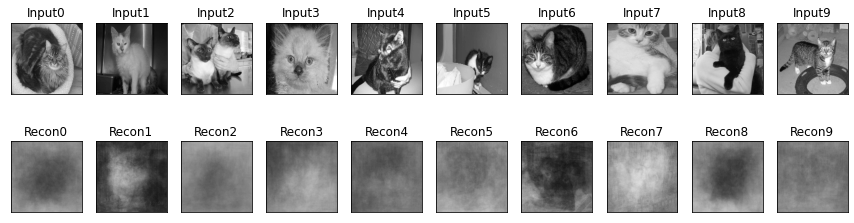
    


## 7. 2D공간에 잠재된 데이터 출력


```python
 #학습모델이 생성한 Manifold를 plot하는 함수 정의
def plot_results(models,
                 data,
                 batch_size=batch_size,
                 model_name="vae_mnist"):
    encoder, decoder = models
    x_test, y_test = data
    filename = "digits_over_latent.png"
    # display a 30x30 2D manifold of digitsa
    n = 15
    digit_size = 128
    figure = np.zeros((digit_size * n, digit_size * n))
    # linearly spaced coordinates corresponding to the 2D plot
    # of digit classes in the latent space
    grid_x = np.linspace(-2, 2, n)
    grid_y = np.linspace(-2, 2, n)[::-1]

    for i, yi in enumerate(grid_y):
        for j, xi in enumerate(grid_x):
            z_sample = np.array([[xi, yi]])
            x_decoded = decoder.predict(z_sample)
            digit = x_decoded[0].reshape(digit_size, digit_size)
            figure[i * digit_size: (i + 1) * digit_size,
                   j * digit_size: (j + 1) * digit_size ] = digit

    plt.figure(figsize=(10, 10))
    start_range = digit_size // 2
    end_range = (n - 1) * digit_size + start_range + 1
    pixel_range = np.arange(start_range, end_range, digit_size)
    sample_range_x = np.round(grid_x, 1)
    sample_range_y = np.round(grid_y, 1)
    plt.xticks(pixel_range, sample_range_x)
    plt.yticks(pixel_range, sample_range_y)
    plt.xlabel("z[0]")
    plt.ylabel("z[1]")
    plt.imshow(figure, cmap='Greys_r')
    plt.savefig(filename)
    plt.show()
    
plot_results(models = (encoder, decoder),
                 data = (x_test, y_test),
                 batch_size=batch_size,
                 model_name="vae_mlp")## 7. 2D공간에 잠재된 데이터 출력
```


    
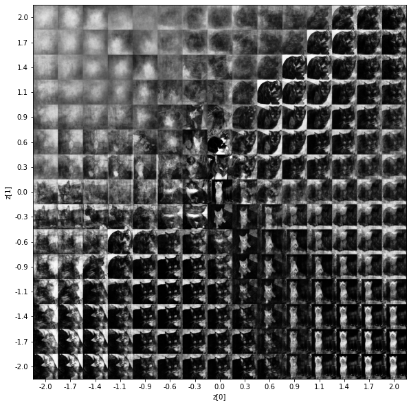
    


```python
def tsne_plot_results(models, data, batch_size=128, model_name='vae_mnist'):
    encoder , decoder = models
    x_test , y_test = data
    os.makedirs(model_name, exist_ok = True)
    
    #filename = os.path.join(model_name, "vae_mean.png")
    filename = "vae_mean.png"
    # display a 2D plot of the digit classes in the latent space
    z_mean, _, _ = encoder.predict(x_test, batch_size=batch_size)
    plt.figure(figsize=(10, 10))
    plt.scatter(z_mean[:, 0], z_mean[:, 1], c=y_test)
    plt.colorbar()
    plt.xlabel("z[0]")
    plt.ylabel("z[1]")
    plt.savefig(filename)
    plt.show()

tsne_plot_results(models = (encoder, decoder),
                 data = (x_test, y_test),
                 batch_size=batch_size,
                 model_name="vae_mlp")
```


    
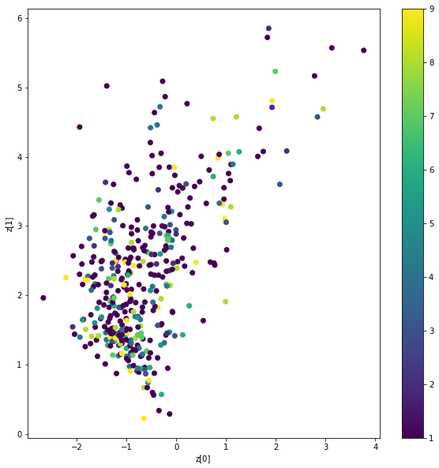
    


## 8. 데이터 간 Interpolation


```python
def linear_interpolation(x_from, x_to, steps=10):
    n = steps + 1
    t_from = x_from
    t_to = x_to
    
    diff = t_to - t_from
    inter = np.zeros((n, t_from.shape[0]))
    
    for i in range(n):
        inter[i] = t_from + i / steps * diff
        
    return decoder.predict(inter)
```


```python
target_a = np.array([1,1]) # 타겟 시작 좌표
target_b = np.array([10,10]) # 타겟 끝 좌표
z_decoder_imgs = linear_interpolation(target_a, target_b, 10)
```


```python
N = 1
M = 10
img_size = 128
fig = plt.figure(figsize=(10,10))
plt.subplots_adjust(top=1, bottom=0, hspace=0, wspace=0.05)
for i in range(N):
    for j in range(M):
        k = i * M + j
        ax = fig.add_subplot(N, M, k+1)
        ax.imshow(np.reshape(z_decoder_imgs[k], (img_size, img_size)), cmap=plt.cm.gist_gray)
        ax.grid(False)
        ax.xaxis.set_ticks([])
        ax.yaxis.set_ticks([])
plt.tight_layout()
```


    
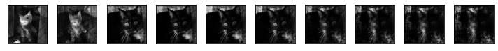
    

